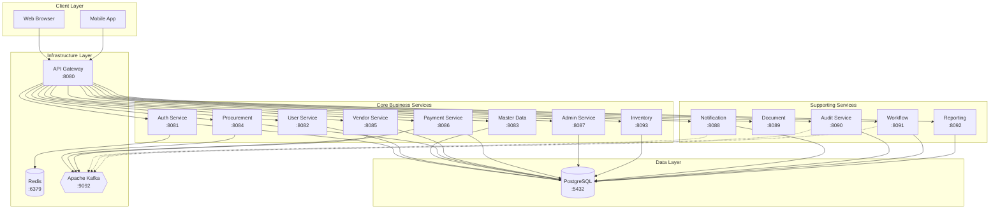
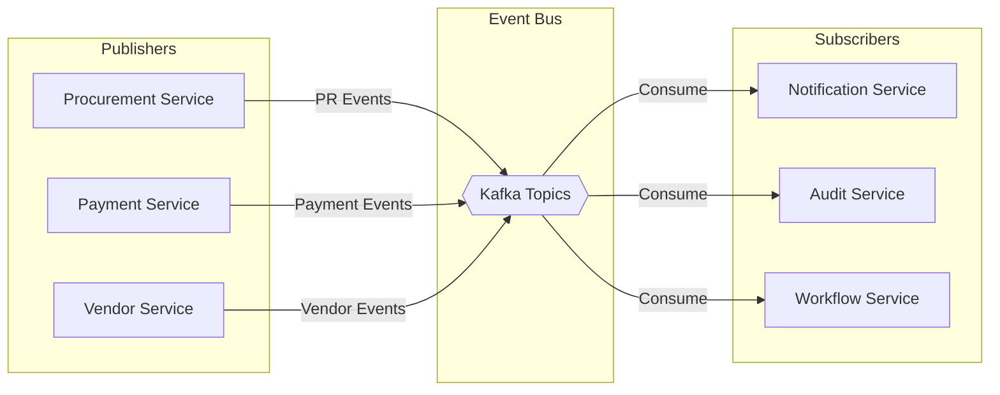
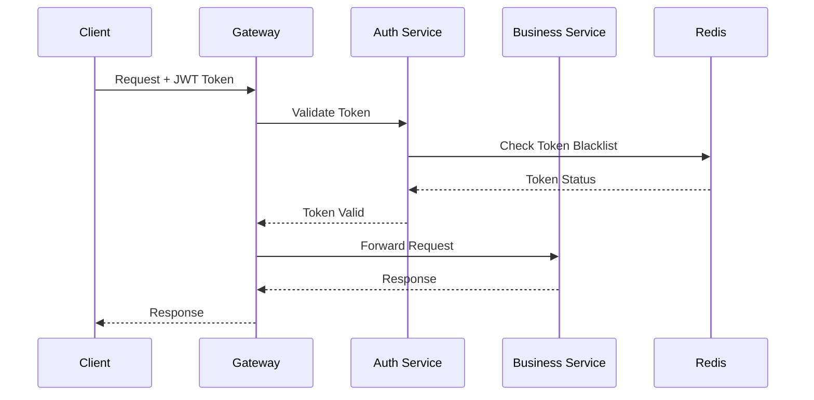

# System Architecture

## Overview

The e-Procurement system follows a **microservices architecture** pattern, designed for scalability, maintainability, and resilience. Each service is independently deployable and communicates through well-defined APIs and asynchronous messaging.

## High-Level Architecture



## Architecture Patterns

### 1. Microservices Pattern
Each business capability is encapsulated in its own service with:
- Independent deployment lifecycle
- Own database schema (shared database, separate schemas)
- Dedicated API endpoints
- Service-specific configuration

### 2. API Gateway Pattern
The Gateway Service acts as a single entry point for all client requests:
- **Routing**: Directs requests to appropriate services
- **Rate Limiting**: Protects services from overload
- **CORS**: Handles cross-origin resource sharing
- **Circuit Breaker**: Provides resilience with Resilience4j

### 3. Event-Driven Architecture
Services communicate asynchronously using Apache Kafka:



### 4. Security Architecture



## Service Responsibilities

### Core Services

| Service | Responsibility | Key Features |
|---------|---------------|--------------|
| **Auth Service** | Authentication & Authorization | JWT tokens, role management, password reset |
| **User Service** | User lifecycle management | Internal/External users, soft delete |
| **Vendor Service** | Vendor management | Registration, verification, scheduling |
| **Procurement Service** | Procurement lifecycle | PR creation, approval workflow, PO management |
| **Master Data Service** | Reference data | Categories, locations, cost centers |
| **Admin Service** | System administration | Cross-service management, monitoring |
| **Inventory Service** | Stock management | Warehouse, stock levels, transactions |

### Supporting Services

| Service | Responsibility | Key Features |
|---------|---------------|--------------|
| **Gateway Service** | API routing & security | Rate limiting, CORS, circuit breaker |
| **Notification Service** | Alert distribution | Email, in-app, push notifications |
| **Audit Service** | Audit logging | Event capture, compliance reporting |
| **Workflow Service** | Process orchestration | Approvals, escalations, reminders |
| **Reporting Service** | Analytics & reports | Dashboard data, exports |
| **Document Service** | File management | Upload, storage, retrieval |

## Technology Stack

### Backend Technologies
| Technology | Version | Purpose |
|------------|---------|---------|
| Java | 21 | Primary language |
| Spring Boot | 4.0.0 | Application framework |
| Spring Cloud | 2024.0.0 | Cloud patterns |
| Spring Security | 6.x | Security framework |
| Spring Data JPA | - | Data access |
| Spring Kafka | - | Message streaming |

### Data & Infrastructure
| Technology | Version | Purpose |
|------------|---------|---------|
| PostgreSQL | 16 | Relational database |
| Redis | 7.4 | Cache & session store |
| Apache Kafka | 7.7.1 | Event streaming |
| Flyway | - | Database migrations |
| Docker | - | Containerization |

### Libraries & Tools
| Library | Purpose |
|---------|---------|
| Lombok | Boilerplate reduction |
| MapStruct | Object mapping |
| SpringDoc OpenAPI | API documentation |
| jjwt | JWT implementation |
| Resilience4j | Circuit breaker |
| Testcontainers | Integration testing |

## Communication Patterns

### Synchronous (REST)
- Used for request-response scenarios
- Gateway routes to appropriate service
- JWT token validation on each request

### Asynchronous (Kafka)
- Used for event-driven processes
- Decouples services for better resilience
- Key topics:
  - `procurement.pr.submitted`
  - `procurement.pr.approved`
  - `procurement.pr.rejected`
  - `procurement.po.created`
  - `procurement.inventory.stock-alert`

## Data Architecture

### Database Strategy
- **Single PostgreSQL instance** with separate schemas per service
- **Flyway migrations** for schema versioning
- **Soft delete pattern** using `is_deleted` flag

### Caching Strategy
- **Redis** for session management and rate limiting
- Token blacklist for logout handling
- Distributed cache for frequently accessed data

## Deployment Architecture

```
┌─────────────────────────────────────────────────────────────────┐
│                    Docker Compose Environment                   │
├─────────────────────────────────────────────────────────────────┤
│                                                                 │
│  ┌──────────────────────────────────────────────────────────┐  │
│  │                  Infrastructure Services                  │  │
│  │  ┌─────────┐  ┌─────────┐  ┌─────────┐  ┌─────────────┐ │  │
│  │  │Postgres │  │  Kafka  │  │  Redis  │  │ PgAdmin UI  │ │  │
│  │  │ :5432   │  │  :9092  │  │  :6379  │  │   :5050     │ │  │
│  │  └─────────┘  └─────────┘  └─────────┘  └─────────────┘ │  │
│  └──────────────────────────────────────────────────────────┘  │
│                                                                 │
│  ┌──────────────────────────────────────────────────────────┐  │
│  │                  Application Services                     │  │
│  │     (Each service runs as independent container)          │  │
│  └──────────────────────────────────────────────────────────┘  │
│                                                                 │
│  Network: micro_net (Bridge)                                    │
└─────────────────────────────────────────────────────────────────┘
```

## Design Decisions

### Why Microservices?
- **Scalability**: Scale individual services based on demand
- **Technology Flexibility**: Use appropriate tech for each service
- **Team Autonomy**: Teams can work independently
- **Fault Isolation**: Failure in one service doesn't affect others

### Why Kafka?
- **Decoupling**: Services don't need to know about each other
- **Reliability**: Message persistence and replay capability
- **Scalability**: Handle high-throughput event processing

### Why Single Database?
- **Simplicity**: Easier to manage in development
- **Consistency**: ACID transactions where needed
- **Migration Path**: Can evolve to separate databases later

## Next Steps
- [Services Overview](./SERVICES.md) - Detailed service documentation
- [API Reference](./API_REFERENCE.md) - Complete API endpoints
- [Getting Started](./GETTING_STARTED.md) - Development setup
