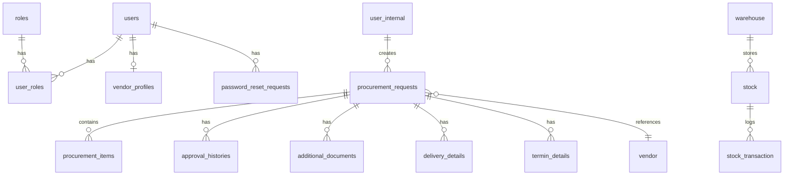

# Database Schema

## Overview

The e-Procurement system uses **PostgreSQL 16** as its primary database. All services share a single database instance with separate schemas/tables per service domain. Database migrations are managed using **Flyway**.

## Database Configuration

```properties
# PostgreSQL Connection
Host: localhost
Port: 5432
Database: masterdb
Username: postgres
Password: postgres
```

## Entity-Relationship Overview



---

## Auth Service Tables

### users
Core user authentication table.

```sql
CREATE TABLE users (
    id UUID PRIMARY KEY,
    username VARCHAR(255) NOT NULL UNIQUE,
    email VARCHAR(255) NOT NULL UNIQUE,
    password_hash VARCHAR(255) NOT NULL,
    status VARCHAR(50) NOT NULL,
    created_at TIMESTAMP,
    updated_at TIMESTAMP,
    last_login_at TIMESTAMP
);
```

| Column | Type | Description |
|--------|------|-------------|
| id | UUID | Primary key |
| username | VARCHAR(255) | Unique username |
| email | VARCHAR(255) | Unique email address |
| password_hash | VARCHAR(255) | Bcrypt hashed password |
| status | VARCHAR(50) | ACTIVE, INACTIVE, LOCKED |
| last_login_at | TIMESTAMP | Last successful login |

### roles
System roles for authorization.

```sql
CREATE TABLE roles (
    id BIGSERIAL PRIMARY KEY,
    name VARCHAR(255) NOT NULL UNIQUE
);
```

| Role | Description |
|------|-------------|
| ADMIN | System administrator |
| SUPERVISOR | Approval authority |
| OPERATOR | PR creator |
| FINANCE | Financial operations |
| VENDOR | External vendor user |

### user_roles
Many-to-many relationship between users and roles.

```sql
CREATE TABLE user_roles (
    user_id UUID NOT NULL,
    role_id BIGINT NOT NULL,
    PRIMARY KEY (user_id, role_id),
    CONSTRAINT fk_user FOREIGN KEY (user_id) REFERENCES users(id),
    CONSTRAINT fk_role FOREIGN KEY (role_id) REFERENCES roles(id)
);
```

### password_reset_requests
Tracks password reset tokens.

```sql
CREATE TABLE password_reset_requests (
    id UUID PRIMARY KEY,
    user_id UUID NOT NULL,
    token VARCHAR(255) NOT NULL UNIQUE,
    expires_at TIMESTAMP NOT NULL,
    used BOOLEAN NOT NULL,
    status VARCHAR(50) NOT NULL
);
```

### vendor_profiles
Vendor registration profile data.

```sql
CREATE TABLE vendor_profiles (
    id UUID PRIMARY KEY,
    user_id UUID NOT NULL,
    company_name VARCHAR(255) NOT NULL,
    npwp VARCHAR(255) NOT NULL,
    address VARCHAR(255) NOT NULL,
    phone VARCHAR(255) NOT NULL,
    documents_meta JSONB,
    verified_by UUID,
    verified_at TIMESTAMP
);
```

---

## User Service Tables

### user_internal
Internal employee records.

```sql
CREATE TABLE user_internal (
    id UUID PRIMARY KEY DEFAULT gen_random_uuid(),
    email VARCHAR(255) UNIQUE NOT NULL,
    full_name VARCHAR(255) NOT NULL,
    employee_id VARCHAR(50) UNIQUE,
    department_id UUID,
    phone VARCHAR(20),
    status VARCHAR(20) DEFAULT 'ACTIVE' 
        CHECK (status IN ('ACTIVE', 'INACTIVE', 'SUSPENDED')),
    is_deleted BOOLEAN DEFAULT FALSE,
    created_at TIMESTAMP DEFAULT CURRENT_TIMESTAMP,
    updated_at TIMESTAMP DEFAULT CURRENT_TIMESTAMP,
    created_by UUID,
    updated_by UUID
);

-- Indexes for query performance
CREATE INDEX idx_user_internal_email 
    ON user_internal(email) WHERE is_deleted = FALSE;
CREATE INDEX idx_user_internal_employee_id 
    ON user_internal(employee_id) WHERE is_deleted = FALSE;
CREATE INDEX idx_user_internal_department 
    ON user_internal(department_id) WHERE is_deleted = FALSE;
CREATE INDEX idx_user_internal_status 
    ON user_internal(status) WHERE is_deleted = FALSE;
```

| Column | Type | Description |
|--------|------|-------------|
| id | UUID | Primary key |
| email | VARCHAR(255) | Unique email |
| full_name | VARCHAR(255) | Display name |
| employee_id | VARCHAR(50) | HR system ID |
| department_id | UUID | Department reference |
| status | VARCHAR(20) | ACTIVE, INACTIVE, SUSPENDED |
| is_deleted | BOOLEAN | Soft delete flag |

### user_external
External user/client records.

```sql
CREATE TABLE user_external (
    id UUID PRIMARY KEY DEFAULT gen_random_uuid(),
    email VARCHAR(255) UNIQUE NOT NULL,
    full_name VARCHAR(255) NOT NULL,
    company_name VARCHAR(255),
    phone VARCHAR(20),
    status VARCHAR(20) DEFAULT 'ACTIVE',
    is_deleted BOOLEAN DEFAULT FALSE,
    created_at TIMESTAMP DEFAULT CURRENT_TIMESTAMP,
    updated_at TIMESTAMP DEFAULT CURRENT_TIMESTAMP
);
```

---

## Procurement Service Tables

### procurement_requests
Core procurement request entity.

```sql
CREATE TABLE procurement_requests (
    id UUID PRIMARY KEY,
    operator_id UUID NOT NULL,
    vendor_id UUID NOT NULL,
    type VARCHAR(20) NOT NULL 
        CHECK (type IN ('GOODS', 'SERVICE')),
    priority VARCHAR(20) NOT NULL DEFAULT 'NORMAL' 
        CHECK (priority IN ('NORMAL', 'IMPORTANT', 'URGENT')),
    status VARCHAR(20) NOT NULL DEFAULT 'DRAFT' 
        CHECK (status IN ('DRAFT', 'SUBMITTED', 'APPROVED', 
                          'REJECTED', 'RETURNED', 'ESCALATED', 'CANCELLED')),
    description TEXT,
    deadline TIMESTAMP,
    created_at TIMESTAMP NOT NULL DEFAULT CURRENT_TIMESTAMP,
    updated_at TIMESTAMP,
    created_by UUID,
    updated_by UUID,
    is_deleted BOOLEAN NOT NULL DEFAULT FALSE,
    deleted_at TIMESTAMP
);

-- Indexes
CREATE INDEX idx_pr_operator_id ON procurement_requests(operator_id) 
    WHERE is_deleted = FALSE;
CREATE INDEX idx_pr_status ON procurement_requests(status) 
    WHERE is_deleted = FALSE;
CREATE INDEX idx_pr_vendor_id ON procurement_requests(vendor_id) 
    WHERE is_deleted = FALSE;
CREATE INDEX idx_pr_created_at ON procurement_requests(created_at DESC) 
    WHERE is_deleted = FALSE;
CREATE INDEX idx_pr_operator_status ON procurement_requests(operator_id, status) 
    WHERE is_deleted = FALSE;
```

### procurement_items
Line items for procurement requests.

```sql
CREATE TABLE procurement_items (
    id UUID PRIMARY KEY,
    pr_id UUID NOT NULL REFERENCES procurement_requests(id),
    catalog_id UUID,
    item_name VARCHAR(255) NOT NULL,
    quantity INTEGER NOT NULL,
    unit_price DECIMAL(15,2) NOT NULL,
    total_price DECIMAL(15,2) NOT NULL,
    specification TEXT,
    uom VARCHAR(50),
    created_at TIMESTAMP DEFAULT CURRENT_TIMESTAMP
);

CREATE INDEX idx_pi_pr_id ON procurement_items(pr_id);
```

### approval_histories
Audit trail for approval actions.

```sql
CREATE TABLE approval_histories (
    id UUID PRIMARY KEY,
    pr_id UUID NOT NULL REFERENCES procurement_requests(id),
    approver_id UUID NOT NULL,
    action VARCHAR(20) NOT NULL,
    notes TEXT,
    created_at TIMESTAMP DEFAULT CURRENT_TIMESTAMP
);

CREATE INDEX idx_ah_pr_id ON approval_histories(pr_id);
CREATE INDEX idx_ah_approver_id ON approval_histories(approver_id);
```

### delivery_details
Delivery tracking information.

```sql
CREATE TABLE delivery_details (
    id UUID PRIMARY KEY,
    pr_id UUID NOT NULL REFERENCES procurement_requests(id),
    delivery_date TIMESTAMP,
    received_by UUID,
    delivery_status VARCHAR(20),
    notes TEXT,
    created_at TIMESTAMP DEFAULT CURRENT_TIMESTAMP
);
```

### additional_documents
Attachments for procurement requests.

```sql
CREATE TABLE additional_documents (
    id UUID PRIMARY KEY,
    pr_id UUID NOT NULL REFERENCES procurement_requests(id),
    file_name VARCHAR(255) NOT NULL,
    file_path VARCHAR(500) NOT NULL,
    file_type VARCHAR(100),
    file_size BIGINT,
    uploaded_by UUID,
    created_at TIMESTAMP DEFAULT CURRENT_TIMESTAMP
);
```

### termin_details
Payment term definitions.

```sql
CREATE TABLE termin_details (
    id UUID PRIMARY KEY,
    pr_id UUID NOT NULL REFERENCES procurement_requests(id),
    termin_number INTEGER NOT NULL,
    percentage DECIMAL(5,2) NOT NULL,
    due_date TIMESTAMP,
    status VARCHAR(20) DEFAULT 'PENDING',
    paid_at TIMESTAMP
);
```

### receiving_records
Goods receipt tracking.

```sql
CREATE TABLE receiving_records (
    id UUID PRIMARY KEY,
    po_id UUID NOT NULL,
    item_id UUID NOT NULL,
    quantity_received INTEGER NOT NULL,
    condition VARCHAR(50),
    received_by UUID,
    received_at TIMESTAMP DEFAULT CURRENT_TIMESTAMP,
    notes TEXT
);
```

---

## Inventory Service Tables

### warehouse
Warehouse location management.

```sql
CREATE TABLE warehouse (
    id UUID PRIMARY KEY,
    name VARCHAR(255) NOT NULL,
    code VARCHAR(50) UNIQUE NOT NULL,
    location_id UUID,
    capacity INTEGER,
    status VARCHAR(20) DEFAULT 'ACTIVE',
    created_at TIMESTAMP DEFAULT CURRENT_TIMESTAMP,
    updated_at TIMESTAMP
);
```

### stock
Current stock levels per item per warehouse.

```sql
CREATE TABLE stock (
    id UUID PRIMARY KEY,
    warehouse_id UUID NOT NULL REFERENCES warehouse(id),
    catalog_id UUID NOT NULL,
    quantity INTEGER NOT NULL DEFAULT 0,
    minimum_level INTEGER DEFAULT 0,
    maximum_level INTEGER,
    last_updated TIMESTAMP DEFAULT CURRENT_TIMESTAMP
);

CREATE UNIQUE INDEX idx_stock_warehouse_catalog 
    ON stock(warehouse_id, catalog_id);
```

### stock_transaction
Stock movement history.

```sql
CREATE TABLE stock_transaction (
    id UUID PRIMARY KEY,
    stock_id UUID NOT NULL REFERENCES stock(id),
    type VARCHAR(10) NOT NULL CHECK (type IN ('IN', 'OUT')),
    quantity INTEGER NOT NULL,
    reference_type VARCHAR(50),
    reference_id UUID,
    notes TEXT,
    created_by UUID,
    created_at TIMESTAMP DEFAULT CURRENT_TIMESTAMP
);

CREATE INDEX idx_st_stock_id ON stock_transaction(stock_id);
CREATE INDEX idx_st_created_at ON stock_transaction(created_at DESC);
```

---

## Audit Service Tables

### audit_logs
System-wide audit trail.

```sql
CREATE TABLE audit_logs (
    id UUID PRIMARY KEY,
    user_id UUID,
    action VARCHAR(100) NOT NULL,
    entity_type VARCHAR(100),
    entity_id UUID,
    old_value JSONB,
    new_value JSONB,
    ip_address VARCHAR(50),
    user_agent TEXT,
    created_at TIMESTAMP DEFAULT CURRENT_TIMESTAMP
);

CREATE INDEX idx_audit_user_id ON audit_logs(user_id);
CREATE INDEX idx_audit_entity ON audit_logs(entity_type, entity_id);
CREATE INDEX idx_audit_created_at ON audit_logs(created_at DESC);
```

---

## Notification Service Tables

### notifications
Notification records.

```sql
CREATE TABLE notifications (
    id UUID PRIMARY KEY,
    user_id UUID NOT NULL,
    type VARCHAR(50) NOT NULL,
    title VARCHAR(255) NOT NULL,
    message TEXT,
    is_read BOOLEAN DEFAULT FALSE,
    link VARCHAR(500),
    created_at TIMESTAMP DEFAULT CURRENT_TIMESTAMP,
    read_at TIMESTAMP
);

CREATE INDEX idx_notif_user_id ON notifications(user_id);
CREATE INDEX idx_notif_unread ON notifications(user_id, is_read) 
    WHERE is_read = FALSE;
```

---

## Common Patterns

### Soft Delete Pattern
All main entities implement soft delete:

```sql
is_deleted BOOLEAN DEFAULT FALSE,
deleted_at TIMESTAMP
```

**Query Pattern:**
```sql
SELECT * FROM table_name WHERE is_deleted = FALSE;
```

### Audit Columns
Common audit columns across tables:

```sql
created_at TIMESTAMP DEFAULT CURRENT_TIMESTAMP,
updated_at TIMESTAMP,
created_by UUID,
updated_by UUID
```

### UUID Primary Keys
All tables use UUID for primary keys:

```sql
id UUID PRIMARY KEY DEFAULT gen_random_uuid()
```

---

## Database Migrations

Migrations are in: `src/main/resources/db/migration/`

### Migration Naming Convention
```
V{version}__{description}.sql

Examples:
V1__init_schema.sql
V2__create_procurement_items_table.sql
V3__add_delivery_tracking.sql
```

### Running Migrations
Migrations run automatically on service startup when Flyway is enabled:

```properties
spring.flyway.enabled=true
spring.flyway.locations=classpath:db/migration
spring.flyway.baseline-on-migrate=true
```

---

## Indexes Strategy

### Partial Indexes
Used extensively for soft-deleted tables:

```sql
CREATE INDEX idx_name ON table(column) WHERE is_deleted = FALSE;
```

### Composite Indexes
For frequently combined filters:

```sql
CREATE INDEX idx_pr_operator_status 
    ON procurement_requests(operator_id, status) 
    WHERE is_deleted = FALSE;
```

---

## Next Steps
- [API Reference](./API_REFERENCE.md) - API endpoints
- [Getting Started](./GETTING_STARTED.md) - Development setup
- [Services Overview](./SERVICES.md) - Service descriptions
