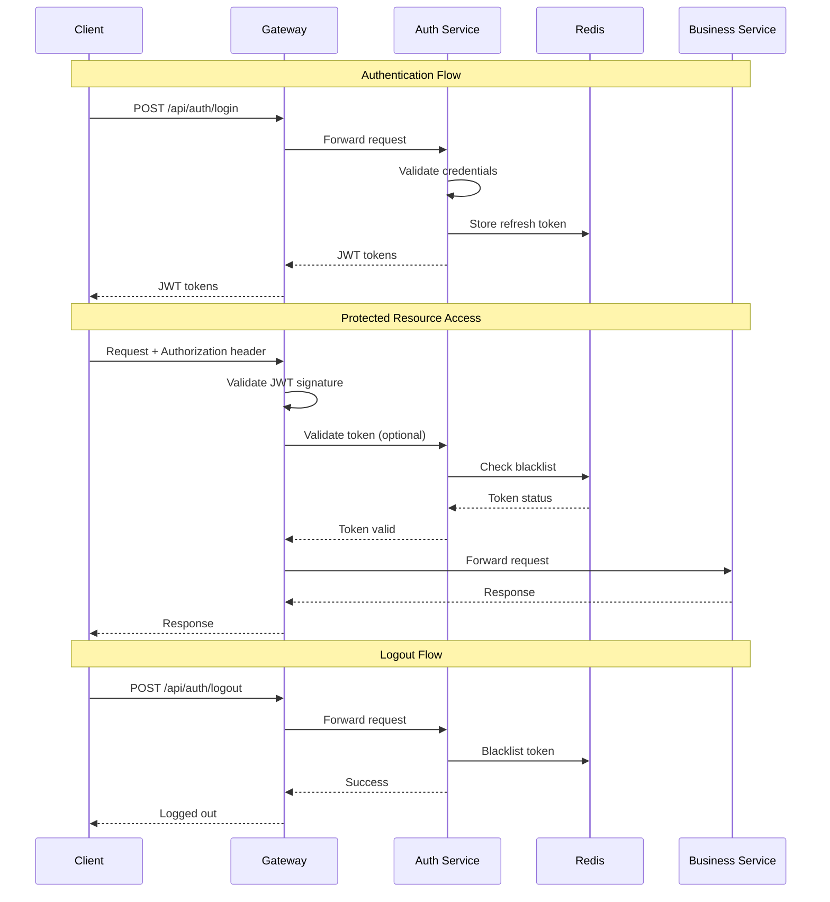
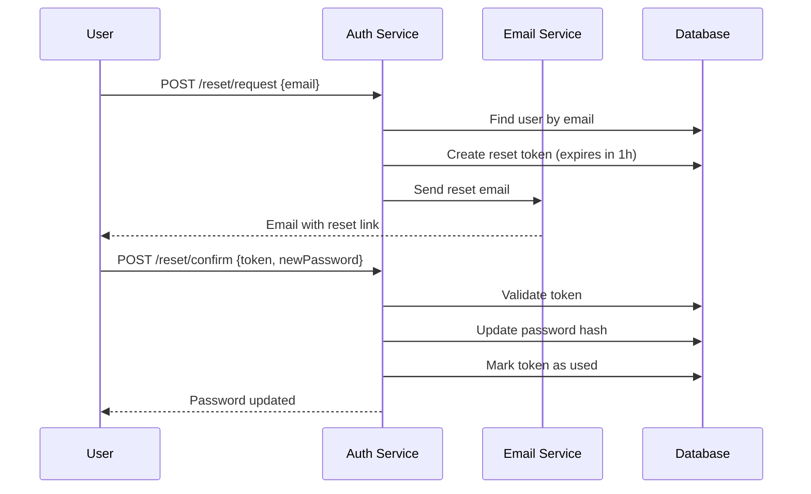

# Security Guide

## Overview

This document covers security implementation across the e-Procurement microservices system, including authentication, authorization, and security best practices.

---

## Security Architecture



---

## Authentication

### JWT Token Structure

The system uses JWT (JSON Web Tokens) for authentication:

```json
{
  "header": {
    "alg": "HS256",
    "typ": "JWT"
  },
  "payload": {
    "sub": "user-uuid",
    "iss": "http://localhost:8081",
    "iat": 1704123600,
    "exp": 1704127200,
    "roles": ["OPERATOR", "USER"],
    "userId": "uuid",
    "username": "john.doe"
  },
  "signature": "..."
}
```

### Token Configuration

```properties
# JWT Configuration
jwt.secret-key=your-256-bit-secret-key-here-minimum-32-characters
jwt.access-token-expiration=3600000     # 1 hour
jwt.refresh-token-expiration=604800000  # 7 days
```

### Login Flow

**Request:**
```http
POST /api/v1/auth/login
Content-Type: application/json

{
  "username": "john.doe",
  "password": "securePassword123"
}
```

**Response:**
```json
{
  "accessToken": "eyJhbGciOiJIUzI1NiIsInR5cCI6IkpXVCJ9...",
  "refreshToken": "eyJhbGciOiJIUzI1NiIsInR5cCI6IkpXVCJ9...",
  "tokenType": "Bearer",
  "expiresIn": 3600
}
```

### Token Refresh

**Request:**
```http
POST /api/v1/auth/refresh
Content-Type: application/json

{
  "refreshToken": "eyJhbGciOiJIUzI1NiIsInR5cCI6IkpXVCJ9..."
}
```

### Logout

**Request:**
```http
POST /api/v1/auth/logout
Authorization: Bearer {accessToken}
```

> On logout, both access and refresh tokens are blacklisted in Redis.

---

## Authorization

### Role-Based Access Control (RBAC)

The system implements RBAC with the following roles:

| Role | Description | Permissions |
|------|-------------|-------------|
| `ADMIN` | System administrator | Full access to all resources |
| `SUPERVISOR` | Approval authority | Approve/reject PRs, read-only vendor access |
| `OPERATOR` | PR creator | Create/manage own PRs |
| `FINANCE` | Financial operations | Payment processing, read-only vendor access |
| `VENDOR` | External vendor | View own orders, update delivery status |

### Role Hierarchy

```
ADMIN
  └── SUPERVISOR
        └── OPERATOR
        └── FINANCE
VENDOR (separate branch)
```

### Endpoint Security

```java
@Configuration
@EnableWebSecurity
public class SecurityConfig {
    
    @Bean
    public SecurityFilterChain filterChain(HttpSecurity http) throws Exception {
        http
            .authorizeHttpRequests(auth -> auth
                // Public endpoints
                .requestMatchers("/api/v1/auth/**").permitAll()
                .requestMatchers("/actuator/health").permitAll()
                .requestMatchers("/swagger-ui/**", "/v3/api-docs/**").permitAll()
                
                // Admin only
                .requestMatchers("/api/v1/admin/**").hasRole("ADMIN")
                
                // Supervisor endpoints
                .requestMatchers("/api/v1/procurements/*/approve").hasAnyRole("ADMIN", "SUPERVISOR")
                .requestMatchers("/api/v1/procurements/*/reject").hasAnyRole("ADMIN", "SUPERVISOR")
                
                // Operator endpoints
                .requestMatchers("/api/v1/procurements/**").hasAnyRole("ADMIN", "SUPERVISOR", "OPERATOR")
                
                // Vendor read-only access
                .requestMatchers(HttpMethod.GET, "/api/v1/vendors/**")
                    .hasAnyRole("ADMIN", "SUPERVISOR", "OPERATOR", "FINANCE")
                
                // Default: authenticated
                .anyRequest().authenticated()
            )
            .oauth2ResourceServer(oauth2 -> oauth2.jwt(Customizer.withDefaults()))
            .csrf(csrf -> csrf.disable())
            .sessionManagement(session -> session
                .sessionCreationPolicy(SessionCreationPolicy.STATELESS));
        
        return http.build();
    }
}
```

### Method-Level Security

```java
@Service
public class ProcurementService {
    
    @PreAuthorize("hasRole('OPERATOR') or hasRole('ADMIN')")
    public ProcurementRequest createPR(CreatePRRequest request) {
        // ...
    }
    
    @PreAuthorize("hasRole('SUPERVISOR') or hasRole('ADMIN')")
    public void approvePR(UUID prId, ApprovalRequest request) {
        // ...
    }
    
    @PreAuthorize("#pr.operatorId == authentication.principal.id or hasRole('ADMIN')")
    public void updatePR(ProcurementRequest pr, UpdatePRRequest request) {
        // ...
    }
}
```

---

## Password Security

### Password Hashing

Passwords are hashed using BCrypt:

```java
@Bean
public PasswordEncoder passwordEncoder() {
    return new BCryptPasswordEncoder(12);  // 12 rounds
}
```

### Password Policy

Recommended password requirements:
- Minimum 8 characters
- At least one uppercase letter
- At least one lowercase letter
- At least one digit
- At least one special character

```java
public class PasswordValidator {
    private static final Pattern PASSWORD_PATTERN = Pattern.compile(
        "^(?=.*[a-z])(?=.*[A-Z])(?=.*\\d)(?=.*[@$!%*?&])[A-Za-z\\d@$!%*?&]{8,}$"
    );
    
    public boolean isValid(String password) {
        return PASSWORD_PATTERN.matcher(password).matches();
    }
}
```

### Password Reset Flow



---

## API Security

### CORS Configuration

```properties
# Gateway CORS settings
spring.cloud.gateway.globalcors.cors-configurations.[/**].allowed-origins=https://app.example.com
spring.cloud.gateway.globalcors.cors-configurations.[/**].allowed-methods=GET,POST,PUT,DELETE,OPTIONS
spring.cloud.gateway.globalcors.cors-configurations.[/**].allowed-headers=Authorization,Content-Type
spring.cloud.gateway.globalcors.cors-configurations.[/**].allow-credentials=true
spring.cloud.gateway.globalcors.cors-configurations.[/**].max-age=3600
```

### Rate Limiting

```properties
# Redis-based rate limiting
spring.cloud.gateway.filter.request-rate-limiter.redis-rate-limiter.replenish-rate=100
spring.cloud.gateway.filter.request-rate-limiter.redis-rate-limiter.burst-capacity=200
```

Rate limit headers returned:
```http
X-RateLimit-Remaining: 95
X-RateLimit-Replenish-Rate: 100
X-RateLimit-Burst-Capacity: 200
```

### Input Validation

All DTOs use Bean Validation:

```java
public class CreatePRRequest {
    
    @NotNull(message = "Vendor ID is required")
    private UUID vendorId;
    
    @NotBlank(message = "Description is required")
    @Size(max = 1000, message = "Description must be less than 1000 characters")
    private String description;
    
    @NotNull(message = "Type is required")
    private ProcurementType type;
    
    @NotEmpty(message = "At least one item is required")
    @Valid
    private List<ProcurementItemRequest> items;
}
```

### Error Response

All API errors return a standardized format:

```json
{
  "timestamp": "2026-01-02T09:30:00.000Z",
  "status": 403,
  "errorCode": "ACCESS_DENIED",
  "message": "You don't have permission to perform this action"
}
```

---

## Data Security

### Soft Delete Pattern

All entities implement soft delete to preserve audit trail:

```java
@Entity
public abstract class BaseEntity {
    
    @Column(name = "is_deleted")
    private Boolean isDeleted = false;
    
    @Column(name = "deleted_at")
    private LocalDateTime deletedAt;
    
    public void softDelete() {
        this.isDeleted = true;
        this.deletedAt = LocalDateTime.now();
    }
}
```

### Audit Trail

All modifications are tracked:

```java
@Entity
@EntityListeners(AuditingEntityListener.class)
public abstract class AuditableEntity {
    
    @CreatedDate
    @Column(name = "created_at", updatable = false)
    private LocalDateTime createdAt;
    
    @LastModifiedDate
    @Column(name = "updated_at")
    private LocalDateTime updatedAt;
    
    @CreatedBy
    @Column(name = "created_by", updatable = false)
    private UUID createdBy;
    
    @LastModifiedBy
    @Column(name = "updated_by")
    private UUID updatedBy;
}
```

### Sensitive Data Handling

```java
public class UserResponse {
    private UUID id;
    private String email;
    
    @JsonIgnore  // Never expose password hash
    private String passwordHash;
    
    @JsonProperty("phone")
    public String getMaskedPhone() {
        // Return masked phone: +62***456789
        return maskPhone(this.phone);
    }
}
```

---

## Security Headers

### Response Headers

```java
@Component
public class SecurityHeadersFilter implements Filter {
    
    @Override
    public void doFilter(ServletRequest request, ServletResponse response, 
                        FilterChain chain) throws IOException, ServletException {
        HttpServletResponse httpResponse = (HttpServletResponse) response;
        
        httpResponse.setHeader("X-Content-Type-Options", "nosniff");
        httpResponse.setHeader("X-Frame-Options", "DENY");
        httpResponse.setHeader("X-XSS-Protection", "1; mode=block");
        httpResponse.setHeader("Strict-Transport-Security", 
            "max-age=31536000; includeSubDomains");
        httpResponse.setHeader("Content-Security-Policy", 
            "default-src 'self'");
        
        chain.doFilter(request, response);
    }
}
```

---

## Security Best Practices

### 1. Secret Management

```bash
# ❌ Never commit secrets
spring.datasource.password=mypassword

# ✅ Use environment variables
spring.datasource.password=${DB_PASSWORD}

# ✅ Use secrets management (production)
# - AWS Secrets Manager
# - HashiCorp Vault
# - Kubernetes Secrets
```

### 2. JWT Secret

```bash
# Generate strong JWT secret (256 bits / 32 bytes minimum)
openssl rand -base64 32
```

### 3. Database Security

```properties
# Use SSL for database connections in production
spring.datasource.url=jdbc:postgresql://host:5432/db?ssl=true&sslmode=require
```

### 4. Actuator Security

```properties
# Production - expose only necessary endpoints
management.endpoints.web.exposure.include=health,info

# Hide sensitive details
management.endpoint.health.show-details=never
```

### 5. Logging Security

```java
// ❌ Never log sensitive data
log.info("User logged in with password: " + password);

// ✅ Log safely
log.info("User '{}' logged in successfully", username);
```

---

## Common Vulnerabilities & Mitigations

| Vulnerability | Mitigation |
|--------------|------------|
| SQL Injection | Use JPA/Hibernate parameterized queries |
| XSS | Input validation, Content-Security-Policy |
| CSRF | Disabled (stateless JWT auth) |
| Brute Force | Rate limiting, account lockout |
| Session Hijacking | Short-lived tokens, HTTPS only |
| Privilege Escalation | Role-based access control, method-level security |

---

## Security Checklist

### Authentication
- [ ] Strong password policy enforced
- [ ] Account lockout after failed attempts
- [ ] Secure password reset flow
- [ ] Short-lived access tokens
- [ ] Token refresh mechanism
- [ ] Proper logout (token blacklisting)

### Authorization
- [ ] Role-based access control
- [ ] Principle of least privilege
- [ ] Resource-level authorization
- [ ] Method-level security

### Data Protection
- [ ] Passwords hashed with BCrypt
- [ ] Sensitive data encrypted at rest
- [ ] TLS/HTTPS in transit
- [ ] Soft delete for audit trail
- [ ] PII data masking in logs

### API Security
- [ ] Rate limiting enabled
- [ ] CORS properly configured
- [ ] Input validation on all endpoints
- [ ] Security headers set
- [ ] Error messages don't leak info

---

## Next Steps

- [Configuration Guide](./CONFIGURATION.md) - Security configuration
- [Deployment Guide](./DEPLOYMENT.md) - Production security
- [API Reference](./API_REFERENCE.md) - Endpoint security
