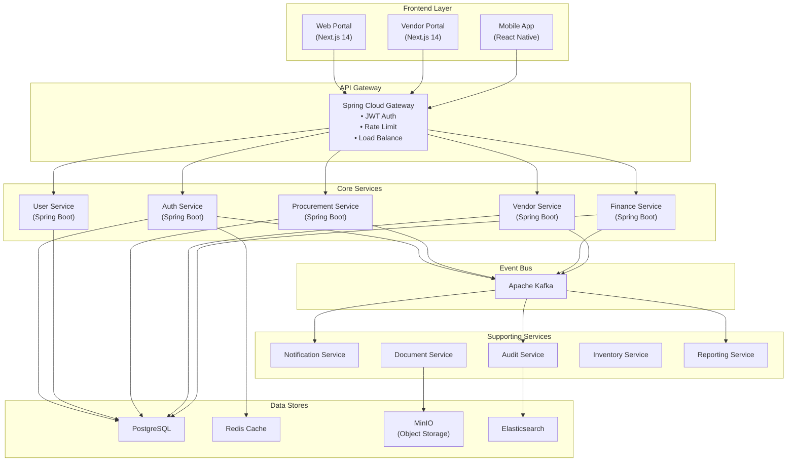

# Penjelasan Arsitektur Sistem

**Lapisan Presentasi dan Gerbang API (Frontend & Gateway)**
Sistem ini dirancang menggunakan arsitektur *microservices* yang modern dan terdistribusi. Pada lapisan presentasi (*User Interface*), terdapat pemisahan yang jelas antara **Web Portal** untuk pengguna internal, **Vendor Portal** untuk rekanan, dan **Mobile App** untuk akses on-the-go, di mana semuanya dibangun menggunakan teknologi terkini seperti Next.js 14 dan React Native. Seluruh akses dari klien-klien ini tidak langsung menyentuh layanan backend, melainkan melalui **API Gateway** (Spring Cloud Gateway) yang berfungsi sebagai pintu gerbang tunggal. Gateway ini bertugas menangani keamanan terpusat (JWT Authentication), pembatasan akses (*rate limiting*), dan penyeimbangan beban (*load balancing*) untuk memastikan keamanan dan stabilitas sistem sebelum permintaan diteruskan ke layanan di belakangnya.

**Layanan Inti dan Komunikasi <i>Event-Driven</i>**
Logika bisnis utama dipecah menjadi beberapa **Core Services** independen berbasis Spring Boot, meliputi layanan Autentikasi, User/Role, Pengadaan (Procurement), Vendor, dan Keuangan. Untuk menjaga performa dan independensi antar-layanan (*decoupling*), sistem menerapkan pola komunikasi *asynchronous* menggunakan **Apache Kafka** sebagai *Event Bus*. Ketika terjadi transaksi penting (seperti 'PR Disetujui' atau 'Invoice Masuk'), layanan inti akan mempublikasikan *event* ke Kafka. Layanan pendukung (*Supporting Services*) seperti Notifikasi, Audit, dan Pelaporan kemudian akan mengonsumsi *event* tersebut secara terpisah. Hal ini memastikan proses berat seperti pengiriman email atau pencatatan log audit tidak memperlambat respon transaksi utama pengguna.

**Strategi Penyimpanan Data (Data Persistence)**
Untuk pengelolaan data, sistem menerapkan strategi *polyglot persistence* yang memilih teknologi penyimpanan terbaik sesuai kebutuhan kasus penggunaan. **PostgreSQL** digunakan sebagai database relasional utama untuk menjamin integritas data transaksional pada setiap *microservice*. Sistem juga memanfaatkan **Redis** sebagai lapisan *caching* berkecepatan tinggi untuk mengurangi beban database, **MinIO** sebagai *Object Storage* yang aman untuk penyimpanan dokumen fisik (seperti file kontrak atau faktur), serta **Elasticsearch** untuk kebutuhan pencarian teks cepat dan agregasi log audit. Kombinasi infrastruktur ini menciptakan ekosistem penyimpanan yang skalabel, andal, dan efisien.
