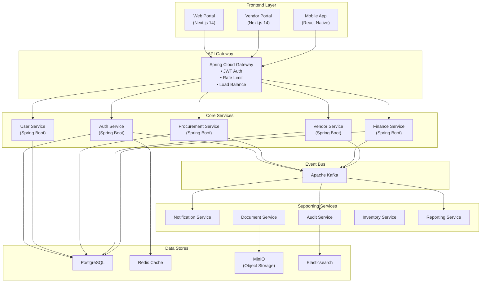
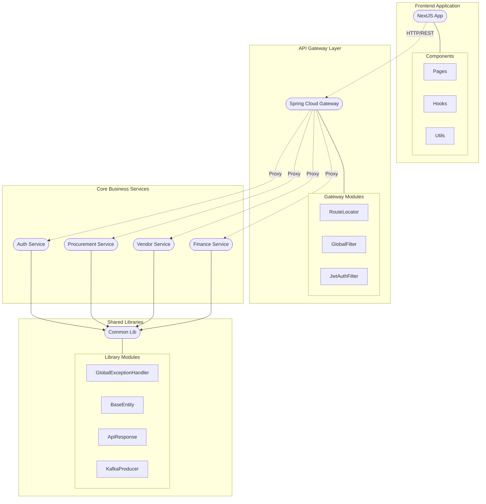
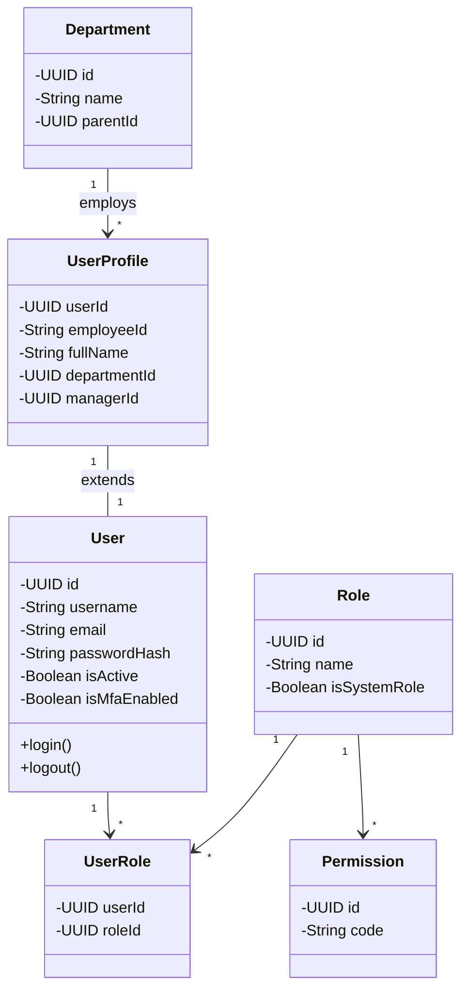
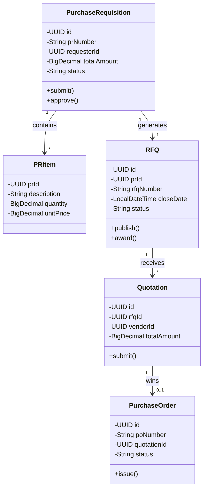
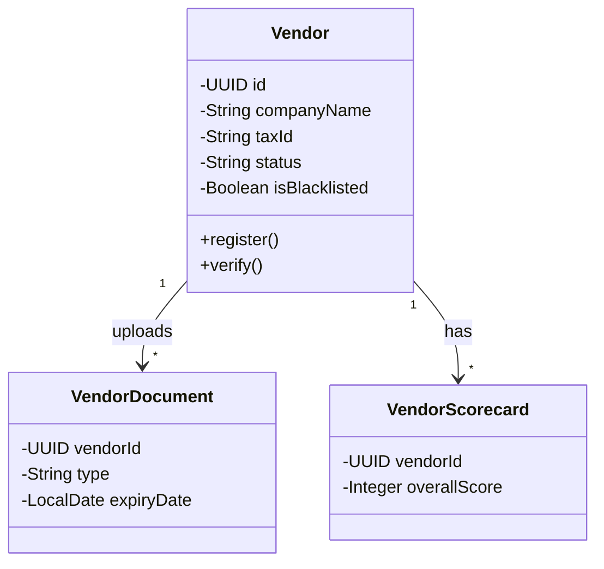
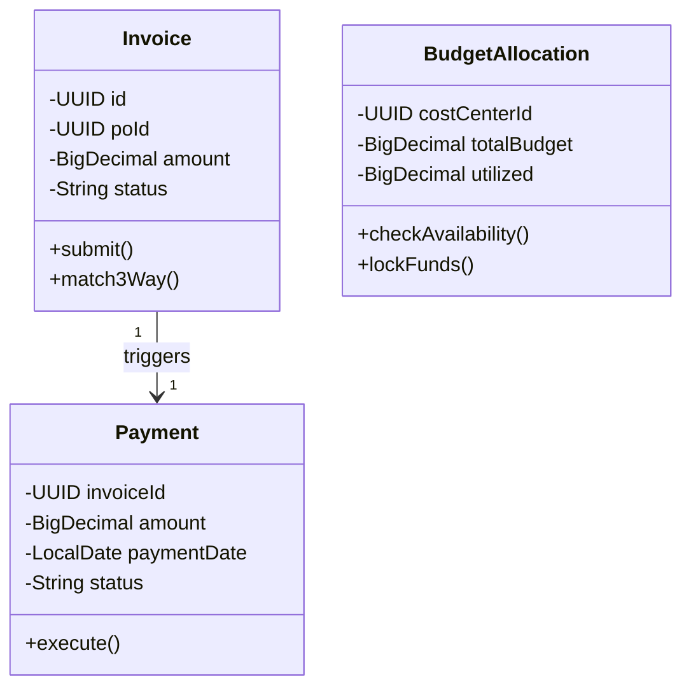

# 4.6.2 Perancangan Arsitektur

## 4.6.2.1 Tinjauan Umum Arsitektur

Arsitektur sistem e-Procurement ini dirancang menggunakan pendekatan *Microservices* yang terdistribusi, memungkinkan skalabilitas tinggi dan pemisahan tanggung jawab yang jelas antar modul. Sistem terdiri dari tiga lapisan utama:
1.  **Frontend Layer**: Antarmuka pengguna yang terbagi menjadi Web Portal, Vendor Portal, dan Mobile App.
2.  **API Gateway**: Gerbang tunggal yang menangani autentikasi, load balancing, dan *routing*.
3.  **Backend Services**: Kumpulan layanan mikro (Auth, User, Procurement, Vendor, Finance) yang berkomunikasi secara *asynchronous* melalui Event Bus (Kafka).

Berikut adalah gambaran visual arsitektur sistem secara keseluruhan:

---

## 4.6.2.2 Arsitektur Perangkat Lunak (Package Diagram)

Diagram paket berikut menggambarkan struktur modular internal dari sistem *Monorepo* atau *Multi-repo* microservices. Setiap layanan memiliki struktur layer yang seragam (Controller, Service, Repository) sesuai dengan standar *Clean Architecture* atau *Layered Architecture* pada Spring Boot.

Struktur paket di atas menunjukkan bahwa setiap microservice (Auth, Procurement, Vendor, Finance) berdiri sendiri namun berbagi pustaka umum (`Common Lib`) untuk menangani hal-hal standar seperti format respons API (`ApiResponse`), penanganan error global (`GlobalExceptionHandler`), dan utilitas logging audit.

---

## 4.6.2.3 Class Diagram

Berikut adalah rancangan detail kelas (Class Diagram) untuk setiap layanan utama, yang menggambarkan atribut data dan operasi (metode) yang dimiliki oleh setiap entitas bisnis.

### 1. Auth Service & User Management

### 2. Procurement Service (Core)

### 3. Vendor Service

### 4. Finance Service

