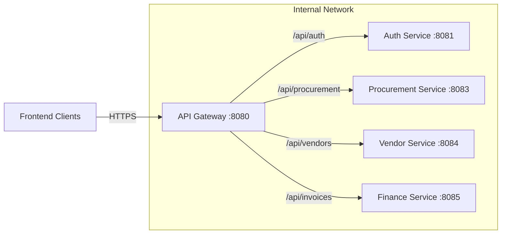

# API Gateway Service
**Package:** `com.eproc.gateway` | **Port:** `8080`

## 1. Overview
The **API Gateway** is the single entry point for all client requests (Web Portal, Vendor Portal, Mobile App). It handles routing, cross-cutting concerns, and acts as a **Backend for Frontend (BFF)**.

### Key Responsibilities
*   **Routing:** Forwarding requests to appropriate microservices based on path.
*   **Edge Security:** Rate limiting, CORS, and generic attack protection.
*   **Authentication (Gateway Filter):** Validating JWT tokens before forwarding requests.
*   **Load Balancing:** Client-side load balancing via service discovery (Eureka).

## 2. Technology Stack
*   **Framework:** Spring Boot 4.0.0
*   **Gateway:** Spring Cloud Gateway (Reactive/WebFlux)
*   **Discovery:** Netflix Eureka Client
*   **Resilience:** Resilience4j (Circuit Breaker)
*   **Monitoring:** Micrometer + Zipkin Tracing

## 3. Architecture

## 4. Route Configuration
Routes are dynamically configured via `application.yml`.

| Path Prefix | Target Service | Auth Required | Rate Limit |
|:---|:---|:---|:---|
| `/api/auth/**` | `auth-service` | No (Public) | 20 req/min |
| `/api/users/**` | `user-service` | Yes (JWT) | 100 req/min |
| `/api/procurement/**` | `procurement-service` | Yes (JWT) | 100 req/min |
| `/api/vendors/**` | `vendor-service` | Yes (JWT) | 50 req/min |
| `/api/finance/**` | `finance-service` | Yes (JWT) | 50 req/min |

## 5. Security Policies

### 5.1 Rate Limiting (Redis)
We use the Request Rate Limiter (Token Bucket algorithm) backed by Redis.
*   **Burst Capacity:** Allow short bursts of traffic (e.g., 20 requests).
*   **Replenish Rate:** Steady state refill (e.g., 10 requests/second).

### 5.2 CORS Configuration
Strict CORS policy to prevent unauthorized cross-origin access.
*   **Allowed Origins:** `http://localhost:3000` (Dev), `https://portal.bank-xyz.com` (Prod).
*   **Allowed Methods:** `GET`, `POST`, `PUT`, `DELETE`, `OPTIONS`.
*   **Allow Credentials:** `true` (for Cookies).

### 5.3 Authentication Filter
A Global/Custom Filter extracts the `Authorization: Bearer <token>` header.
1.  Check for existence of header.
2.  (Optional) Validate signature locally or via `auth-service`.
3.  Inject User ID / Roles into downstream request headers.
