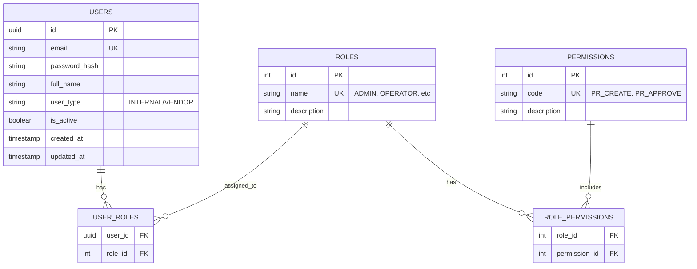

# Database Schema: Auth Service
**Database Name:** `auth_db`

## 1. ER Diagram

## 2. Table Definitions

### 2.1 Users (`users`)
Main identity table for all actors in the system.

| Column | Type | Constraints | Description |
|:---|:---|:---|:---|
| `id` | UUID | PK, Default UUID | Unique Identifier |
| `email` | VARCHAR(100) | UK, Not Null | Login Email |
| `password_hash` | VARCHAR(255) | Not Null | BCrypt Encrypted Password |
| `full_name` | VARCHAR(100) | Not Null | Display Name |
| `user_type` | VARCHAR(20) | Not Null | `INTERNAL` or `VENDOR` |
| `vendor_id` | UUID | Nullable | Link to Vendor Profile (if VENDOR) |
| `is_active` | BOOLEAN | Default TRUE | Soft Delete / Ban status |

### 2.2 Roles (`roles`)
Pre-defined roles based on the business requirements.

| ID | Name | Description |
|:---|:---|:---|
| 1 | `ADMIN` | System Administrator |
| 2 | `OPERATOR` | Procurement Staff (Create PR, PO) |
| 3 | `SUPERVISOR` | Approver (Dept Head, Manager) |
| 4 | `FINANCE` | Finance Staff (Invoice, Payment) |
| 5 | `VENDOR` | External Vendor User |

### 2.3 Permissions (`permissions`)
Granular capabilities assigned to roles.

| Code | Description | Assigned To |
|:---|:---|:---|
| `PR_CREATE` | Create Purchase Requisition | OPERATOR |
| `PR_APPROVE` | Approve/Reject PR | SUPERVISOR |
| `PO_CREATE` | Convert PR to PO | OPERATOR |
| `INVOICE_READ` | View Invoices | FINANCE, OPERATOR |
| `INVOICE_Create` | Submit Invoice | VENDOR |

## 3. Redis Structures

### 3.1 Refresh Tokens
*   **Key:** `auth:refresh_token:{email}`
*   **Value:** `{refreshTokenString}`
*   **TTL:** 7 Days

### 3.2 Blacklist (Optional)
*   **Key:** `auth:blacklist:{jti}`
*   **Value:** `true`
*   **TTL:** Remaining Token Expiry
