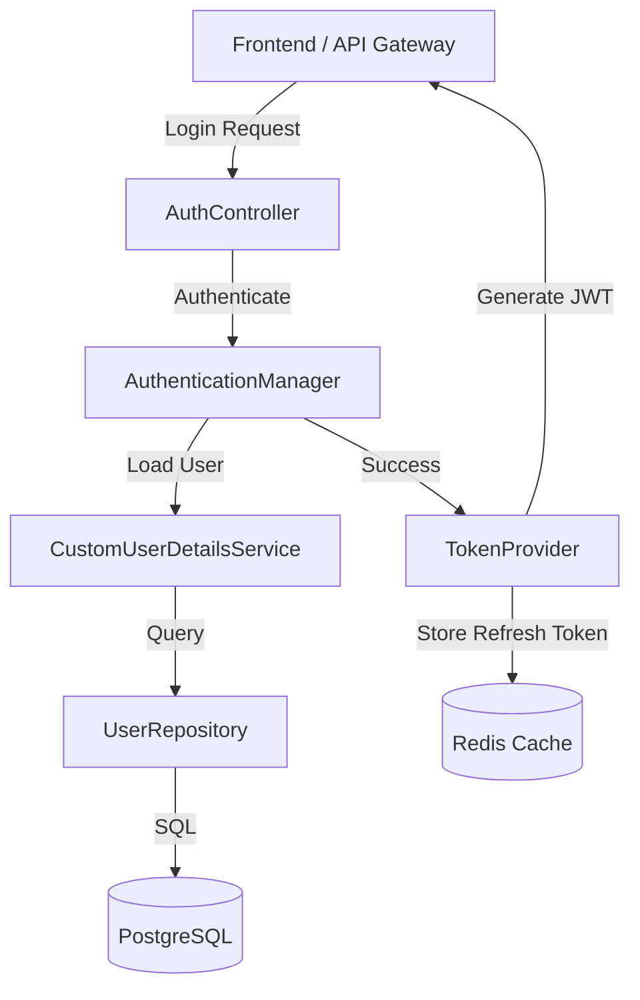

# Auth Service (Authentication & Authorization)
**Package:** `com.eproc.auth` | **Port:** `8081`

## 1. Overview
The **Auth Service** is the central security authority for the Nexus Procura ERP system. It handles identity management, authentication, and authorization for all user types (Internal Staff and External Vendors).

### Key Responsibilities
*   **Identity Management:** Managing lifecycle of `User`, `Role`, and `Permission`.
*   **Authentication:** Validating credentials (Email/Password) and issuing JWT Tokens.
*   **Authorization:** Enforcing Role-Based Access Control (RBAC).
*   **Session Management:** Handling Refresh Tokens and Logout.
*   **Audit Logging:** Recording all security events (Login Success/Fail, Password Change).

## 2. Technology Stack
*   **Framework:** Spring Boot 4.0.0
*   **Security:** Spring Security 6.x (OAuth2 Resource Server)
*   **Token:** JJWT (Java JWT) for RS256 signing.
*   **Database:** PostgreSQL (`auth_db`)
*   **Cache:** Redis (for storing Refresh Tokens & Blacklist)
*   **Messaging:** Kafka (publishing `USER_CREATED`, `LOGIN_EVENT`)

## 3. Architecture
The service follows a standard controller-service-repository pattern but integrates deeply with Spring Security filters.

## 4. Security Flow
1.  **Login:** User sends credentials -> Service validates -> Returns `AccessToken` (15 min) & `RefreshToken` (7 days).
2.  **Access Resource:** Client sends `Authorization: Bearer <AccessToken>` -> Gateway validates signature -> Forwards request.
3.  **Refresh:** Client sends `RefreshToken` -> Service validates against Redis -> Issues new `AccessToken`.
