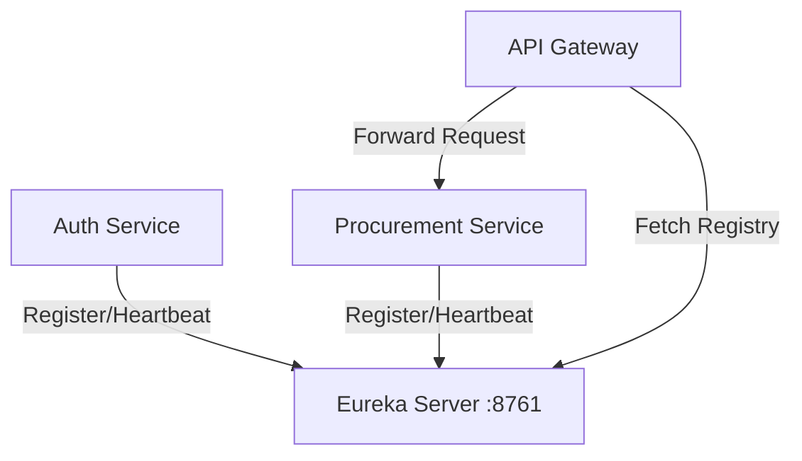

# Service Discovery (Eureka Server)
**Package:** `com.eproc.discovery` | **Port:** `8761`

## 1. Overview
The **Service Discovery** module acts as the central registry for all microservices in the Nexus Procura ecosystem. It allows services to find and communicate with each other dynamically without hardcoded IP addresses.

### Key Responsibilities
*   **Service Registry:** Maintain a live list of available service instances.
*   **Health Monitoring:** Receive heartbeats from services to ensure availability.
*   **Load Balancing Support:** Client-side load balancers (like in API Gateway) query Eureka to get available instances.

## 2. Technology Stack
*   **Framework:** Spring Boot 4.0.0
*   **Core:** Spring Cloud Netflix Eureka Server
*   **Monitoring:** Spring Boot Actuator

## 3. Architecture

## 4. Configuration Requirements
*   **Self-Preservation Mode:** Enabled by default in Prod to prevent mass deregistration during network glitches.
*   **Standalone Mode:** For this deployment, Eureka runs as a standalone instance (not clustered), so it does not register with itself.

## 5. Deployment
*   **Docker Image:** `eproc/service-discovery:latest`
*   **Health Check:** `http://localhost:8761/actuator/health`
