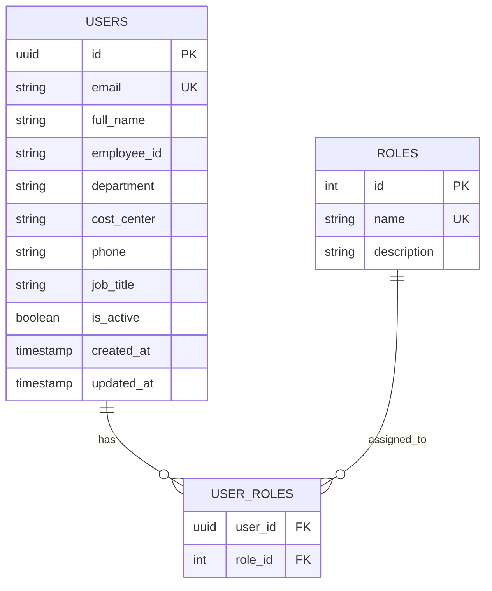

# Database Schema: User Service
**Database Name:** `user_db`

## 1. ER Diagram

## 2. Table Definitions

### 2.1 Users (`users`)
Detailed profile information. Note: No passwords here.

| Column | Type | Constraints | Description |
|:---|:---|:---|:---|
| `id` | UUID | PK | Shared UUID with Auth Service |
| `email` | VARCHAR(100) | UK, Not Null | Business Email |
| `full_name` | VARCHAR(100) | Not Null | User's Name |
| `employee_id` | VARCHAR(50) | Nullable | NIK / Employee Number |
| `department` | VARCHAR(50) | Not Null | e.g., "IT", "Finance" |
| `cost_center` | VARCHAR(20) | Nullable | For budget allocation |
| `job_title` | VARCHAR(100) | Nullable | e.g., "Senior Manager" |
| `is_active` | BOOLEAN | Default TRUE | - |

### 2.2 Roles (`roles`)
Mirrors the roles in Auth Service for reference/checking.

| ID | Name | Description |
|:---|:---|:---|
| 1 | `ADMIN` | System Administrator |
| 2 | `OPERATOR` | Procurement Staff |
| 3 | `SUPERVISOR` | Approver |
| 4 | `FINANCE` | Finance Staff |
| 5 | `VENDOR` | External Vendor |
