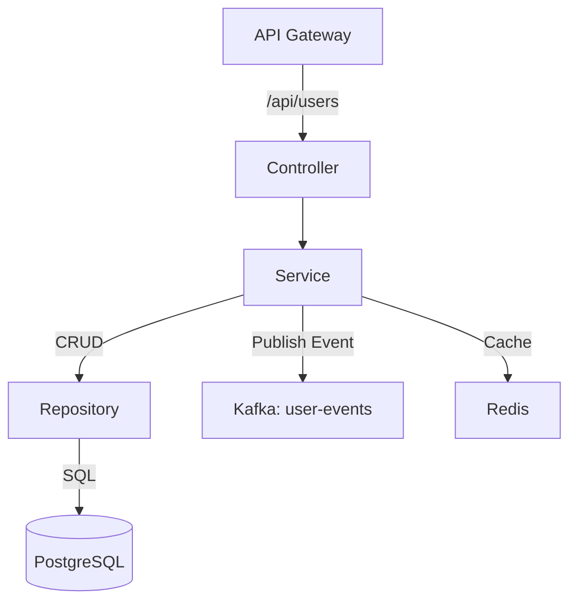

# User Service
**Package:** `com.eproc.user` | **Port:** `8082`

## 1. Overview
The **User Service** is responsible for managing user profiles, role assignments, and organizational hierarchy. It serves as the source of truth for user data (excluding authentication credentials, which are handled by Auth Service).

### Key Responsibilities
*   **User Management:** CRUD operations for Internal and Vendor users.
*   **Role Management:** Assigning Roles and Permissions to users.
*   **Profile Management:** Handling user details (Department, Cost Center).
*   **Synchronization:** Publishing `USER_CREATED` and `USER_UPDATED` events.

## 2. Technology Stack
*   **Framework:** Spring Boot 4.0.0
*   **Database:** PostgreSQL (`user_db`)
*   **Event Bus:** Kafka (Producer for user events)
*   **Cache:** Redis (Caching user profiles)

## 3. Architecture

## 4. Interaction with Other Services
*   **Auth Service:** User Service does **NOT** store passwords. When a user is created here, it may trigger an event or API call to Auth Service to generate credentials (or vice-versa, depending on flow). In this architecture, we assume Auth Service manages credentials, and User Service manages profile data.
*   **Procurement Service:** Uses User Service to validate requester details (Department, Budget Authority).
