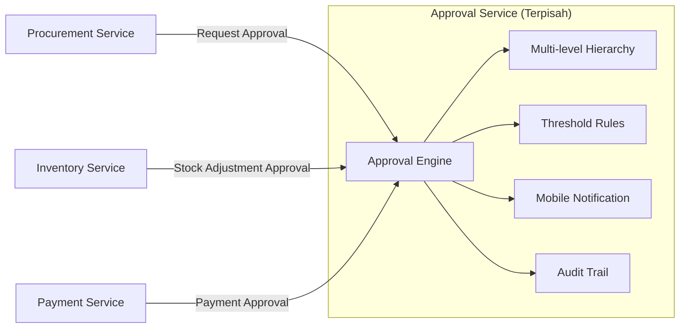
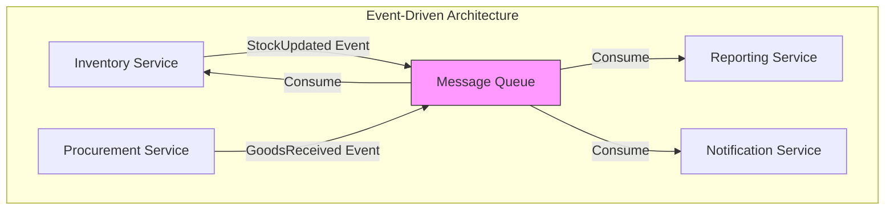
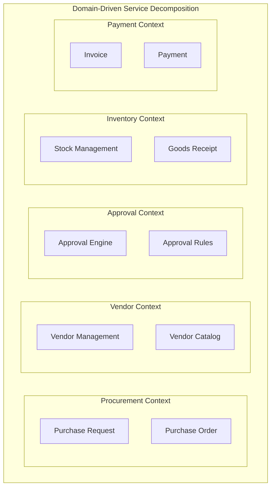
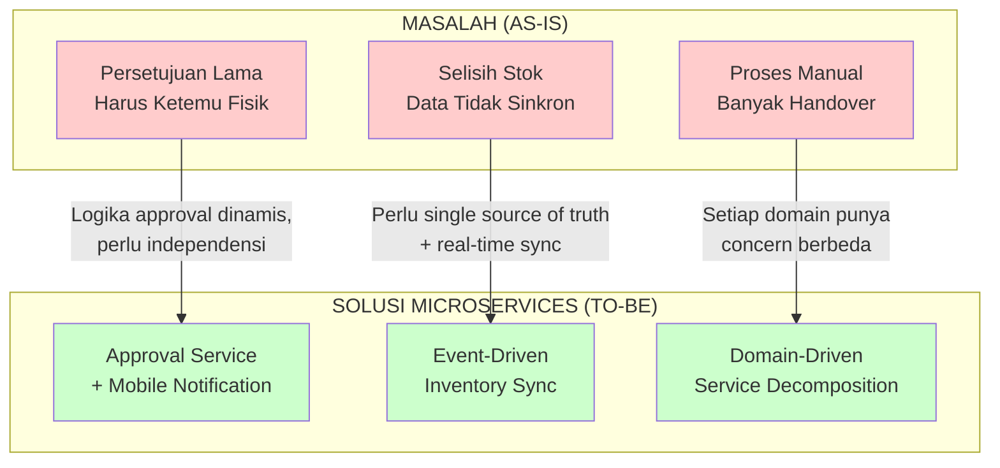

# Analisis Gap: Masalah User → Solusi Microservices
## Untuk Penulisan Latar Belakang Masalah (BAB I)

---

## Identifikasi Masalah User (Hasil Wawancara)

| # | Keluhan User | Kategori |
|---|--------------|----------|
| 1 | Proses manual yang ribet | Process Inefficiency |
| 2 | Sering selisih stok | Data Inconsistency |
| 3 | Persetujuan lama karena harus ketemu fisik | Approval Bottleneck |

---

## Gap Analysis: Masalah → Solusi Microservices

### 1. 📋 Persetujuan Lama & Ketergantungan Fisik → **Approval Service Terpisah**

#### Kondisi Saat Ini (AS-IS)
```
😓 MASALAH:
• Persetujuan harus dilakukan secara tatap muka
• Pejabat yang berwenang sering tidak di tempat (meeting, dinas luar)
• Dokumen fisik harus "keliling" dari meja ke meja
• Tidak ada tracking status persetujuan
• Approval terhambat = seluruh proses pengadaan tertunda
```

#### Akar Masalah yang Ditemukan
```
🔍 ROOT CAUSE ANALYSIS:
1. Proses approval bergantung pada kehadiran fisik
2. Tidak ada sistem notifikasi untuk approver
3. Threshold approval berubah-ubah sesuai kebijakan manajemen
4. Hierarki approval berbeda per jenis pengadaan (barang vs jasa)
5. Tidak ada audit trail siapa approve kapan
```

#### Solusi Microservices (TO-BE)

> **"Karena logika approval sangat dinamis dan sering berubah sesuai kebijakan manajemen, membungkusnya dalam service terpisah (`Approval Service`) memungkinkan modifikasi flow approval tanpa mengganggu service lain seperti `Procurement Service` atau `Inventory Service`."**



#### Justifikasi Arsitektur

| Aspek | Monolithic | Microservices |
|-------|------------|---------------|
| **Perubahan threshold** | Rebuild & deploy seluruh sistem | Deploy `Approval Service` saja |
| **Tambah level approval** | Testing regresi penuh | Testing terisolasi |
| **Integrasi mobile** | Kompleks, coupled | API-first, loosely coupled |
| **Kegagalan approval** | Sistem pengadaan down | Service lain tetap jalan |

#### Narasi untuk Latar Belakang

> *"Masalah persetujuan yang memerlukan kehadiran fisik dapat diatasi dengan membangun Approval Service yang terpisah. Arsitektur microservices memungkinkan service ini beroperasi secara independen, menyediakan approval digital melalui notifikasi mobile, dan memiliki fleksibilitas untuk mengubah aturan threshold atau hierarki approval tanpa mempengaruhi modul pengadaan atau inventori. Pemisahan ini juga memudahkan audit trail yang terstruktur untuk keperluan compliance internal."*

---

### 2. 📦 Selisih Stok & Data Tidak Konsisten → **Event-Driven Inventory Synchronization**

#### Kondisi Saat Ini (AS-IS)
```
😓 MASALAH:
• Data stok di gudang berbeda dengan catatan admin
• Update stok dilakukan manual di Excel/buku
• Tidak ada pencatatan real-time saat barang masuk/keluar
• Ketika audit, harus stock opname manual
• Selisih stok menyebabkan pembelian ganda atau shortage
```

#### Akar Masalah yang Ditemukan
```
🔍 ROOT CAUSE ANALYSIS:
1. Tidak ada single source of truth untuk data inventori
2. Update data terjadi di multiple tempat (gudang, admin, finance)
3. Tidak ada sinkronisasi antar bagian
4. Human error dalam pencatatan manual
5. Tidak ada history/log perubahan stok
```

#### Solusi Microservices (TO-BE)

> **"Masalah selisih stok terjadi karena tidak adanya sinkronisasi data antar bagian. Dengan arsitektur microservices yang event-driven, setiap perubahan stok di `Inventory Service` akan meng-emit event yang dikonsumsi oleh `Procurement Service` dan `Reporting Service` secara real-time, menjamin konsistensi data across services."**



#### Skenario Sinkronisasi

```
📋 FLOW: Barang Diterima dari Vendor

1. Gudang scan barcode barang masuk
2. Inventory Service update stok +100 unit
3. Event "StockUpdated" dipublish ke Message Queue
4. Procurement Service consume → Update status PO menjadi "Received"
5. Reporting Service consume → Update dashboard stok real-time
6. Notification Service consume → Notify admin dan finance

HASIL: Semua bagian melihat data yang sama, real-time
```

#### Justifikasi Arsitektur

| Aspek | Manual/Excel | Monolithic | Microservices + Event |
|-------|--------------|------------|----------------------|
| **Konsistensi data** | ❌ Sering selisih | ⚠️ Tightly coupled | ✅ Eventually consistent |
| **Real-time update** | ❌ Tidak ada | ⚠️ Synchronous call | ✅ Async event streaming |
| **Audit trail** | ❌ Manual | ⚠️ Single DB | ✅ Event log sebagai history |
| **Scalability** | ❌ N/A | ⚠️ Scale semua | ✅ Scale Inventory saja |

#### Narasi untuk Latar Belakang

> *"Permasalahan selisih stok yang kerap terjadi disebabkan oleh tidak tersinkronisasinya data antara bagian gudang, administrasi, dan keuangan. Arsitektur microservices dengan pendekatan event-driven architecture memungkinkan Inventory Service menjadi single source of truth yang meng-emit event setiap kali terjadi perubahan stok. Event ini dikonsumsi oleh service lain secara asinkron, memastikan konsistensi data tanpa coupling yang ketat. Pemisahan ini juga memungkinkan pencatatan history perubahan stok yang lengkap untuk kebutuhan audit."*

---

### 3. 📝 Proses Manual yang Ribet → **Service Decomposition by Business Domain**

#### Kondisi Saat Ini (AS-IS)
```
😓 MASALAH:
• Satu proses pengadaan melibatkan banyak bagian (user, admin, gudang, finance)
• Setiap bagian punya "cara kerja" dan "form" sendiri
• Handover antar bagian tidak terstandar
• Satu orang sakit/cuti = proses terhambat
• Tidak ada visibility status proses saat ini
```

#### Akar Masalah yang Ditemukan
```
🔍 ROOT CAUSE ANALYSIS:
1. Proses bisnis tidak terstruktur dan terdokumentasi
2. Setiap bagian bekerja dalam silo
3. Tidak ada workflow engine yang mengatur alur
4. Ketergantungan pada expertise individual
5. Tidak ada dashboard untuk monitoring progress
```

#### Solusi Microservices (TO-BE)

> **"Proses pengadaan yang melibatkan banyak stakeholder dengan concern berbeda (user request, vendor management, approval, payment) secara natural dapat dipetakan ke dalam bounded contexts yang menjadi service terpisah. Dengan demikian, setiap domain bisnis dapat berevolusi secara independen tanpa mengganggu domain lain."**



#### Mapping Masalah ke Service

| Bagian/Stakeholder | Concern | Microservice |
|--------------------|---------|--------------|
| User (Requestor) | Membuat permintaan barang | `Procurement Service` |
| Admin Pengadaan | Kelola vendor, negosiasi | `Vendor Service` |
| Pejabat | Approval berjenjang | `Approval Service` |
| Gudang | Terima barang, update stok | `Inventory Service` |
| Finance | Pembayaran, invoice | `Payment Service` |
| Management | Laporan, monitoring | `Reporting Service` |

#### Justifikasi Arsitektur

| Aspek | Proses Manual | Microservices |
|-------|---------------|---------------|
| **Handover antar bagian** | Paper-based, tidak terstandar | API contract yang jelas |
| **Visibility status** | Harus tanya langsung | Dashboard real-time |
| **Ketergantungan individu** | Tinggi (tacit knowledge) | Rendah (logic in code) |
| **Perubahan proses** | Sulit, resistance tinggi | Modular, incremental change |
| **Parallel work** | Sulit koordinasi | Service independen |

#### Narasi untuk Latar Belakang

> *"Proses manual yang melibatkan banyak stakeholder dengan peran berbeda menciptakan silo informasi dan ketergantungan pada individu tertentu. Dengan menerapkan prinsip Domain-Driven Design pada arsitektur microservices, setiap bounded context bisnis—seperti pengadaan, vendor, approval, dan inventory—dienkapsulasi dalam service terpisah dengan API contract yang jelas. Hal ini menstandarisasi handover antar bagian, memberikan visibility terhadap status proses melalui dashboard terpusat, dan memungkinkan setiap domain berevolusi secara independen sesuai kebutuhan masing-masing stakeholder."*

---

## Rangkuman untuk Penulisan BAB I

### Template Paragraf Latar Belakang

```markdown
PT XYZ saat ini menghadapi beberapa permasalahan dalam proses pengadaan barang
dan jasa internal. Berdasarkan hasil wawancara dengan stakeholder terkait,
ditemukan tiga masalah utama: (1) proses yang masih manual dan rumit,
(2) sering terjadinya selisih stok, dan (3) proses persetujuan yang lama
karena memerlukan kehadiran fisik pejabat berwenang.

[PARAGRAF MASALAH 1 - APPROVAL]
Proses persetujuan yang memerlukan kehadiran fisik menyebabkan bottleneck
dalam alur pengadaan. Pejabat yang berwenang sering tidak berada di tempat
karena rapat atau dinas luar, sehingga dokumen pengadaan menumpuk menunggu
tanda tangan. Kondisi ini diperparah dengan aturan threshold approval yang
sering berubah sesuai kebijakan manajemen...

[PARAGRAF MASALAH 2 - STOK]
Permasalahan selisih stok terjadi karena pencatatan yang dilakukan secara
manual dan tidak tersinkronisasi antar bagian. Data stok yang dimiliki gudang
berbeda dengan catatan administrasi, menyebabkan pengadaan ganda atau shortage
yang mengganggu operasional...

[PARAGRAF MASALAH 3 - MANUAL]
Proses pengadaan yang melibatkan banyak pihak—dari user yang membuat permintaan,
admin yang mengelola vendor, pejabat yang menyetujui, hingga finance yang
memproses pembayaran—berjalan dalam silo yang tidak terintegrasi...

[PARAGRAF SOLUSI - JUSTIFIKASI MICROSERVICES]
Berdasarkan karakteristik permasalahan tersebut, penelitian ini mengusulkan
pembangunan sistem e-Procurement menggunakan arsitektur microservices.
Arsitektur ini dipilih karena tiga alasan utama:

Pertama, logika approval yang dinamis dan sering berubah dapat dienkapsulasi
dalam Approval Service terpisah, memungkinkan modifikasi tanpa mengganggu
modul lain.

Kedua, pendekatan event-driven pada arsitektur microservices memungkinkan
sinkronisasi data stok secara real-time antar service, mengatasi masalah
inkonsistensi data.

Ketiga, dekomposisi berdasarkan domain bisnis memungkinkan setiap bounded
context—pengadaan, vendor, approval, inventory—berevolusi secara independen,
mengurangi ketergantungan antar bagian dan memberikan visibility status proses
melalui dashboard terpusat.
```

---

## Diagram Ringkas untuk Skripsi



---

## Quick Reference: Masalah → Microservices Benefit

| Masalah User | Akar Masalah | Microservices Solution | Keuntungan |
|--------------|--------------|------------------------|------------|
| **Persetujuan lama** | Approval tightly coupled dengan kehadiran fisik | Approval Service + Notification Service | Independent deployment, mobile approval |
| **Selisih stok** | Data tidak sinkron antar bagian | Event-driven architecture | Eventually consistent, audit trail |
| **Proses manual ribet** | Silo antar bagian, handover tidak standard | Domain-driven decomposition | API contract jelas, dashboard terpusat |

---

> 💡 **Tip Sidang**: Ketika dosen bertanya "Kenapa microservices?", mulai dari MASALAH USER, bukan dari fitur arsitektur. Tunjukkan bahwa arsitektur adalah SOLUSI dari masalah yang ditemukan, bukan arsitektur yang dicari-carikan masalahnya.
