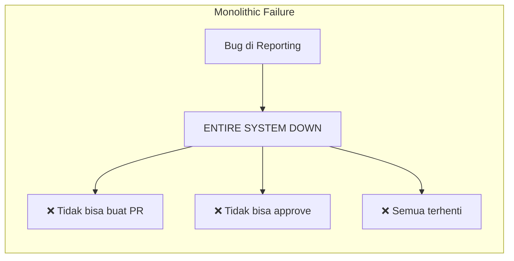
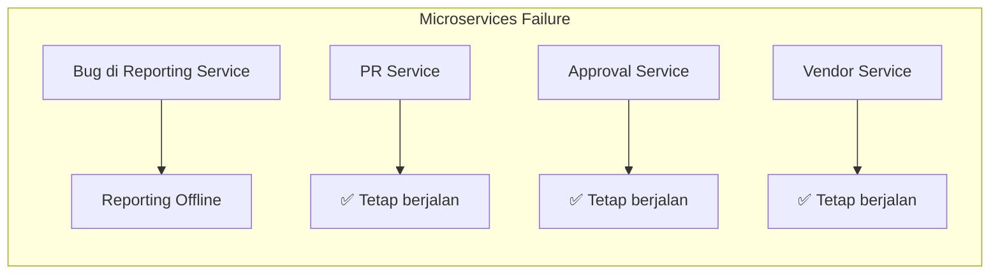

# Justifikasi Penggunaan Arsitektur Microservices
## Sistem Internal Pengadaan Barang dan Jasa PT XYZ

> **Dokumen ini menjawab kritik bahwa arsitektur Microservices adalah "over-engineered" untuk sistem internal dengan fokus pada Non-Functional Requirements (NFR) yang relevan.**

---

## Konteks Masalah

| Kritik Dosen Pembimbing | Realitas Lapangan |
|-------------------------|-------------------|
| Sistem internal = tidak perlu kompleks | User mengeluh proses manual yang ribet |
| Tidak ada keluhan traffic tinggi | Tidak ada data kinerja sistem karena belum ada sistem |
| Over-engineered | Perlu perspektif jangka panjang |

**Key Insight**: Ketiadaan keluhan tentang "server down" atau "traffic tinggi" adalah **karena belum ada sistem**, bukan karena kebutuhan tersebut tidak ada. Justifikasi harus difokuskan pada NFR yang menjawab masalah **proses bisnis** yang ribet.

---

## 3 Argumen Teknis (Non-Functional Requirements)

---

### 1. 🔧 **Maintainability & Independent Deployability**
> *"Kemudahan pemeliharaan dan deployment independen untuk sistem jangka panjang"*

#### Definisi NFR
| Atribut | Spesifikasi |
|---------|-------------|
| **ISO 25010** | Maintainability (Modularity, Modifiability, Testability) |
| **Target Metric** | Mean Time to Deploy (MTTD) < 1 jam per service |
| **Konteks Procurement** | Perubahan regulasi internal, update approval workflow |

#### Mengapa Relevan untuk Sistem Internal?

```
📌 FAKTA PROCUREMENT:
Proses pengadaan sangat dinamis - kebijakan internal berubah sesuai:
• Perubahan struktur organisasi (rotasi jabatan approver)
• Update threshold approval berdasarkan nilai pengadaan
• Penambahan vendor baru dengan requirement berbeda
• Audit internal yang membutuhkan logging baru
```

#### Perbandingan Arsitektur

| Skenario Perubahan | Monolithic | Microservices |
|--------------------|------------|---------------|
| Update approval workflow | Deploy ulang seluruh sistem | Deploy hanya `approval-service` |
| Tambah integrasi vendor baru | Testing regresi penuh | Testing terisolasi pada `vendor-service` |
| Perbaikan bug di payment | Downtime seluruh sistem | Zero downtime, rolling update |
| Perubahan format laporan | Full rebuild | Update `reporting-service` saja |

#### Bukti Literatur
> *"Microservices enable independent deployability, which is crucial for systems that require frequent updates without affecting other parts of the application."*
> — **Newman, S. (2021). Building Microservices, 2nd Edition. O'Reilly Media.**

#### Argumen Kunci
```
✅ Sistem procurement PASTI akan berubah seiring waktu
✅ Perubahan kebijakan internal = perubahan kode yang frequent
✅ Microservices memungkinkan update tanpa mengganggu modul lain
✅ Mengurangi risiko deployment = mengurangi resistance adopsi user
```

---

### 2. 🛡️ **Fault Isolation & System Resilience**
> *"Isolasi kegagalan untuk menjaga kontinuitas operasional pengadaan"*

#### Definisi NFR
| Atribut | Spesifikasi |
|---------|-------------|
| **ISO 25010** | Reliability (Fault Tolerance, Recoverability) |
| **Target Metric** | Single service failure tidak menyebabkan total system outage |
| **Konteks Procurement** | Proses pengadaan tetap berjalan meski ada gangguan partial |

#### Mengapa Relevan untuk Sistem Internal?

```
📌 CRITICAL BUSINESS PROCESS:
Procurement adalah proses bisnis kritikal:
• Keterlambatan pembelian = terhambatnya operasional
• Approval yang tertunda = opportunity cost
• Data vendor yang tidak accessible = potential fraud risk
```

#### Skenario Fault Isolation





#### Business Impact Analysis

| Komponen Gagal | Dampak Monolithic | Dampak Microservices |
|----------------|-------------------|----------------------|
| Modul Reporting | Total downtime | Hanya laporan tidak tersedia |
| Modul Notification | Total downtime | PR/PO tetap bisa diproses |
| Modul Vendor | Total downtime | Transaksi dengan vendor existing tetap jalan |
| Database Connection Pool | Crash propagation | Circuit breaker mencegah cascade failure |

#### Bukti Literatur
> *"In a microservices architecture, the failure of one service does not necessarily bring down the entire system. This is critical for business-critical applications where uptime is essential."*
> — **Richardson, C. (2018). Microservices Patterns. Manning Publications.**

#### Argumen Kunci
```
✅ Procurement adalah proses bisnis kritikal yang tidak boleh terhenti
✅ Monolithic = single point of failure
✅ Microservices = graceful degradation
✅ User bisa tetap bekerja meski ada partial failure
```

---

### 3. 📈 **Scalability by Business Domain**
> *"Skalabilitas berdasarkan domain bisnis, bukan prediksi traffic"*

#### Definisi NFR
| Atribut | Spesifikasi |
|---------|-------------|
| **ISO 25010** | Performance Efficiency (Scalability) |
| **Target Metric** | Kemampuan scale horizontal per service |
| **Konteks Procurement** | Beban kerja berbeda per modul berdasarkan siklus bisnis |

#### Mengapa Relevan untuk Sistem Internal?

```
📌 PROCUREMENT MEMILIKI POLA BEBAN TIDAK MERATA:
• Akhir tahun anggaran = lonjakan pembuatan PR/PO
• Periode audit = lonjakan akses reporting
• Tender besar = lonjakan aktivitas vendor management
• Proses approval = bottleneck pada hierarchy approval
```

#### Perbandingan Pola Scaling

| Pendekatan | Cara Scale | Efisiensi Resource |
|------------|------------|-------------------|
| **Monolithic** | Scale seluruh aplikasi | ❌ Wasteful - semua modul ikut scale |
| **Microservices** | Scale service yang butuh saja | ✅ Efisien - hanya bottleneck yang scale |

#### Contoh Kasus Scaling Domain-Specific

```
🗓️ SKENARIO: Akhir Tahun Anggaran (November-Desember)

Kebutuhan: Approval Service sangat sibuk karena banyak PR pending
           Reporting Service perlu generate laporan tahunan

MONOLITHIC:
└── Scale seluruh aplikasi 3x → Biaya server 3x
    └── Vendor Service ikut scale (tidak perlu)
    └── Catalog Service ikut scale (tidak perlu)

MICROSERVICES:
├── Scale Approval Service 3x → Biaya +2 instance
├── Scale Reporting Service 2x → Biaya +1 instance
└── Service lain tetap → Tidak ada biaya tambahan
```

#### Bukti Literatur
> *"Microservices allow scaling of individual components rather than the entire application. This is particularly valuable when different parts of the system have different scalability requirements."*
> — **Fowler, M. & Lewis, J. (2014). Microservices: A Definition of This New Architectural Term. martinfowler.com**

#### Argumen Kunci
```
✅ Scalability bukan hanya soal "traffic tinggi"
✅ Scalability adalah soal EFISIENSI resource
✅ Setiap domain bisnis punya pola beban berbeda
✅ Microservices = scale smart, bukan scale brute-force
```

---

## Ringkasan Argumen

| # | NFR | Relevance untuk Internal System | Counter terhadap "Over-Engineered" |
|---|-----|--------------------------------|-----------------------------------|
| 1 | **Maintainability** | Kebijakan internal PASTI berubah | Investasi jangka panjang, bukan premature optimization |
| 2 | **Fault Isolation** | Procurement = critical process | Downtime = business loss, walaupun internal |
| 3 | **Scalability** | Pola beban tidak merata | Smart scaling = efisiensi biaya, bukan antisipasi traffic |

---

## Framework Argumen untuk Sidang

### Ketika Ditanya: "Kenapa tidak Monolithic saja?"

```
TEMPLATE JAWABAN:

"Pertanyaan yang sangat baik, Pak/Bu. Saya memilih Microservices bukan karena
antisipasi traffic tinggi, melainkan karena 3 alasan:

1. MAINTAINABILITY: Sistem procurement akan terus berevolusi mengikuti
   kebijakan internal. Dengan Microservices, perubahan di satu modul
   tidak memerlukan testing dan deployment seluruh sistem.

2. FAULT ISOLATION: Procurement adalah proses bisnis kritikal. Jika
   menggunakan Monolithic, bug di modul reporting bisa mengganggu
   seluruh proses approval. Dengan Microservices, kegagalan satu
   service tidak berdampak ke service lain.

3. DOMAIN-BASED SCALABILITY: Bukan soal traffic, tapi efisiensi.
   Akhir tahun anggaran, hanya modul approval yang sibuk.
   Dengan Microservices, kita scale yang perlu saja."
```

---

## Referensi Akademis

1. **Newman, S. (2021).** *Building Microservices: Designing Fine-Grained Systems, 2nd Edition.* O'Reilly Media.

2. **Richardson, C. (2018).** *Microservices Patterns: With Examples in Java.* Manning Publications.

3. **Fowler, M. & Lewis, J. (2014).** Microservices: A Definition of This New Architectural Term. Retrieved from https://martinfowler.com/articles/microservices.html

4. **ISO/IEC 25010:2011.** Systems and software engineering — Systems and software Quality Requirements and Evaluation (SQuaRE) — System and software quality models.

5. **Bass, L., Clements, P., & Kazman, R. (2021).** *Software Architecture in Practice, 4th Edition.* Addison-Wesley Professional.

---

> **Catatan**: Dokumen ini dapat digunakan sebagai lampiran atau referensi dalam penulisan BAB II (Tinjauan Pustaka) dan BAB III (Metodologi) untuk memperkuat justifikasi pemilihan arsitektur.
