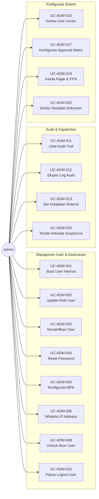
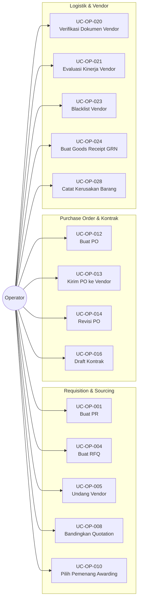
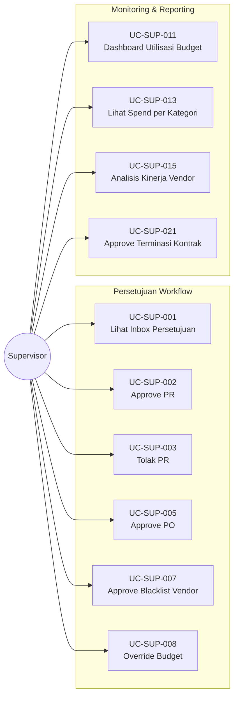
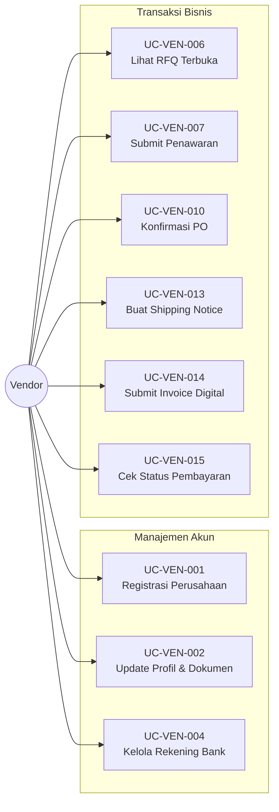
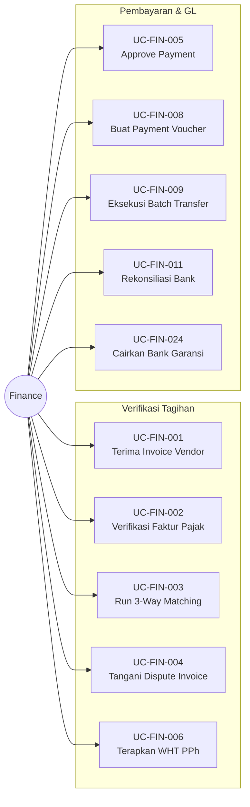

# BAB IV
# ANALISIS DAN PERANCANGAN SISTEM

## 4.1 Analisis Sistem

Pembangunan sistem informasi pengadaan barang dan jasa pada PT XYZ, sebuah perusahaan perbankan swasta di Indonesia, dilakukan berdasarkan hasil analisis mendalam terhadap permasalahan operasional yang terjadi di lingkungan divisi logistik yang tersebar di berbagai Kantor Wilayah (Kanwil) dan Kantor Cabang (Kancab). Sistem ini dikembangkan dengan tujuan utama untuk mentransformasi proses pengadaan manual menjadi ekosistem digital yang efisien, aman, dan terintegrasi.

Sebelum adanya sistem ini, proses pengadaan di PT XYZ berjalan secara terfragmentasi. Pengajuan *Purchase Request* (PR) dilakukan melalui formulir manual yang dikirim via email, menyebabkan *traceability* dokumen menjadi sulit. Operator di kantor pusat harus mengunduh lampiran, melakukan rekapitulasi manual ke dalam *spreadsheet*, dan mengirimkan kembali email untuk persetujuan. Proses ini memiliki kelemahan fatal:
1.  **Risiko Human Error**: Kesalahan input harga atau spesifikasi barang saat rekapitulasi data.
2.  **Keterlambatan Approval**: Dokumen sering tertahan di meja pejabat berwenang tanpa notifikasi otomatis.
3.  **Celah Keamanan**: Vendor mengirimkan penawaran dan tagihan via jalur email publik yang tidak terenkripsi, meningkatkan risiko kebocoran data harga (*Price Leakage*) dan manipulasi dokumen tagihan (*Invoice Fraud*).

Merespons tantangan tersebut, sistem *E-Procurement* ini dirancang menggunakan arsitektur **Microservices** dengan pendekatan keamanan **Zero Trust Network**. Sistem tidak hanya fokus pada fitur fungsional, tetapi juga pada isolasi keamanan melalui pola **DMZ (Demilitarized Zone)**. Layanan yang berinteraksi dengan publik (*Vendor Service*) dipisahkan secara fisik dari layanan inti (*Core Procurement*), di mana komunikasi antar layanan dijembatani oleh teknologi event streaming **Apache Kafka** untuk menjamin konsistensi data secara *real-time* tanpa mengorbankan keamanan.

## 4.2 Lingkup Masalah

Lingkup masalah pada pembangunan sistem ini mencakup seluruh siklus hidup pengadaan (*procurement lifecycle*), mulai dari inisiasi permintaan oleh unit kerja hingga pelunasan pembayaran kepada vendor.

### 4.2.1 Batasan Lingkup Sistem

Sistem ini difokuskan pada pengadaan barang operasional dan jasa rutin (OpEx). Adapun batasan lingkup pengembangannya adalah sebagai berikut:

**A. Proses yang Termasuk dalam Lingkup (In-Scope):**
1.  **Manajemen Pengajuan (Requisition)**: Pembuatan PR (*Purchase Request*) oleh unit kerja dan proses persetujuan digital berjenjang (*Multi-level Approval*).
2.  **Manajemen Katalog & Vendor**: Portal mandiri bagi vendor untuk mengelola profil perusahaan, update katalog produk, dan harga satuan.
3.  **Proses Pemesanan (Ordering)**: Konversi PR menjadi PO (*Purchase Order*) secara otomatis setelah persetujuan.
4.  **Verifikasi & Pembayaran (Settlement)**: Mekanisme *3-Way Matching* (PO vs Goods Receipt vs Invoice) dan verifikasi dokumen tagihan digital.
5.  **Manajemen Inventaris (Inventory)**: Pencatatan mutasi stok (masuk/keluar) di gudang unit kerja akibat transaksi pengadaan.
6.  **Audit & Reporting**: Perekaman jejak audit (*Audit Trail*) untuk setiap aktivitas user dan laporan kinerja vendor (*Vendor Scorecard*).

**B. Proses yang Tidak Termasuk dalam Lingkup (Out-of-Scope):**
1.  **Sistem Kepegawaian (HRIS)**: Pengelolaan data karyawan di luar kebutuhan otorisasi sistem.
2.  **Integrasi Core Banking (GL Posting)**: Sistem tidak melakukan penjurnalan otomatis ke buku besar (*General Ledger*) SAP/Core Banking demi alasan keamanan dan kompleksitas skripsi.
3.  **Logistik Ekspedisi**: Manajemen armada pengiriman dan rute distribusi fisik barang.
4.  **Tanda Tangan Elektronik (Digital Signature)**: Fitur tanda tangan digital tersertifikasi (e.g., PrivyID) dianggap di luar lingkup, digantikan oleh persetujuan sistem (*System Approval Log*).

### 4.2.2 Lingkup Pengguna dan Peran (Actors)

Sistem dirancang untuk melayani lima kategori pengguna utama dengan matriks akses berbasis peran (*Role-Based Access Control* / RBAC):

**1. Admin (System Administrator)**
Bertindak sebagai "Super User" yang bertanggung jawab atas konfigurasi teknis, manajemen user, dan keamanan sistem.

**2. Operator (Unit Kerja/Cabang)**
Pengguna operasional yang menjadi inisiator transaksi, bertanggung jawab atas pembuatan PR, penerimaan barang, dan manajemen inventaris.

**3. Supervisor (Pejabat Pemutus)**
Pengguna level manajerial yang berfungsi sebagai *gatekeeper* anggaran, menyetujui pengajuan, dan memantau kinerja pengadaan.

**4. Vendor (Mitra Eksternal)**
Pengguna eksternal di zona DMZ yang melakukan interaksi bisnis seperti penawaran harga dan penagihan.

**5. Finance (Divisi Keuangan)**
Pengguna yang bertugas sebagai validator akhir dokumen tagihan dan pelaksana pembayaran.

## 4.3 Perspektif Produk

Sistem ini dikembangkan sebagai solusi *Enterprise Web Application* dengan karakteristik "Secure, Scalable, & Responsive". Secara arsitektural, sistem ini mengadopsi pola **Microservices** untuk memecah kompleksitas logika bisnis menjadi 9 layanan otonom. Interaksi antar komponen menggunakan protokol REST API untuk sinkron dan Apache Kafka untuk asinkron, memastikan ketahanan sistem tinggi.

## 4.4 Fungsi Produk & Use Case

### 4.4.1 Diagram Use Case

Berikut adalah penjabaran interaksi aktor dengan sistem yang digambarkan melalui Diagram Use Case per aktor.

#### A. Diagram Use Case Admin
Aktor Admin bertanggung jawab atas keamanan, konfigurasi, dan manajemen master data.

#### B. Diagram Use Case Operator
Aktor Operator fokus pada operasional pengadaan sehari-hari (PR, PO) dan logistik.

#### C. Diagram Use Case Supervisor
Aktor Supervisor memegang peran otorisasi dan pengawasan.

#### D. Diagram Use Case Vendor
Aktor Vendor mengakses sistem melalui zona aman DMZ.

#### E. Diagram Use Case Finance
Aktor Finance melakukan 3-way matching dan eksekusi pembayaran.

### 4.4.2 Klasifikasi Layanan Mikro (Microservices)

Perancangan arsitektur perangkat lunak dalam penelitian ini didasarkan pada prinsip *Separation of Concerns* untuk memitigasi risiko kegagalan tunggal (*Single Point of Failure*) yang sering ditemukan pada sistem monolitik. Mengacu pada kebutuhan akan isolasi keamanan yang ketat antara layanan publik (Vendor) dan layanan internal (Procurement/Finance), arsitektur *Microservices* dipilih sebagai landasan pengembangan sistem. Pendekatan ini memungkinkan setiap komponen layanan dikembangkan, diterapkan (*deployed*), dan diskalakan secara independen sesuai dengan beban kerja spesifik masing-masing domain bisnis.

Sistem e-Procurement ini dibangun di atas arsitektur Microservices yang terdekomposisi menjadi 9 layanan otonom. Setiap layanan memiliki tanggung jawab tunggal (*Single Responsibility*) dan basis data terpisah untuk menjamin loose coupling. Berikut adalah penjelasan mendetail mengenai fungsi dan tanggung jawab masing-masing layanan:

#### 1. Auth Service (Service-01)
Layanan ini berfungsi sebagai gerbang keamanan utama sistem yang menangani Identitas dan Akses Manajemen (IAM).
*   **Fungsi Utama**:
    *   **Authentication**: Memvalidasi kredensial pengguna (Internal & Eksternal) dan menerbitkan token akses berbasis **JWT (JSON Web Token)**.
    *   **Authorization**: Menegakkan kontrol akses berbasis peran (*Role-Based Access Control*), memastikan user hanya dapat mengakses API yang diizinkan sesuai role-nya (misal: Vendor tidak bisa akses API Approval).
    *   **Session Management**: Mengelola masa aktif sesi dan menangani mekanisme *Force Logout* jika terdeteksi anomali.

#### 2. Admin Service (Service-02)
Bertanggung jawab sebagai pusat konfigurasi sistem dan pengelolaan data referensi global.
*   **Fungsi Utama**:
    *   **Master Data Management**: Mengelola data statis yang digunakan lintas modul, seperti Kategori Barang, Satuan Unit (UoM), Lokasi Kantor, dan Mata Uang.
    *   **Workflow Configuration**: Menyediakan antarmuka dinamis untuk mengatur matriks approval (misal: "Pengadaan > 500 Juta harus disetujui Direktur").
    *   **System Parameter**: Mengatur variabel global sistem seperti PPN Rate, Batas Waktu SLA, dan Kebijakan Retensi Data.

#### 3. Vendor Service (Service-03)
Layanan ini ditempatkan secara khusus di zona **DMZ (Demilitarized Zone)** sebagai satu-satunya *entry point* bagi pengguna eksternal (Vendor). Isolasi ini melindungi jaringan internal bank dari akses publik langsung.
*   **Fungsi Utama**:
    *   **Vendor Portal**: Menyediakan API publik untuk pendaftaran vendor, update profil perusahaan, dan upload dokumen legalitas.
    *   **Katalog Manajemen**: Memungkinkan vendor mengelola harga dan stok produk mereka secara mandiri.
    *   **Document Submission**: Menangani upload aman dokumen penawaran (*Quotation*) dan tagihan (*Invoice*) sebelum diteruskan ke jaringan internal via Message Broker.

#### 4. Procurement Service (Service-04)
Merupakan *Core Service* yang menangani logika bisnis utama pengadaan barang dan jasa.
*   **Fungsi Utama**:
    *   **Requisition Management**: Mengelola siklus hidup *Purchase Request* (PR) dari draft, persetujuan, hingga konversi menjadi PO.
    *   **Sourcing Engine**: Menjalankan logika pemilihan vendor, perbandingan harga (*Price Comparison Matrix*), dan penunjukan pemenang (*Awarding*).
    *   **Order Processing**: Menghasilkan dokumen *Purchase Order* (PO) resmi dan mengelola versi perubahan (*Change Order*) jika terjadi revisi kuantitas atau harga.

#### 5. Inventory Service (Service-05)
Menangani aspek logistik dan pengelolaan fisik barang di berbagai unit kerja.
*   **Fungsi Utama**:
    *   **Stock Recording**: Mencatat setiap pergerakan barang masuk (*Goods Receipt*) dan barang keluar (*Issuance*).
    *   **Stock Opname**: Mendukung proses verifikasi fisik stok berkala dan penyesuaian saldo sistem (*Adjustment*).
    *   **Reorder Point Alert**: Menganalisis tren pemakaian dan memberikan notifikasi otomatis jika stok barang kritis menipis di bawah ambang batas aman.

#### 6. Finance Service (Service-06)
Layanan ini menangani aspek validasi keuangan, perpajakan, dan inisiasi pembayaran.
*   **Fungsi Utama**:
    *   **3-Way Matching**: Menjalankan algoritma validasi otomatis yang membandingkan kecocokan data antara PO (Harga), Goods Receipt (Fisik Diterima), dan Invoice (Tagihan Vendor).
    *   **Tax Calculation**: Menghitung kewajiban pajak (PPN, PPh 23) secara otomatis pada setiap tagihan.
    *   **Payment Tracking**: Memantau status pembayaran dan memperbarui status invoice menjadi *PAID* setelah menerima konfirmasi dari sistem Core Banking.

#### 7. Notification Service (Service-07)
Berfungsi sebagai pusat komunikasi asinkron yang memisahkan logika notifikasi dari logika bisnis utama.
*   **Fungsi Utama**:
    *   **Channel Router**: Mengirimkan pesan melalui berbagai saluran (Email SMTP, Push Notification, atau SMS Gateway).
    *   **Event Listener**: Mendengarkan *event* spesifik dari Kafka (misal: `PR_APPROVED`, `PO_ISSUED`) dan mengubahnya menjadi pesan notifikasi yang *personalisasi* untuk pengguna terkait.

#### 8. Audit Service (Service-08)
Layanan kritis untuk memenuhi standar kepatuhan perbankan (*Auditability*).
*   **Fungsi Utama**:
    *   **Centralized Logging**: Merekam setiap aktivitas perubahan data (*Create, Update, Delete*) dari seluruh layanan mikro ke dalam satu sistem log terpusat yang *immutable*.
    *   **Traceability**: Menyimpan metadata audit lengkap (Siapa, Kapan, Apa, Dari IP Mana) untuk keperluan investigasi forensik atau audit eksternal.

#### 9. Report Service (Service-09)
Layanan khusus untuk kebutuhan analitik dan pelaporan, memisahkan beban kerja OLAP (*On-Line Analytical Processing*) dari beban kerja transaksional (OLTP).
*   **Fungsi Utama**:
    *   **Dashboard Aggregation**: Mengumpulkan data dari berbagai layanan (Procurement, Finance, Vendor) untuk menyajikan dashboard eksekutif *real-time*.
    *   **Performance Analytics**: Menghasilkan laporan kompleks seperti *Vendor Scorecard*, *SLA Compliance Report*, dan *Budget Utilization Monitor*.

## 4.4.3 Rancangan Layanan Auth Service (Service-01)
### 4.4.3.1 Deskripsi Layanan
Auth Service bertanggung jawab penuh atas mekanisme autentikasi dan otorisasi dalam ekosistem sistem. Layanan ini mengimplementasikan protokol OAuth 2.0 dan OpenID Connect untuk manajemen identitas yang aman. Seluruh request API yang masuk harus melalui validasi token pada layanan ini sebelum diteruskan ke layanan bisnis lainnya.

### 4.4.3.2 Entitas Data
Layanan ini mengelola entitas data utama sebagai berikut:
1.  **User**: Menyimpan kredensial (`username`, `password_hash`), profil dasar, dan status akun (`active`, `locked`).
2.  **Role**: Definisi peran pengguna (contoh: `ADMIN`, `OPERATOR`, `VENDOR`) yang menentukan level akses.
3.  **Permission**: Hak akses granular yang dipetakan ke setiap Role (contoh: `PR_CREATE`, `PO_APPROVE`).
4.  **SessionLog**: Mencatat riwayat login, alamat IP, dan token aktif untuk keperluan audit keamanan.

### 4.4.3.3 Detail Use Case
Berikut adalah penjabaran detail use case yang ditangani oleh Auth Service:

**1. UC-ADM-001 Buat User Internal**
| Atribut | Detail |
| :--- | :--- |
| **Nama Use Case** | Buat User Internal |
| **Role** | Admin |
| **Deskripsi** | Membuat akun user internal baru dengan kredensial login awal. |
| **Pre-Kondisi** | Admin login dengan privilege `USER_MANAGEMENT`. |
| **Post-Kondisi** | Akun user dibuat dengan status `PENDING_ACTIVATION`. |
| **Basic Flow** | 1. Admin input detail user (Nama, Email, Departemen). 2. Admin assign Role awal. 3. Sistem validasi email domain. 4. Sistem generate password sementara/link aktivasi. 5. Sistem kirim email enkripsi ke user. |
| **Alternative Flow** | *Bulk Import:* Admin upload file CSV untuk pembuatan massal. |
| **Error Flow** | *Email Exist:* Sistem tolak jika email sudah terdaftar. |

**2. UC-ADM-004 Reset Password**
| Atribut | Detail |
| :--- | :--- |
| **Nama Use Case** | Reset Password User |
| **Role** | Admin |
| **Deskripsi** | Mereset password user secara administratif karena lockout atau lupa. |
| **Pre-Kondisi** | Request valid dari user. |
| **Post-Kondisi** | Status user `MUST_CHANGE_PASSWORD`. |
| **Basic Flow** | 1. Admin pilih user target. 2. Admin klik "Reset Password". 3. Sistem generate password sementara. 4. Admin komunikasikan password ke user via jalur aman. 5. Sistem catat audit log. |
| **Alternative Flow** | - |
| **Error Flow** | - |

**3. UC-ADM-005 Konfigurasi MFA**
| Atribut | Detail |
| :--- | :--- |
| **Nama Use Case** | Konfigurasi MFA |
| **Role** | Admin |
| **Deskripsi** | Mengaktifkan kebijakan Multi-Factor Authentication (WAJIB untuk Finance). |
| **Pre-Kondisi** | Provider MFA terintegrasi. |
| **Post-Kondisi** | Policy keamanan diperbarui. |
| **Basic Flow** | 1. Admin navigasi ke Pengaturan Keamanan. 2. Admin aktifkan "Enforce MFA". 3. Admin pilih scope role (Finance, Supervisor). 4. Admin simpan policy. 5. Sistem enforce MFA pada login berikutnya. |
| **Alternative Flow** | - |
| **Error Flow** | *Provider Down:* Sistem error jika SMS gateway tidak merespons. |

**4. UC-ADM-008 Unlock Akun**
| Atribut | Detail |
| :--- | :--- |
| **Nama Use Case** | Unlock Akun User |
| **Role** | Admin |
| **Deskripsi** | Membuka blokir akun yang terkunci akibat brute force protection. |
| **Pre-Kondisi** | Status user `LOCKED`. |
| **Post-Kondisi** | Status user `ACTIVE`, fail counter reset. |
| **Basic Flow** | 1. Admin temukan user terkunci. 2. Admin verifikasi ini bukan serangan aktual. 3. Admin klik "Unlock Akun". 4. Sistem reset counter login. 5. Sistem notifikasi user. |
| **Alternative Flow** | - |
| **Error Flow** | - |

**5. UC-ADM-010 Paksa Logout**
| Atribut | Detail |
| :--- | :--- |
| **Nama Use Case** | Paksa Logout User |
| **Role** | Admin |
| **Deskripsi** | Menghentikan sesi aktif user secara paksa (Kill Session). |
| **Pre-Kondisi** | User memiliki sesi aktif. |
| **Post-Kondisi** | Token sesi di-revoke. |
| **Basic Flow** | 1. Admin lihat dashboard Sesi Aktif. 2. Admin identifikasi sesi mencurigakan. 3. Admin klik "Paksa Logout". 4. Sistem revoke token (JWT Blacklist). 5. User dipaksa ke halaman login. |
| **Alternative Flow** | - |
| **Error Flow** | - |

## 4.4.4 Rancangan Layanan Admin Service (Service-02)
### 4.4.4.1 Deskripsi Layanan
Admin Service bertindak sebagai pusat konfigurasi sistem. Layanan ini memastikan konsistensi data referensi yang digunakan oleh seluruh layanan mikro lainnya, sehingga perubahan parameter bisnis (seperti tarif pajak atau struktur organisasi) dapat dilakukan secara terpusat tanpa mengubah kode program.

### 4.4.4.2 Entitas Data
Layanan ini mengelola *Master Data* sebagai berikut:
1.  **ItemCategory**: Kategori hierarkis untuk barang dan jasa (contoh: IT Hardware, ATK).
2.  **UoM (Unit of Measure)**: Satuan standar pengukuran (Pcs, Box, Kg).
3.  **OfficeLocation**: Daftar lokasi kantor cabang dan wilayah untuk tujuan pengiriman.
4.  **ApprovalMatrix**: Aturan dinamis yang memetakan batas nominal (`limit_amount`) dengan hierarki jabatan approver.
5.  **SystemConfig**: Tabel *key-value* untuk parameter global (misal: `VAT_RATE = 12%`).

### 4.4.4.3 Detail Use Case
Berikut adalah penjabaran detail use case yang ditangani oleh Admin Service:

**1. UC-ADM-016 Kelola Cost Center**
| Atribut | Detail |
| :--- | :--- |
| **Nama Use Case** | Kelola Departemen/Cost Center |
| **Role** | Admin |
| **Deskripsi** | Setup struktur organisasi dan kode budget. |
| **Pre-Kondisi** | - |
| **Post-Kondisi** | Departemen tersedia untuk PR. |
| **Basic Flow** | 1. Admin buka Master Data Cost Center. 2. Admin input Kode, Nama, dan Budget Owner. 3. Admin mapping ke GL Segment. 4. Admin simpan record. |
| **Alternative Flow** | *Import:* Admin upload struktur dari ERP. |
| **Error Flow** | *Duplikat:* Sistem tolak kode yang sama. |

**2. UC-ADM-017 Konfigurasi Matriks Approval**
| Atribut | Detail |
| :--- | :--- |
| **Nama Use Case** | Konfigurasi Matriks Approval |
| **Role** | Admin |
| **Deskripsi** | Mendefinisikan workflow approval dinamis berdasarkan nominal. |
| **Pre-Kondisi** | Cost Center sudah didefinisikan. |
| **Post-Kondisi** | Logika workflow updated. |
| **Basic Flow** | 1. Admin buat Rule baru (misal: "IT PR > 500 Juta"). 2. Admin set kondisi filter. 3. Admin atur urutan Approver (Manager -> Director). 4. Admin simpan rule. |
| **Alternative Flow** | - |
| **Error Flow** | *Gap Config:* Sistem deteksi range nominal yang tidak tercover rule apapun. |

**3. UC-ADM-019 Kelola Pajak & PPN**
| Atribut | Detail |
| :--- | :--- |
| **Nama Use Case** | Kelola Kode & Tarif Pajak |
| **Role** | Admin |
| **Deskripsi** | Konfigurasi tarif pajak sesuai regulasi (misal update PPN 11% ke 12%). |
| **Pre-Kondisi** | - |
| **Post-Kondisi** | Kalkulasi PO baru gunakan rate baru. |
| **Basic Flow** | 1. Admin edit kode pajak "PPN". 2. Admin ubah nilai rate. 3. Admin set tanggal efektif. 4. Admin simpan. |
| **Alternative Flow** | - |
| **Error Flow** | *Invalid:* Rate di luar 0-100%. |

**4. UC-ADM-022 Kelola Template Dokumen**
| Atribut | Detail |
| :--- | :--- |
| **Nama Use Case** | Kelola Template Dokumen |
| **Role** | Admin |
| **Deskripsi** | Upload dan konfigurasi template HTML untuk cetakan PO/RFQ. |
| **Pre-Kondisi** | Template HTML siap. |
| **Post-Kondisi** | Dokumen tercetak mengikuti format baru. |
| **Basic Flow** | 1. Admin pilih tipe dokumen (PO). 2. Admin upload file template HTML. 3. Admin validasi mapping placeholder. 4. Admin preview output. 5. Admin publish. |
| **Alternative Flow** | - |
| **Error Flow** | *Syntax Error:* Sistem reject jika tag placeholder rusak. |

## 4.4.5 Rancangan Layanan Vendor Service (Service-03)
### 4.4.5.1 Deskripsi Layanan
Vendor Service adalah layanan *public-facing* yang ditempatkan di zona DMZ. Layanan ini memfasilitasi *self-service* bagi mitra kerja untuk berinteraksi dengan sistem pengadaan bank. Fokus utamanya adalah kemudahan penggunaan bagi eksternal namun dengan validasi keamanan input yang ketat.

### 4.4.5.2 Entitas Data
1.  **VendorProfile**: Data perusahaan, NPWP, NIB, dan kontak PIC.
2.  **VendorDocument**: File digital legalitas (SIUP, TDP) dengan masa berlaku.
3.  **CatalogItem**: Produk atau jasa yang ditawarkan vendor beserta harga satuan.
4.  **Quotation**: Penawaran harga yang disubmit merespons RFQ.

### 4.4.5.3 Detail Use Case
Berikut adalah penjabaran detail use case yang ditangani oleh Vendor Service:

**1. UC-VEN-001 Registrasi Perusahaan**
| Atribut | Detail |
| :--- | :--- |
| **Nama Use Case** | Registrasi Perusahaan |
| **Role** | Vendor (Guest) |
| **Deskripsi** | Pendaftaran mandiri calon vendor baru menggunakan token undangan. |
| **Pre-Kondisi** | Token undangan valid dari Buyer. |
| **Post-Kondisi** | Akun Vendor dibuat, status `INCOMPLETE_PROFILE`. |
| **Basic Flow** | 1. Vendor akses link registrasi. 2. Sistem validasi token. 3. Vendor input NPWP dan Password. 4. Vendor setuju Code of Conduct. 5. Vendor submit registrasi. |
| **Alternative Flow** | - |
| **Error Flow** | *Expired Token:* Sistem tolak registrasi jika token kadaluarsa. |

**2. UC-VEN-002 Update Profil & Dokumen**
| Atribut | Detail |
| :--- | :--- |
| **Nama Use Case** | Update Profil & Dokumen |
| **Role** | Vendor |
| **Deskripsi** | Melengkapi data perusahaan dan upload dokumen legalitas (KYC). |
| **Pre-Kondisi** | Login berhasil. |
| **Post-Kondisi** | Profil updated, dokumen status `PENDING_VERIFICATION`. |
| **Basic Flow** | 1. Vendor edit profil perusahaan. 2. Vendor upload dokumen wajib (NIB, SIUP). 3. Vendor input tanggal kadaluarsa dokumen. 4. Vendor simpan perubahan. |
| **Alternative Flow** | - |
| **Error Flow** | *File Size:* Sistem tolak file > 10MB. |

**3. UC-VEN-007 Submit Penawaran Komersial**
| Atribut | Detail |
| :--- | :--- |
| **Nama Use Case** | Submit Penawaran Komersial |
| **Role** | Vendor |
| **Deskripsi** | Mengirimkan harga penawaran untuk tender/RFQ yang diikuti. |
| **Pre-Kondisi** | RFQ dalam status `OPEN`. |
| **Post-Kondisi** | Penawaran tersimpan (terenkripsi hingga closing date). |
| **Basic Flow** | 1. Vendor buka detail RFQ. 2. Vendor input harga satuan per item. 3. Vendor input masa berlaku penawaran. 4. Vendor klik "Submit Quotation". 5. Sistem enkripsi data harga. |
| **Alternative Flow** | *Partial Bid:* Vendor hanya menawar sebagian item (jika diizinkan). |
| **Error Flow** | *Late Submit:* Sistem tolak jika waktu server > closing date. |

**4. UC-VEN-013 Buat Shipping Notice (ASN)**
| Atribut | Detail |
| :--- | :--- |
| **Nama Use Case** | Buat Advance Shipping Notice |
| **Role** | Vendor |
| **Deskripsi** | Memberitahu buyer bahwa barang sedang dikirim (In-Transit). |
| **Pre-Kondisi** | PO sudah di-acknowledge. |
| **Post-Kondisi** | Status PO `IN_TRANSIT`. |
| **Basic Flow** | 1. Vendor pilih PO. 2. Vendor input Nomor Resi/Tracking dan Ekspedisi. 3. Vendor input estimasi tiba (ETA). 4. Vendor submit ASN. |
| **Alternative Flow** | - |
| **Error Flow** | - |

**5. UC-VEN-018 Update Item Katalog**
| Atribut | Detail |
| :--- | :--- |
| **Nama Use Case** | Update Item Katalog |
| **Role** | Vendor |
| **Deskripsi** | Mengelola daftar produk dan harga standar (untuk pembelian non-tender). |
| **Pre-Kondisi** | - |
| **Post-Kondisi** | Item katalog terupdate. |
| **Basic Flow** | 1. Vendor buka Manajemen Katalog. 2. Vendor edit item atau tambah baru. 3. Vendor update Gambar, Deskripsi, dan Harga. 4. Vendor publish item. |
| **Alternative Flow** | *Bulk Upload:* Vendor upload via Excel. |
| **Error Flow** | - |

## 4.4.6 Rancangan Layanan Procurement Service (Service-04)
### 4.4.6.1 Deskripsi Layanan
Procurement Service adalah mesin utama (*core engine*) dari sistem ini. Layanan ini mengorkestrasi seluruh alur kerja pengadaan mulai dari permintaan user hingga penerbitan pesanan pembelian. Layanan ini berkomunikasi intensif dengan Admin Service untuk aturan approval dan Inventory Service untuk data barang.

### 4.4.6.2 Entitas Data
1.  **PurchaseRequest (PR)**: Header dan detail item permintaan pengadaan dari user.
2.  **RFQ (Request for Quotation)**: Dokumen tender yang dikirim ke beberapa vendor.
3.  **PurchaseOrder (PO)**: Kontrak pembelian legal yang diterbitkan ke vendor terpilih.
4.  **Contract**: Perjanjian kerjasama jangka panjang (PKS) yang menjadi dasar PO berulang.

### 4.4.6.3 Detail Use Case
Berikut adalah penjabaran detail use case yang ditangani oleh Procurement Service:

**1. UC-OP-001 Buat Purchase Request (PR)**
| Atribut | Detail |
| :--- | :--- |
| **Nama Use Case** | Buat Purchase Requisition |
| **Role** | Operator (Requester) |
| **Deskripsi** | Membuat permintaan formal untuk pembelian barang/jasa. |
| **Pre-Kondisi** | Cost Center memiliki budget tersedia. |
| **Post-Kondisi** | Status PR `PENDING_APPROVAL`, Budget `SOFT_LOCKED`. |
| **Basic Flow** | 1. Operator input Judul dan Tanggal Dibutuhkan. 2. Operator tambah item barang dan kuantitas. 3. Sistem hitung estimasi total. 4. Operator submit PR. 5. Sistem kunci sementara budget. 6. Sistem route ke approver. |
| **Alternative Flow** | - |
| **Error Flow** | *Budget Full:* Sistem tolak submission jika budget tidak cukup. |

**2. UC-OP-004 Buat RFQ**
| Atribut | Detail |
| :--- | :--- |
| **Nama Use Case** | Buat Request for Quotation |
| **Role** | Operator (Buyer) |
| **Deskripsi** | Memulai sourcing event (tender) dari PR yang disetujui. |
| **Pre-Kondisi** | Status PR `APPROVED`. |
| **Post-Kondisi** | RFQ dibuat dengan status `PUBLISHED`. |
| **Basic Flow** | 1. Operator pilih PR untuk disource. 2. Operator set parameter RFQ (Tipe Bidding, Deadline). 3. Operator undang vendor. 4. Operator publish RFQ. |
| **Alternative Flow** | - |
| **Error Flow** | *Vendor Kurang:* Sistem warning jika jumlah undangan < 3 (Kepatuhan). |

**3. UC-OP-010 Pilih Pemenang (Awarding)**
| Atribut | Detail |
| :--- | :--- |
| **Nama Use Case** | Pilih Vendor Pemenang |
| **Role** | Operator (Buyer) |
| **Deskripsi** | Menetapkan vendor pemenang berdasarkan evaluasi harga dan teknis. |
| **Pre-Kondisi** | RFQ status `CLOSED` (Masa penawaran habis). |
| **Post-Kondisi** | Status RFQ `AWARDED`, Draft PO terbentuk. |
| **Basic Flow** | 1. Operator buka matriks perbandingan harga. 2. Operator pilih vendor dengan harga terendah. 3. Operator klik "Award". 4. Sistem generate Draft PO otomatis. |
| **Alternative Flow** | *Split Award:* Operator membagi award item ke vendor berbeda. |
| **Error Flow** | - |

**4. UC-OP-012 Buat Purchase Order (PO)**
| Atribut | Detail |
| :--- | :--- |
| **Nama Use Case** | Buat Purchase Order |
| **Role** | Operator (Buyer) |
| **Deskripsi** | Finalisasi dokumen pemesanan sebelum dikirim ke vendor. |
| **Pre-Kondisi** | RFQ Awarded. |
| **Post-Kondisi** | Status PO `PENDING_APPROVAL`. |
| **Basic Flow** | 1. Operator review detail PO (Ship To, Terms). 2. Operator input instruksi pengiriman. 3. Operator submit PO. 4. Sistem validasi budget final. 5. Sistem route ke Supervisor. |
| **Alternative Flow** | - |
| **Error Flow** | - |

**5. UC-SUP-002 Approve PR**
| Atribut | Detail |
| :--- | :--- |
| **Nama Use Case** | Setujui Purchase Requisition |
| **Role** | Supervisor |
| **Deskripsi** | Otorisasi manajerial untuk permintaan pengadaan. |
| **Pre-Kondisi** | PR masuk inbox approval. |
| **Post-Kondisi** | Status PR `APPROVED`. |
| **Basic Flow** | 1. Supervisor review detail PR dan lampiran. 2. Supervisor klik "Setujui". 3. Sistem update status PR. 4. Sistem notifikasi Requester. |
| **Alternative Flow** | *Reject:* Supervisor tolak PR, budget dilepaskan. |
| **Error Flow** | - |

**6. UC-SUP-005 Approve PO**
| Atribut | Detail |
| :--- | :--- |
| **Nama Use Case** | Setujui Purchase Order |
| **Role** | Supervisor |
| **Deskripsi** | Persetujuan final penerbitan kontrak pembelian. |
| **Pre-Kondisi** | PO `PENDING_APPROVAL`. |
| **Post-Kondisi** | Status PO `ISSUED` (Terkirim ke Vendor). |
| **Basic Flow** | 1. Supervisor cek kesesuaian nilai PO dengan matriks kewenangan. 2. Supervisor klik "Setujui". 3. Sistem generate dokumen PDF PO. 4. Sistem kirim email ke vendor. |
| **Alternative Flow** | - |
| **Error Flow** | - |

## 4.4.7 Rancangan Layanan Inventory Service (Service-05)
### 4.4.7.1 Deskripsi Layanan
Inventory Service mengelola pergerakan fisik barang. Layanan ini memastikan bahwa barang yang dipesan benar-benar diterima (*Goods Receipt*) sebelum pembayaran dilakukan, serta mencatat distribusi barang tersebut ke unit kerja pemesan.

### 4.4.7.2 Entitas Data
1.  **InventoryItem**: Saldo stok barang per lokasi gudang/cabang.
2.  **GoodsReceipt (GR)**: Bukti penerimaan barang fisik dari vendor.
3.  **StockMovement**: Log histori pergerakan barang (Masuk, Keluar, Adjust, Return).
4.  **StockOpname**: Dokumen verifikasi fisik berkala.

### 4.4.7.3 Detail Use Case
Berikut adalah penjabaran detail use case yang ditangani oleh Inventory Service:

**1. UC-OP-024 Buat Goods Receipt (GRN)**
| Atribut | Detail |
| :--- | :--- |
| **Nama Use Case** | Buat Goods Receipt Note (GRN) |
| **Role** | Operator (Receiver) |
| **Deskripsi** | Mencatat penerimaan fisik barang di gudang. |
| **Pre-Kondisi** | Barang tiba, PO ada. |
| **Post-Kondisi** | Stok bertambah, Accrual terbentuk. |
| **Basic Flow** | 1. Operator scan DO dari Vendor. 2. Sistem tarik data PO. 3. Operator input kuantitas diterima. 4. Operator submit GRN. 5. Sistem update stok gudang. |
| **Alternative Flow** | - |
| **Error Flow** | *Over Delivery:* Sistem tolak kuantitas > PO (kecuali dalam toleransi). |

**2. UC-OP-025 Inspeksi Barang (QC)**
| Atribut | Detail |
| :--- | :--- |
| **Nama Use Case** | Inspeksi Barang Diterima (QC) |
| **Role** | Operator (QC) |
| **Deskripsi** | Melakukan validasi kualitas barang yang diterima. |
| **Pre-Kondisi** | GRN Partial/Pending QC. |
| **Post-Kondisi** | Barang dipindahkan dari Karantina ke Stok Utama. |
| **Basic Flow** | 1. QC Inspector periksa sampel barang. 2. Inspector tandai "Lolos" atau "Reject". 3. Inspector submit hasil QC. 4. Sistem update status stok. |
| **Alternative Flow** | - |
| **Error Flow** | - |

**3. UC-OP-026 Return to Vendor (RTV)**
| Atribut | Detail |
| :--- | :--- |
| **Nama Use Case** | Kembalikan Barang Rusak (RTV) |
| **Role** | Operator |
| **Deskripsi** | Mengembalikan barang yang tidak lolos QC ke vendor. |
| **Pre-Kondisi** | Barang Rejected di QC. |
| **Post-Kondisi** | Stok dikurangi, Debit Memo request ke Finance. |
| **Basic Flow** | 1. Operator buat dokumen retur. 2. Operator pilih kuantitas rejected. 3. Operator input alasan. 4. Sistem generate Gate Pass. 5. Sistem trigger Debit Note di Finance. |
| **Alternative Flow** | - |
| **Error Flow** | - |

**4. UC-OP-028 Catat Kerusakan Barang**
| Atribut | Detail |
| :--- | :--- |
| **Nama Use Case** | Catat Kerusakan Barang |
| **Role** | Operator |
| **Deskripsi** | Pelaporan kerusakan stok yang sudah tersimpan (bukan saat penerimaan). |
| **Pre-Kondisi** | Barang ada di stok. |
| **Post-Kondisi** | Adjustment stok (Write-off). |
| **Basic Flow** | 1. Operator pilih item stok. 2. Operator upload foto kerusakan. 3. Operator input jumlah rusak. 4. Sistem generate Berita Acara Kerusakan. 5. Sistem kurangi stok aktif. |
| **Alternative Flow** | - |
| **Error Flow** | - |

## 4.4.8 Rancangan Layanan Finance Service (Service-06)
### 4.4.8.1 Deskripsi Layanan
Finance Service bertindak sebagai 'Gatekeeper' terakhir. Layanan ini tidak mengelola uang secara fisik, namun mengelola *Logic* validasi tagihan untuk mencegah *fraud* dan *overpayment*. Layanan ini memastikan prinsip *3-Way Matching* terpenuhi sebelum status pembayaran diubah.

### 4.4.8.2 Entitas Data
1.  **Invoice**: Tagihan digital yang diupload oleh vendor (termasuk nilai pajak).
2.  **TaxInvoice**: Data Faktur Pajak untuk validasi PPN.
3.  **PaymentVoucher**: Dokumen perintah bayar internal yang mengelompokkan beberapa invoice.
4.  **BudgetControl**: Ledger alokasi dan realisasi anggaran per Cost Center.

### 4.4.8.3 Detail Use Case
Berikut adalah penjabaran detail use case yang ditangani oleh Finance Service:

**1. UC-FIN-001 Terima Invoice Vendor**
| Atribut | Detail |
| :--- | :--- |
| **Nama Use Case** | Terima Invoice Vendor |
| **Role** | Finance (AP Officer) |
| **Deskripsi** | Registrasi tagihan masuk untuk diproses. |
| **Pre-Kondisi** | Vendor kirim invoice. |
| **Post-Kondisi** | Invoice status `RECEIVED`. |
| **Basic Flow** | 1. Finance input nomor invoice dan tanggal. 2. Finance upload scan invoice. 3. Finance link ke PO terkait. 4. Sistem simpan record. |
| **Alternative Flow** | - |
| **Error Flow** | *Duplikat:* Sistem tolak nomor invoice sama untuk vendor yang sama. |

**2. UC-FIN-003 Run 3-Way Matching**
| Atribut | Detail |
| :--- | :--- |
| **Nama Use Case** | Lakukan 3-Way Matching |
| **Role** | Sistem / Finance |
| **Deskripsi** | Validasi otomatis antara PO, GRN (Terima Barang), dan Invoice. |
| **Pre-Kondisi** | Invoice, PO, dan GRN tersedia. |
| **Post-Kondisi** | Status Invoice `MATCHED` atau `EXCEPTION`. |
| **Basic Flow** | 1. Sistem bandingkan Qty PO vs GRN vs Invoice. 2. Sistem bandingkan Harga PO vs Invoice. 3. Jika selisih 0, status `MATCHED`. 4. Sistem post jurnal hutang (AP). |
| **Alternative Flow** | *Manual Override:* Finance paksa match selisih kecil (tolerance) dengan approval. |
| **Error Flow** | *Mismatch:* Selisih harga/qty > toleransi. Masuk antrian Exception. |

**3. UC-FIN-005 Approve Payment**
| Atribut | Detail |
| :--- | :--- |
| **Nama Use Case** | Setujui Invoice untuk Pembayaran |
| **Role** | Finance Manager |
| **Deskripsi** | Persetujuan akhir untuk melepas dana (Segregation of Duties). |
| **Pre-Kondisi** | Invoice `MATCHED`. |
| **Post-Kondisi** | Invoice `READY_TO_PAY`. |
| **Basic Flow** | 1. Manager seleksi invoice yang jatuh tempo. 2. Manager cek cash flow. 3. Manager klik "Approve". 4. Sistem jadwalkan batch transfer. |
| **Alternative Flow** | - |
| **Error Flow** | - |

**4. UC-FIN-006 Terapkan WHT PPh**
| Atribut | Detail |
| :--- | :--- |
| **Nama Use Case** | Terapkan Withholding Tax |
| **Role** | Sistem / Finance |
| **Deskripsi** | Potong PPh 23/4(2) otomatis untuk jasa. |
| **Pre-Kondisi** | Item kategori Jasa. |
| **Post-Kondisi** | Nilai bayar dikurangi pajak potong pungut. |
| **Basic Flow** | 1. Sistem deteksi kode jasa. 2. Sistem hitung tarif (misal 2%). 3. Sistem kurangi Net Payment. 4. Sistem catat hutang pajak (Tax Payable). |
| **Alternative Flow** | - |
| **Error Flow** | - |

**5. UC-FIN-024 Cairkan Bank Garansi**
| Atribut | Detail |
| :--- | :--- |
| **Nama Use Case** | Cairkan Bank Garansi |
| **Role** | Finance |
| **Deskripsi** | Klaim jaminan bank jika vendor wanprestasi (Default). |
| **Pre-Kondisi** | Vendor gagal memenuhi kontrak/refund. |
| **Post-Kondisi** | Dana cair, Vendor Blacklisted. |
| **Basic Flow** | 1. Finance verifikasi validitas BG. 2. Finance submit klaim ke Bank Penerbit. 3. Bank transfer dana. 4. Sistem catat penerimaan kas. 5. Sistem update status vendor `BLACKLISTED`. |
| **Alternative Flow** | - |
| **Error Flow** | *Expired BG:* Klaim ditolak jika masa berlaku habis. |

## 4.4.9 Rancangan Layanan Notification Service (Service-07)
### 4.4.9.1 Deskripsi Layanan
Layanan utilitas yang didedikasikan untuk mengelola komunikasi keluar (*Outbound Communication*). Layanan ini men-subscribe topik-topik relevan di Kafka dan mengirimkan notifikasi tanpa membebani layanan bisnis utama.

### 4.4.9.2 Entitas Data
1.  **NotificationTemplate**: Template pesan (Email/HTML) dengan placeholder variabel dinamis.
2.  **NotificationLog**: Catatan status pengiriman pesan (Sent, Failed, Read).
3.  **UserPreference**: Preferensi kanal notifikasi per user (Email/App/WA).

### 4.4.9.3 Detail Use Case
Berikut adalah penjabaran detail use case yang ditangani oleh Notification Service:

**1. System Event Listener**
| Atribut | Detail |
| :--- | :--- |
| **Nama Use Case** | Listen System Event |
| **Role** | System (Listener) |
| **Deskripsi** | Menangkap event bisnis dari Message Bus (Kafka) untuk memicu notifikasi. |
| **Pre-Kondisi** | Event dipublish service lain (misal: `PR_APPROVED`). |
| **Post-Kondisi** | Notifikasi di-queue. |
| **Basic Flow** | 1. Listener subscribe ke consumer group. 2. Event diterima (payload: `user_id`, `doc_id`). 3. Sistem lookup preferensi user. 4. Sistem pilih template notifikasi. 5. Sistem masukkan ke antrian pengiriman. |
| **Alternative Flow** | - |
| **Error Flow** | *Invalid Payload:* Log error dan buang message jika format salah. |

**2. Send Email Notification**
| Atribut | Detail |
| :--- | :--- |
| **Nama Use Case** | Kirim Notifikasi Email |
| **Role** | System (Worker) |
| **Deskripsi** | Mengirim email transaksional via SMTP. |
| **Pre-Kondisi** | Item ada di queue. |
| **Post-Kondisi** | Email terkirim, Log created. |
| **Basic Flow** | 1. Worker ambil job dari queue. 2. Worker render template HTML dengan data. 3. Worker connect ke SMTP Server. 4. Worker kirim email. 5. Worker update status log `SENT`. |
| **Alternative Flow** | - |
| **Error Flow** | *SMTP Down:* Retry mechanism (exponential backoff). |

**3. Send Pusher Notification**
| Atribut | Detail |
| :--- | :--- |
| **Nama Use Case** | Kirim Notifikasi Real-time |
| **Role** | System (Worker) |
| **Deskripsi** | Push notifikasi ke dashboard web pengguna yang sedang aktif (WebSocket). |
| **Pre-Kondisi** | User login. |
| **Post-Kondisi** | Notifikasi muncul di UI (Toast/Bell). |
| **Basic Flow** | 1. Worker deteksi event prioritas tinggi. 2. Worker push payload ke Pusher/WebSocket channel user. 3. Browser client terima dan tampilkan alert. |
| **Alternative Flow** | - |
| **Error Flow** | - |

## 4.4.10 Rancangan Layanan Audit Service (Service-08)
### 4.4.10.1 Deskripsi Layanan
Layanan kepatuhan yang menyediakan *immutable audit trail*. Layanan ini menangkap jejak digital dari setiap tindakan *Create/Update/Delete* yang terjadi di seluruh ekosistem, memastikan sistem memenuhi standar regulasi perbankan (seperti OJK/BI).

### 4.4.10.2 Entitas Data
1.  **AuditLog**: Record detail aktivitas (Timestamp, Actor, Action, ResourceID, IP Address, Pre-Value, New-Value).

### 4.4.10.3 Detail Use Case
Berikut adalah penjabaran detail use case yang ditangani oleh Audit Service:

**1. UC-ADM-011 Lihat Audit Trail**
| Atribut | Detail |
| :--- | :--- |
| **Nama Use Case** | Lihat Audit Trail Global |
| **Role** | Admin (Auditor) |
| **Deskripsi** | Melihat log immutable semua aktivitas sistem untuk analisis forensik. |
| **Pre-Kondisi** | User role Auditor, MFA verified. |
| **Post-Kondisi** | Data log ditampilkan. |
| **Basic Flow** | 1. Auditor filter log berdasarkan Aktor atau Resource. 2. Sistem query Elasticsearch/DB. 3. Sistem tampilkan tabel histori. 4. Auditor klik detail untuk melihat JSON Diff (Before/After). |
| **Alternative Flow** | - |
| **Error Flow** | - |

**2. UC-ADM-012 Ekspor Log Audit**
| Atribut | Detail |
| :--- | :--- |
| **Nama Use Case** | Ekspor Log Audit |
| **Role** | Admin (Auditor) |
| **Deskripsi** | Download laporan audit untuk pihak eksternal. |
| **Pre-Kondisi** | Data tersaring. |
| **Post-Kondisi** | File PDF/Excel terunduh. |
| **Basic Flow** | 1. Auditor klik "Ekspor". 2. Sistem generate file terenkripsi password. 3. Sistem catat aktivitas ekspor ini sebagai audit log baru. |
| **Alternative Flow** | - |
| **Error Flow** | - |

**3. Log Ingestion (Internal)**
| Atribut | Detail |
| :--- | :--- |
| **Nama Use Case** | Log Ingestion |
| **Role** | System |
| **Deskripsi** | Menerima stream log aktivitas dari microservice lain secara asinkron. |
| **Pre-Kondisi** | Kafka topic `audit-log` aktif. |
| **Post-Kondisi** | Log tersimpan permanen. |
| **Basic Flow** | 1. Service lain publish event change. 2. Audit Service consume message. 3. Audit Service validasi signature (tamper-proof check). 4. Audit Service simpan ke Write-Once Storage. |
| **Alternative Flow** | - |
| **Error Flow** | - |

## 4.4.11 Rancangan Layanan Report Service (Service-09)
### 4.4.11.1 Deskripsi Layanan
Layanan analitik yang memisahkan beban pelaporan berat dari database transaksional. Layanan ini melakukan *Data Aggregation* berkala untuk menyajikan statistik kinerja pengadaan bagi manajemen.

### 4.4.11.2 Entitas Data
1.  **DashboardMetadata**: Konfigurasi tampilan widget dashboard user.
2.  **AggregatedMetric**: Tabel denormalisasi untuk performa query cepat (misal: `MonthlySpendSummary`).
3.  **VendorScorecard**: Nilai kinerja vendor yang dikalkulasi ulang secara periodik.

### 4.4.11.3 Detail Use Case
Berikut adalah penjabaran detail use case yang ditangani oleh Report Service:

**1. UC-SUP-011 Dashboard Utilisasi Budget**
| Atribut | Detail |
| :--- | :--- |
| **Nama Use Case** | Dashboard Utilisasi Budget |
| **Role** | Supervisor |
| **Deskripsi** | Visualisasi penyerapan anggaran per departemen. |
| **Pre-Kondisi** | - |
| **Post-Kondisi** | Grafik ditampilkan. |
| **Basic Flow** | 1. Supervisor buka dashboard. 2. Sistem query tabel agregat budget. 3. Sistem tampilkan Gauge Chart (Realisasi vs Target). 4. Supervisor drill-down ke detail transaksi. |
| **Alternative Flow** | - |
| **Error Flow** | - |

**2. UC-SUP-015 Analisis Kinerja Vendor**
| Atribut | Detail |
| :--- | :--- |
| **Nama Use Case** | Analisis Kinerja Vendor |
| **Role** | Supervisor |
| **Deskripsi** | Laporan performa vendor berdasarkan SLA pengiriman dan kualitas. |
| **Pre-Kondisi** | Data evaluasi tersedia. |
| **Post-Kondisi** | Laporan Scorecard. |
| **Basic Flow** | 1. Supervisor set filter periode. 2. Sistem kalkulasi skor rata-rata. 3. Sistem ranking vendor (Top/Bottom performers). 4. Sistem highlight vendor di bawah standar. |
| **Alternative Flow** | - |
| **Error Flow** | - |

**3. UC-SUP-016 Monitor Pelanggaran SLA**
| Atribut | Detail |
| :--- | :--- |
| **Nama Use Case** | Monitor Pelanggaran SLA |
| **Role** | Supervisor |
| **Deskripsi** | Melacak proses pengadaan yang melebihi batas waktu standar. |
| **Pre-Kondisi** | - |
| **Post-Kondisi** | Daftar insiden SLA. |
| **Basic Flow** | 1. Sistem identifikasi PR/PO yang overdue di setiap step. 2. Sistem agregasi durasi proses. 3. Supervisor lihat laporan hambatan (bottleneck). |
| **Alternative Flow** | - |
| **Error Flow** | - |

