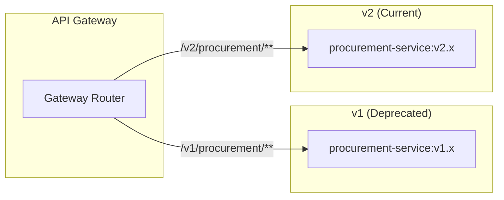

# API Versioning & Evolution Strategy
**Enterprise e-Procurement ERP**
**Versi:** 1.0 | **Status:** Active

---

## 1. Versioning Strategy

### 1.1 Approach: URI Path Versioning

Kami menggunakan **URI Path Versioning** sebagai strategi utama karena:
- Eksplisit dan mudah dipahami
- Mudah di-route di API Gateway
- Mendukung dokumentasi terpisah per versi

**Format:**
```
https://api.eprocurement.bank.com/v{major}/{resource}
```

**Contoh:**
```
GET /v1/procurement/pr
GET /v2/procurement/pr
```

### 1.2 Version Numbering

| Komponen | Format | Contoh | Kapan Increment |
|:---|:---|:---|:---|
| **Major (v1, v2)** | `/v{N}/` | `/v1/`, `/v2/` | Breaking changes |
| **Minor** | Header | `X-API-Version: 1.2` | New features (optional) |
| **Patch** | Internal | - | Bug fixes, no client impact |

---

## 2. Breaking vs Non-Breaking Changes

### 2.1 Non-Breaking Changes (Backward Compatible)

Perubahan berikut **TIDAK memerlukan** version bump:

| Tipe | Contoh | Catatan |
|:---|:---|:---|
| ✅ **Add field** | Response: `{ "id": 1, "newField": "x" }` | Field baru diabaikan oleh client lama |
| ✅ **Add endpoint** | `POST /v1/pr/{id}/duplicate` | Endpoint baru, tidak affect existing |
| ✅ **Add optional param** | `GET /v1/pr?status=APPROVED&newFilter=x` | Query param opsional |
| ✅ **Add enum value** | `status: "ARCHIVED"` | Nilai baru di existing enum |
| ✅ **Relax validation** | `name: max 100 → max 200` | Lebih permisif |
| ✅ **Deprecate field** | Mark as deprecated, keep working | Grace period |

### 2.2 Breaking Changes (Require New Version)

Perubahan berikut **MEMERLUKAN** major version bump (`v1` → `v2`):

| Tipe | Contoh | Impact |
|:---|:---|:---|
| ❌ **Remove field** | Response field dihapus | Client error parsing |
| ❌ **Rename field** | `prNumber` → `requisitionNumber` | Client tidak dapat field |
| ❌ **Change field type** | `amount: string → number` | Parsing error |
| ❌ **Remove endpoint** | `DELETE /v1/pr/{id}` dihapus | 404 error |
| ❌ **Change HTTP method** | `POST` → `PUT` | Method not allowed |
| ❌ **Stricter validation** | `name: optional → required` | Validation error |
| ❌ **Change response structure** | Flat → nested | Parsing error |
| ❌ **Authentication change** | API Key → OAuth2 | Auth failure |

---

## 3. Deprecation Policy

### 3.1 Deprecation Timeline

```
┌──────────────────────────────────────────────────────────────────────────┐
│                        DEPRECATION TIMELINE                               │
├──────────────────────────────────────────────────────────────────────────┤
│  Announce    │  Deprecated   │  Sunset        │  Removed                 │
│  (Month 0)   │  (Month 3)    │  (Month 9)     │  (Month 12)              │
│      │       │       │       │        │       │        │                 │
│      ▼       │       ▼       │        ▼       │        ▼                 │
│  ┌───────┐   │   ┌───────┐   │    ┌───────┐   │    ┌───────┐             │
│  │ v1.0  │   │   │ v1.0  │   │    │ v1.0  │   │    │  N/A  │             │
│  │ STABLE│   │   │ DEPR. │   │    │SUNSET │   │    │REMOVED│             │
│  └───────┘   │   └───────┘   │    └───────┘   │    └───────┘             │
│              │               │                │                          │
│  v2.0 Beta   │   v2.0 GA     │    v2.0 Only   │    v2.0 Only             │
└──────────────────────────────────────────────────────────────────────────┘
```

### 3.2 Deprecation Rules

| Phase | Duration | Actions |
|:---|:---|:---|
| **Announce** | Month 0 | Blog post, email to developers, docs update |
| **Deprecated** | Month 0-9 | `Sunset` header added, docs marked deprecated |
| **Sunset Warning** | Month 6-9 | Increased warnings, migration guide sent |
| **End of Life** | Month 12 | Endpoint returns 410 Gone |

### 3.3 Deprecation Headers

```http
HTTP/1.1 200 OK
Deprecation: Sun, 01 Jun 2026 00:00:00 GMT
Sunset: Sun, 01 Dec 2026 00:00:00 GMT
Link: <https://api.eprocurement.bank.com/v2/pr>; rel="successor-version"
X-API-Warn: "This endpoint is deprecated. Please migrate to /v2/pr"
```

---

## 4. Migration Guide Template

### 4.1 Migration Document Structure

```markdown
# Migration Guide: v1 → v2

## Overview
- **Target Date:** December 1, 2026
- **v1 Sunset:** December 1, 2026
- **Estimated Effort:** 2-4 weeks

## Breaking Changes Summary
| Area | v1 | v2 | Action Required |
|:---|:---|:---|:---|
| PR Response | Flat structure | Nested structure | Update parsing |
| Auth | API Key | OAuth2 | Implement OAuth flow |

## Step-by-Step Migration

### Step 1: Update Authentication
[Details...]

### Step 2: Update Response Handling
[Details...]

## Testing Checklist
- [ ] Auth flow working
- [ ] All endpoints migrated
- [ ] Error handling updated

## Support
- Email: api-support@bank.com
- Slack: #api-migration
```

---

## 5. API Gateway Routing

### 5.1 Version Routing Configuration

```yaml
# Spring Cloud Gateway
spring:
  cloud:
    gateway:
      routes:
        # v1 Routes (Deprecated)
        - id: procurement-v1
          uri: lb://procurement-service
          predicates:
            - Path=/v1/procurement/**
          filters:
            - StripPrefix=2
            - AddResponseHeader=Deprecation, "2026-06-01"
            - AddResponseHeader=Sunset, "2026-12-01"
            - name: RequestRateLimiter
              args:
                redis-rate-limiter.replenishRate: 50  # Reduced for deprecated

        # v2 Routes (Current)
        - id: procurement-v2
          uri: lb://procurement-service-v2
          predicates:
            - Path=/v2/procurement/**
          filters:
            - StripPrefix=2
            - name: RequestRateLimiter
              args:
                redis-rate-limiter.replenishRate: 100
```

### 5.2 Service Deployment Strategy



---

## 6. Backward Compatibility Guidelines

### 6.1 Response Envelope (Stable Contract)

**Jangan pernah ubah struktur envelope ini:**

```json
{
  "success": true,
  "message": "Success",
  "data": { /* Payload - dapat berubah per version */ },
  "timestamp": "2026-01-06T10:00:00Z",
  "requestId": "req-123"
}
```

**Error Response (Jangan ubah):**

```json
{
  "success": false,
  "message": "Validation failed",
  "errorCode": "VALIDATION_ERROR",
  "errors": [
    { "field": "amount", "message": "Must be positive" }
  ],
  "timestamp": "2026-01-06T10:00:00Z",
  "requestId": "req-123"
}
```

### 6.2 Field Evolution Rules

```java
public class PurchaseRequisitionDTO {
    // NEVER remove or rename existing fields
    private String id;
    private String prNumber;
    
    // ADD new fields as Optional/Nullable
    @Nullable
    private String newField;  // OK - backward compatible
    
    // Use @JsonAlias for renames
    @JsonProperty("amount")
    @JsonAlias("totalAmount")  // Accept old name too
    private BigDecimal amount;
    
    // Deprecate with annotation
    @Deprecated
    @JsonProperty("legacyField")
    private String legacyField;
}
```

---

## 7. Client SDK Versioning

### 7.1 SDK Version Matrix

| SDK | Current Version | Supports API |
|:---|:---|:---|
| **Java SDK** | 2.0.0 | v1, v2 |
| **JavaScript SDK** | 2.0.0 | v1, v2 |
| **Python SDK** | 2.0.0 | v1, v2 |

### 7.2 SDK Initialization

```typescript
// JavaScript SDK
import { EProcurementClient } from '@eprocurement/sdk';

const client = new EProcurementClient({
  apiVersion: 'v2',  // Explicit version
  baseUrl: 'https://api.eprocurement.bank.com',
  auth: {
    type: 'oauth2',
    clientId: 'xxx',
    clientSecret: 'xxx'
  }
});

// Automatic version warning
client.on('deprecation-warning', (info) => {
  console.warn(`API deprecated: ${info.message}`);
});
```

---

## 8. Testing Strategy per Version

### 8.1 Contract Testing

```java
@SpringBootTest
@AutoConfigureMockMvc
class PRControllerV1ContractTest {

    @Test
    void shouldReturnV1ResponseFormat() {
        mockMvc.perform(get("/v1/procurement/pr/PR-001"))
            .andExpect(status().isOk())
            .andExpect(jsonPath("$.data.prNumber").exists())  // v1 format
            .andExpect(jsonPath("$.data.requisition.number").doesNotExist());  // v2 format
    }
}

class PRControllerV2ContractTest {

    @Test
    void shouldReturnV2ResponseFormat() {
        mockMvc.perform(get("/v2/procurement/pr/PR-001"))
            .andExpect(status().isOk())
            .andExpect(jsonPath("$.data.requisition.number").exists());  // v2 nested
    }
}
```

### 8.2 Parallel Running

```yaml
# docker-compose for testing
services:
  procurement-v1:
    image: procurement-service:1.9.0
    ports:
      - "8083:8080"
    
  procurement-v2:
    image: procurement-service:2.0.0
    ports:
      - "8084:8080"
    
  api-gateway:
    image: api-gateway:latest
    ports:
      - "8080:8080"
    environment:
      - PROCUREMENT_V1_URL=http://procurement-v1:8080
      - PROCUREMENT_V2_URL=http://procurement-v2:8080
```

---

## 9. Version Changelog

### 9.1 Changelog Format

```markdown
# API Changelog

## [v2.0.0] - 2026-06-01

### Breaking Changes
- **BREAKING**: PR response structure changed to nested format
- **BREAKING**: Authentication changed from API Key to OAuth2

### New Features
- Added bulk operations endpoint
- Added real-time webhooks

### Deprecated
- /v1/* endpoints (sunset: 2026-12-01)

## [v1.9.0] - 2026-03-01

### Added
- New filter parameter for PR list

### Fixed
- Pagination bug on large datasets
```

---

## 10. Summary Checklist

### Before Releasing Breaking Changes:

- [ ] New version endpoint deployed and tested
- [ ] Migration guide written and reviewed
- [ ] Deprecation headers configured
- [ ] Client SDKs updated
- [ ] Announcement sent (email, blog, docs)
- [ ] Support team briefed
- [ ] Monitoring for v1 usage setup
- [ ] Sunset date communicated
