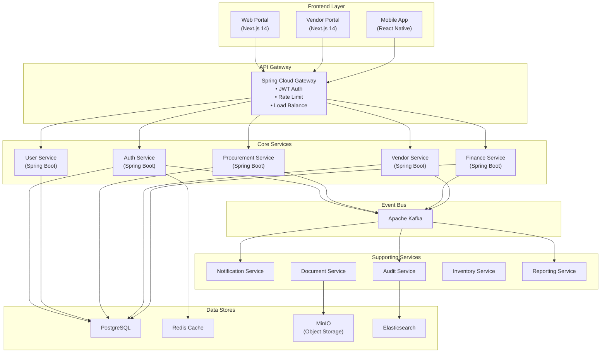
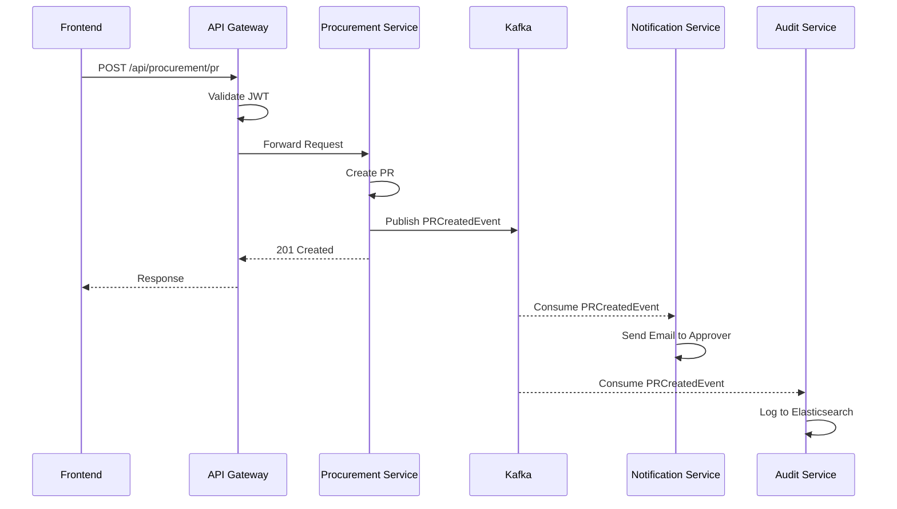
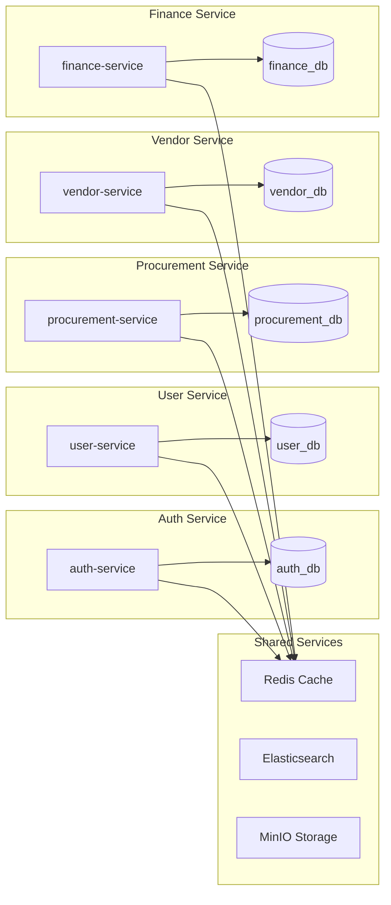
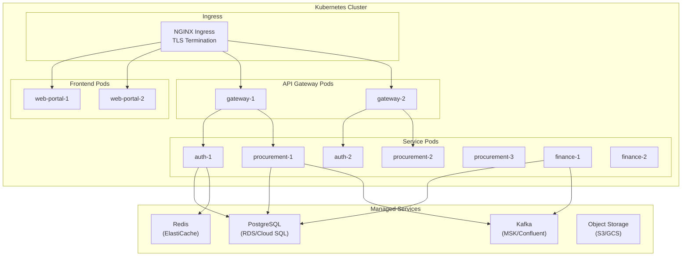
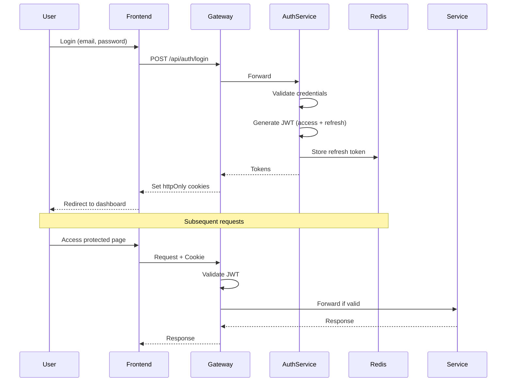

# Dokumentasi Arsitektur Sistem
**Enterprise e-Procurement ERP**
**Versi:** 2.0 | **Tech Stack:** Spring Boot + Next.js + Kafka

---

## 1. Gambaran Arsitektur

### 1.1 High-Level Architecture

```
┌─────────────────────────────────────────────────────────────────────────────┐
│                           USER LAYER                                         │
│  ┌─────────────────┐  ┌─────────────────┐  ┌─────────────────┐              │
│  │   Web Portal    │  │  Vendor Portal  │  │   Mobile App    │              │
│  │   (Next.js)     │  │   (Next.js)     │  │ (React Native)  │              │
│  └────────┬────────┘  └────────┬────────┘  └────────┬────────┘              │
└───────────┼────────────────────┼────────────────────┼────────────────────────┘
            │                    │                    │
            ▼                    ▼                    ▼
┌─────────────────────────────────────────────────────────────────────────────┐
│                         API GATEWAY LAYER                                    │
│  ┌─────────────────────────────────────────────────────────────────────┐    │
│  │                    Spring Cloud Gateway                              │    │
│  │  • Rate Limiting  • JWT Validation  • Load Balancing  • Routing     │    │
│  └─────────────────────────────────────────────────────────────────────┘    │
└─────────────────────────────────────────────────────────────────────────────┘
            │
            ▼
┌─────────────────────────────────────────────────────────────────────────────┐
│                      MICROSERVICES LAYER                                     │
│  ┌─────────┐ ┌─────────┐ ┌─────────────┐ ┌─────────┐ ┌─────────────┐       │
│  │  Auth   │ │  User   │ │ Procurement │ │ Vendor  │ │   Finance   │       │
│  │ Service │ │ Service │ │   Service   │ │ Service │ │   Service   │       │
│  └────┬────┘ └────┬────┘ └──────┬──────┘ └────┬────┘ └──────┬──────┘       │
│       │          │             │             │             │               │
│  ┌────┴────┐ ┌───┴────┐ ┌──────┴──────┐ ┌────┴────┐ ┌──────┴──────┐       │
│  │Notifica-│ │ Audit  │ │  Document   │ │Inventory│ │  Reporting  │       │
│  │  tion   │ │Service │ │   Service   │ │ Service │ │   Service   │       │
│  └─────────┘ └────────┘ └─────────────┘ └─────────┘ └─────────────┘       │
└─────────────────────────────────────────────────────────────────────────────┘
            │                    │                    │
            ▼                    ▼                    ▼
┌─────────────────────────────────────────────────────────────────────────────┐
│                         EVENT BUS (Apache Kafka)                             │
│  ┌─────────────────────────────────────────────────────────────────────┐    │
│  │  Topics: pr-events | po-events | invoice-events | vendor-events     │    │
│  └─────────────────────────────────────────────────────────────────────┘    │
└─────────────────────────────────────────────────────────────────────────────┘
            │
            ▼
┌─────────────────────────────────────────────────────────────────────────────┐
│                         DATA LAYER                                           │
│  ┌─────────────┐  ┌─────────────┐  ┌─────────────┐  ┌─────────────┐         │
│  │ PostgreSQL  │  │    Redis    │  │    MinIO    │  │Elasticsearch│         │
│  │  (Primary)  │  │   (Cache)   │  │   (Files)   │  │   (Search)  │         │
│  └─────────────┘  └─────────────┘  └─────────────┘  └─────────────┘         │
└─────────────────────────────────────────────────────────────────────────────┘
```

### 1.2 Arsitektur Diagram (Mermaid)



---

## 2. Technology Stack

### 2.1 Frontend

| Komponen | Teknologi | Versi | Deskripsi |
|:---|:---|:---|:---|
| **Framework** | Next.js | 14.x | SSR, App Router, Server Components |
| **UI Library** | shadcn/ui | Latest | Radix + Tailwind components |
| **State Mgmt** | Zustand | 4.x | Lightweight state management |
| **API Client** | TanStack Query | 5.x | Server state, caching, mutations |
| **Forms** | React Hook Form | 7.x | Form validation |
| **Styling** | Tailwind CSS | 3.x | Utility-first CSS |
| **Auth** | NextAuth.js | 5.x | OAuth, JWT session |
| **Charts** | Recharts | 2.x | Data visualization |

### 2.2 Backend

| Komponen | Teknologi | Versi | Deskripsi |
|:---|:---|:---|:---|
| **Framework** | Spring Boot | 4.0.0 | Java 21, Virtual Threads |
| **API** | Spring WebFlux | 3.2.x | Reactive REST APIs |
| **Security** | Spring Security | 6.x | JWT, OAuth2, RBAC |
| **Data Access** | Spring Data JPA | 3.2.x | Hibernate 6 |
| **Messaging** | Spring Kafka | 3.1.x | Event streaming |
| **Validation** | Jakarta Validation | 3.0 | Bean validation |
| **API Docs** | SpringDoc OpenAPI | 2.x | Swagger UI |
| **Monitoring** | Micrometer | 1.12.x | Metrics, tracing |

### 2.3 Infrastructure

| Komponen | Teknologi | Versi | Deskripsi |
|:---|:---|:---|:---|
| **Database** | PostgreSQL | 16 | Primary data store |
| **Cache** | Redis | 7.x | Session, caching |
| **Message Broker** | Apache Kafka | 3.6.x | Event streaming |
| **Object Storage** | MinIO | Latest | S3-compatible |
| **Search** | Elasticsearch | 8.x | Full-text search, audit logs |
| **Container** | Docker | 24.x | Containerization |
| **Orchestration** | Kubernetes | 1.29.x | Container orchestration |
| **Ingress** | NGINX | Latest | Load balancer |

---

## 3. Microservices Detail

### 3.1 Daftar Microservices

| Service | Port | Database | Responsibilities |
|:---|:---:|:---|:---|
| **api-gateway** | 8080 | - | Routing, Auth, Rate Limit |
| **auth-service** | 8081 | auth_db | Login, JWT, MFA, Sessions |
| **user-service** | 8082 | user_db | Users, Roles, Permissions |
| **procurement-service** | 8083 | procurement_db | PR, RFQ, PO, Contracts |
| **vendor-service** | 8084 | vendor_db | Vendor reg, KYC, Scoring |
| **finance-service** | 8085 | finance_db | Invoice, Payment, Budget |
| **notification-service** | 8086 | notification_db | Email, SMS, In-app |
| **audit-service** | 8087 | audit_db (ES) | Audit logs, Compliance |
| **document-service** | 8088 | document_db | File upload, versioning |
| **inventory-service** | 8089 | inventory_db | GRN, Stock, RTV |
| **reporting-service** | 8090 | - (read replica) | Analytics, Reports |

### 3.2 Service Communication



---

## 4. Event-Driven Architecture

### 4.1 Kafka Topics

| Topic | Producer | Consumers | Retention |
|:---|:---|:---|:---|
| `pr-events` | procurement-service | notification, audit, reporting | 7 days |
| `po-events` | procurement-service | notification, audit, finance, inventory | 7 days |
| `rfq-events` | procurement-service | notification, audit, vendor | 7 days |
| `vendor-events` | vendor-service | notification, audit, procurement | 7 days |
| `invoice-events` | finance-service | notification, audit, reporting | 30 days |
| `payment-events` | finance-service | notification, audit, vendor | 30 days |
| `user-events` | user-service | notification, audit | 7 days |
| `auth-events` | auth-service | audit | 90 days |

### 4.2 Event Schema (CloudEvents Format)

```json
{
  "specversion": "1.0",
  "type": "com.eprocurement.pr.created",
  "source": "/procurement-service",
  "id": "evt-550e8400-e29b-41d4-a716-446655440000",
  "time": "2026-01-06T10:00:00Z",
  "datacontenttype": "application/json",
  "data": {
    "prId": "PR-2026-00001",
    "requesterId": "user-123",
    "department": "IT",
    "totalAmount": 50000000,
    "currency": "IDR",
    "status": "PENDING_APPROVAL",
    "approverId": "user-456"
  }
}
```

### 4.3 Event Types

```
com.eprocurement.pr.created
com.eprocurement.pr.approved
com.eprocurement.pr.rejected
com.eprocurement.pr.cancelled

com.eprocurement.rfq.published
com.eprocurement.rfq.closed
com.eprocurement.rfq.awarded

com.eprocurement.po.created
com.eprocurement.po.approved
com.eprocurement.po.issued
com.eprocurement.po.acknowledged
com.eprocurement.po.cancelled

com.eprocurement.grn.created
com.eprocurement.grn.partial
com.eprocurement.grn.completed

com.eprocurement.invoice.submitted
com.eprocurement.invoice.matched
com.eprocurement.invoice.disputed
com.eprocurement.invoice.approved

com.eprocurement.payment.scheduled
com.eprocurement.payment.executed
com.eprocurement.payment.failed

com.eprocurement.vendor.registered
com.eprocurement.vendor.verified
com.eprocurement.vendor.blacklisted
```

---

## 5. API Gateway Configuration

### 5.1 Route Configuration

```yaml
spring:
  cloud:
    gateway:
      routes:
        - id: auth-service
          uri: lb://auth-service
          predicates:
            - Path=/api/auth/**
          filters:
            - StripPrefix=2

        - id: procurement-service
          uri: lb://procurement-service
          predicates:
            - Path=/api/procurement/**
          filters:
            - StripPrefix=2
            - name: JwtAuthFilter
            - name: RateLimiter
              args:
                redis-rate-limiter.replenishRate: 100
                redis-rate-limiter.burstCapacity: 200

        - id: vendor-service
          uri: lb://vendor-service
          predicates:
            - Path=/api/vendors/**
          filters:
            - StripPrefix=2
            - name: JwtAuthFilter
```

### 5.2 Security Configuration

```java
@Configuration
@EnableWebFluxSecurity
public class SecurityConfig {

    @Bean
    public SecurityWebFilterChain securityWebFilterChain(ServerHttpSecurity http) {
        return http
            .csrf(ServerHttpSecurity.CsrfSpec::disable)
            .cors(cors -> cors.configurationSource(corsConfigurationSource()))
            .authorizeExchange(exchanges -> exchanges
                .pathMatchers("/api/auth/**").permitAll()
                .pathMatchers("/api/public/**").permitAll()
                .pathMatchers("/actuator/health").permitAll()
                .pathMatchers("/api/admin/**").hasRole("ADMIN")
                .pathMatchers("/api/**").authenticated()
            )
            .oauth2ResourceServer(oauth2 -> oauth2
                .jwt(jwt -> jwt.jwtDecoder(jwtDecoder()))
            )
            .build();
    }
}
```

---

## 6. Database per Service

### 6.1 Database Isolation



### 6.2 Cross-Service Data Access

**Prinsip:** Services tidak boleh akses database service lain secara langsung.

| Skenario | Solusi |
|:---|:---|
| Procurement butuh data User | Sync call ke User Service API |
| Finance butuh data Vendor | Async event / Sync call ke Vendor Service |
| Reporting butuh semua data | Read Replica / Event Sourcing ke Data Lake |

---

## 7. Frontend Architecture (Next.js)

### 7.1 Project Structure

```
frontend/
├── src/
│   ├── app/                      # Next.js App Router
│   │   ├── (auth)/               # Auth layout group
│   │   │   ├── login/
│   │   │   └── register/
│   │   ├── (dashboard)/          # Dashboard layout group
│   │   │   ├── procurement/
│   │   │   │   ├── pr/
│   │   │   │   ├── rfq/
│   │   │   │   └── po/
│   │   │   ├── vendors/
│   │   │   ├── finance/
│   │   │   └── admin/
│   │   ├── api/                  # API Routes (BFF)
│   │   ├── layout.tsx
│   │   └── page.tsx
│   ├── components/
│   │   ├── ui/                   # shadcn/ui components
│   │   ├── forms/                # Form components
│   │   ├── tables/               # Data tables
│   │   └── charts/               # Chart components
│   ├── hooks/                    # Custom React hooks
│   ├── lib/                      # Utilities
│   │   ├── api.ts                # API client
│   │   ├── auth.ts               # Auth utilities
│   │   └── utils.ts              # Helpers
│   ├── stores/                   # Zustand stores
│   ├── types/                    # TypeScript types
│   └── styles/
│       └── globals.css
├── public/
├── next.config.js
├── tailwind.config.ts
└── package.json
```

### 7.2 API Client Pattern

```typescript
// lib/api.ts
import { QueryClient } from '@tanstack/react-query';

const API_BASE = process.env.NEXT_PUBLIC_API_URL;

export const apiClient = {
  get: async <T>(endpoint: string): Promise<T> => {
    const res = await fetch(`${API_BASE}${endpoint}`, {
      headers: { 'Authorization': `Bearer ${getToken()}` }
    });
    if (!res.ok) throw new ApiError(res);
    return res.json();
  },

  post: async <T>(endpoint: string, data: unknown): Promise<T> => {
    const res = await fetch(`${API_BASE}${endpoint}`, {
      method: 'POST',
      headers: {
        'Content-Type': 'application/json',
        'Authorization': `Bearer ${getToken()}`
      },
      body: JSON.stringify(data)
    });
    if (!res.ok) throw new ApiError(res);
    return res.json();
  }
};

// hooks/usePurchaseRequisitions.ts
export function usePurchaseRequisitions() {
  return useQuery({
    queryKey: ['purchase-requisitions'],
    queryFn: () => apiClient.get<PR[]>('/api/procurement/pr')
  });
}
```

---

## 8. Deployment Architecture

### 8.1 Kubernetes Deployment

```yaml
# deployment.yaml
apiVersion: apps/v1
kind: Deployment
metadata:
  name: procurement-service
spec:
  replicas: 3
  selector:
    matchLabels:
      app: procurement-service
  template:
    metadata:
      labels:
        app: procurement-service
    spec:
      containers:
        - name: procurement-service
          image: eprocurement/procurement-service:latest
          ports:
            - containerPort: 8083
          env:
            - name: SPRING_PROFILES_ACTIVE
              value: "production"
            - name: DB_HOST
              valueFrom:
                secretKeyRef:
                  name: db-secret
                  key: host
          resources:
            requests:
              memory: "512Mi"
              cpu: "250m"
            limits:
              memory: "1Gi"
              cpu: "500m"
          livenessProbe:
            httpGet:
              path: /actuator/health/liveness
              port: 8083
            initialDelaySeconds: 30
          readinessProbe:
            httpGet:
              path: /actuator/health/readiness
              port: 8083
            initialDelaySeconds: 10
```

### 8.2 Infrastructure Diagram



---

## 9. Monitoring & Observability

### 9.1 Stack

| Layer | Tool | Purpose |
|:---|:---|:---|
| Metrics | Prometheus + Grafana | System & app metrics |
| Logging | ELK Stack | Centralized logs |
| Tracing | Jaeger | Distributed tracing |
| Alerting | AlertManager | Incident management |

### 9.2 Health Checks

```java
@Component
public class DatabaseHealthIndicator implements HealthIndicator {

    @Override
    public Health health() {
        // Check database connectivity
        if (isDatabaseHealthy()) {
            return Health.up()
                .withDetail("database", "PostgreSQL")
                .withDetail("status", "Connected")
                .build();
        }
        return Health.down()
            .withDetail("error", "Cannot connect to database")
            .build();
    }
}
```

---

## 10. Security Architecture

### 10.1 Authentication Flow



### 10.2 Authorization Matrix

| Role | Auth | User | Procurement | Vendor | Finance |
|:---|:---:|:---:|:---:|:---:|:---:|
| ADMIN | Full | Full | Read | Read | Read |
| OPERATOR | - | Read | Full | Read | - |
| SUPERVISOR | - | Read | Approve | Approve | Read |
| FINANCE | - | Read | Read | Read | Full |
| VENDOR | - | - | Bid Only | Own Profile | Submit Invoice |
