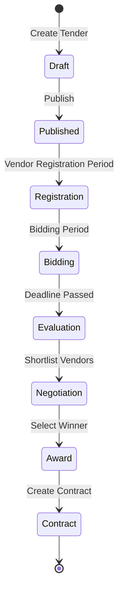

# Fitur Tambahan: Banking Procurement Specifics

## 1. Budget Management

### 1.1 Klasifikasi Anggaran

| Tipe | Kode | Deskripsi | Approval |
|:---|:---|:---|:---|
| **CAPEX** | CAP-xxx | Capital Expenditure (Aset tetap, IT infra) | CFO + Direksi |
| **OPEX** | OPX-xxx | Operational Expenditure (Consumable, jasa) | Dept Head |

### 1.2 Budget Blocking Mechanism

```
┌─────────────────────────────────────────────────────────────────┐
│                    BUDGET LIFECYCLE                              │
├─────────────────────────────────────────────────────────────────┤
│                                                                  │
│  ANNUAL         CREATE PR        APPROVE PR       CREATE PO     │
│  BUDGET  ──────►  (Check)  ──────► (Block)  ──────► (Commit)    │
│                                                                  │
│  ┌────────┐    ┌────────────┐    ┌───────────┐    ┌──────────┐ │
│  │Rp 100M │    │Check avail │    │Block 50M  │    │Commit 50M│ │
│  │        │───►│IF < amount │───►│Remaining: │───►│Used: 50M │ │
│  │        │    │THEN reject │    │Rp 50M     │    │Avail: 50M│ │
│  └────────┘    └────────────┘    └───────────┘    └──────────┘ │
│                                                                  │
│              ┌───────────────────────────────────────┐          │
│              │  Budget Status:                       │          │
│              │  • Allocated: Rp 100,000,000         │          │
│              │  • Blocked:   Rp  50,000,000 (PR-001)│          │
│              │  • Used:      Rp  30,000,000 (Paid)  │          │
│              │  • Available: Rp  20,000,000         │          │
│              └───────────────────────────────────────┘          │
│                                                                  │
└─────────────────────────────────────────────────────────────────┘
```

### 1.3 Database Schema - Budget

```sql
CREATE TABLE budgets (
    id UUID PRIMARY KEY,
    budget_code VARCHAR(30) UNIQUE NOT NULL,  -- CAP-IT-2026-001
    budget_type VARCHAR(10) NOT NULL,          -- CAPEX, OPEX
    department_id UUID REFERENCES departments(id),
    fiscal_year INT NOT NULL,
    allocated_amount DECIMAL(18,2) NOT NULL,
    blocked_amount DECIMAL(18,2) DEFAULT 0,    -- Reserved by approved PRs
    used_amount DECIMAL(18,2) DEFAULT 0,       -- Actually spent
    currency VARCHAR(3) DEFAULT 'IDR',
    status VARCHAR(20) DEFAULT 'ACTIVE',
    created_at TIMESTAMP DEFAULT CURRENT_TIMESTAMP
);

CREATE TABLE budget_transactions (
    id UUID PRIMARY KEY,
    budget_id UUID REFERENCES budgets(id),
    transaction_type VARCHAR(20) NOT NULL,  -- BLOCK, UNBLOCK, COMMIT, RELEASE
    reference_type VARCHAR(20),              -- PR, PO, INVOICE
    reference_id UUID,
    amount DECIMAL(18,2) NOT NULL,
    notes TEXT,
    created_by UUID REFERENCES users(id),
    created_at TIMESTAMP DEFAULT CURRENT_TIMESTAMP
);
```

---

## 2. Contract Management

### 2.1 Contract Types

| Tipe | Deskripsi | Durasi |
|:---|:---|:---|
| **Spot Contract** | One-time purchase | Single delivery |
| **Blanket/Framework** | Multiple PO under one contract | 1-3 tahun |
| **Service Agreement** | Kontrak jasa recurring | 1 tahun + renewal |

### 2.2 SLA & Penalty

```sql
CREATE TABLE contracts (
    id UUID PRIMARY KEY,
    contract_number VARCHAR(30) UNIQUE NOT NULL,
    vendor_id UUID REFERENCES vendors(id),
    contract_type VARCHAR(30) NOT NULL,
    start_date DATE NOT NULL,
    end_date DATE NOT NULL,
    total_value DECIMAL(18,2),
    status VARCHAR(20) DEFAULT 'ACTIVE',
    auto_renewal BOOLEAN DEFAULT FALSE,
    notice_period_days INT DEFAULT 30,
    created_at TIMESTAMP DEFAULT CURRENT_TIMESTAMP
);

CREATE TABLE contract_sla (
    id UUID PRIMARY KEY,
    contract_id UUID REFERENCES contracts(id),
    sla_metric VARCHAR(100) NOT NULL,    -- e.g., "Delivery Time"
    target_value VARCHAR(50) NOT NULL,    -- e.g., "3 days"
    penalty_type VARCHAR(20),             -- FIXED, PERCENTAGE
    penalty_value DECIMAL(18,2),          -- e.g., 1% per day
    max_penalty_cap DECIMAL(18,2),        -- e.g., max 10%
    created_at TIMESTAMP DEFAULT CURRENT_TIMESTAMP
);
```

### 2.3 Contract Milestone

| Phase | Milestone | Payment % |
|:---|:---|:---:|
| 1 | Contract Signed | 20% (DP) |
| 2 | Goods Delivered | 50% |
| 3 | Installation Complete | 20% |
| 4 | UAT Accepted | 10% |

---

## 3. Enhanced Approval Matrix

### 3.1 Approval by Category & Amount

| Kategori | Amount | Approver Level |
|:---|:---|:---|
| **IT Equipment** | < 50 juta | Dept Head |
| **IT Equipment** | 50-500 juta | Div Head + IT Head |
| **IT Equipment** | > 500 juta | Direksi |
| **Office Supplies** | < 10 juta | Section Head |
| **Office Supplies** | 10-50 juta | Dept Head |
| **Jasa Konsultan** | Any | Direksi (policy) |

### 3.2 Maker-Checker Pattern

```
┌────────────────────────────────────────────────────────────┐
│                 MAKER-CHECKER WORKFLOW                      │
├────────────────────────────────────────────────────────────┤
│                                                             │
│   For transactions > Rp 100,000,000:                       │
│                                                             │
│   MAKER              CHECKER 1          CHECKER 2          │
│   (Operator)         (Supervisor)       (Manager)          │
│       │                   │                  │             │
│       ▼                   ▼                  ▼             │
│   ┌───────┐          ┌───────┐          ┌───────┐         │
│   │Create │  ──────► │Review │  ──────► │Approve│         │
│   │  PR   │          │& Check│          │ Final │         │
│   └───────┘          └───────┘          └───────┘         │
│                                                             │
│   Rules:                                                    │
│   • Maker ≠ Checker (enforced by system)                   │
│   • Checker 1 ≠ Checker 2                                  │
│   • Cannot approve own department's request                │
│                                                             │
└────────────────────────────────────────────────────────────┘
```

### 3.3 Database Schema - Approval Config

```sql
CREATE TABLE approval_matrices (
    id UUID PRIMARY KEY,
    category_id UUID REFERENCES categories(id),
    min_amount DECIMAL(18,2) DEFAULT 0,
    max_amount DECIMAL(18,2),
    approval_levels INT NOT NULL,          -- Number of approvers
    requires_dual_approval BOOLEAN DEFAULT FALSE,
    approver_roles JSONB,                  -- ["DEPT_HEAD", "DIV_HEAD"]
    is_active BOOLEAN DEFAULT TRUE,
    created_at TIMESTAMP DEFAULT CURRENT_TIMESTAMP
);
```

---

## 4. Vendor Risk Assessment

### 4.1 Risk Rating

| Rating | Score | Criteria | Action |
|:---|:---:|:---|:---|
| 🟢 **Low** | 80-100 | Established, good track record | Standard process |
| 🟡 **Medium** | 50-79 | Some issues, new vendor | Extra verification |
| 🔴 **High** | < 50 | History of problems | Management approval |
| ⚫ **Blacklisted** | N/A | Fraud, breach of contract | Block all transactions |

### 4.2 Risk Scoring Components

| Component | Weight | Metrics |
|:---|:---:|:---|
| Financial Health | 25% | Revenue, profitability, debt ratio |
| Delivery Performance | 30% | On-time delivery rate |
| Quality | 25% | Defect rate, rejection rate |
| Compliance | 20% | Document validity, certifications |

### 4.3 Database Schema - Vendor Risk

```sql
CREATE TABLE vendor_risk_assessments (
    id UUID PRIMARY KEY,
    vendor_id UUID REFERENCES vendors(id),
    assessment_date DATE NOT NULL,
    financial_score DECIMAL(5,2),
    delivery_score DECIMAL(5,2),
    quality_score DECIMAL(5,2),
    compliance_score DECIMAL(5,2),
    overall_score DECIMAL(5,2),
    risk_rating VARCHAR(20),    -- LOW, MEDIUM, HIGH
    assessed_by UUID REFERENCES users(id),
    notes TEXT,
    next_review_date DATE,
    created_at TIMESTAMP DEFAULT CURRENT_TIMESTAMP
);

CREATE TABLE vendor_blacklist (
    id UUID PRIMARY KEY,
    vendor_id UUID REFERENCES vendors(id),
    reason TEXT NOT NULL,
    blacklist_type VARCHAR(30),   -- INTERNAL, EXTERNAL (OJK/BI list)
    source VARCHAR(100),
    effective_date DATE NOT NULL,
    expiry_date DATE,             -- NULL = permanent
    approved_by UUID REFERENCES users(id),
    created_at TIMESTAMP DEFAULT CURRENT_TIMESTAMP
);
```

---

## 5. Tender/Bidding Process

### 5.1 Procurement Methods

| Method | Threshold | Vendor Requirement |
|:---|:---|:---|
| **Direct Purchase** | < 50 juta | Min 1 quotation |
| **Limited Tender** | 50-500 juta | Min 3 invited vendors |
| **Open Tender** | > 500 juta | Public announcement |
| **e-Auction** | Commodity items | Registered vendors |

### 5.2 Tender Workflow


