# Business Process Model: Enterprise e-Procurement ERP
**Version:** 1.0
**Date:** January 2026
**Purpose:** Developer Reference for Business Logic Implementation

---

## 1. End-to-End Procure-to-Pay (P2P) Process

### 1.1 Process Overview
The Procure-to-Pay cycle covers all activities from identifying a need to paying the vendor. This is the **core business process** of the system.

**Phases:**
1.  **Requisition:** Operator identifies need and creates PR.
2.  **Sourcing:** Operator creates RFQ and invites vendors.
3.  **Ordering:** PO is generated and sent to winning vendor.
4.  **Receiving:** Goods are received and inspected.
5.  **Payment:** Invoice is verified and payment is executed.

### 1.2 Swimlane Diagram (BPMN)

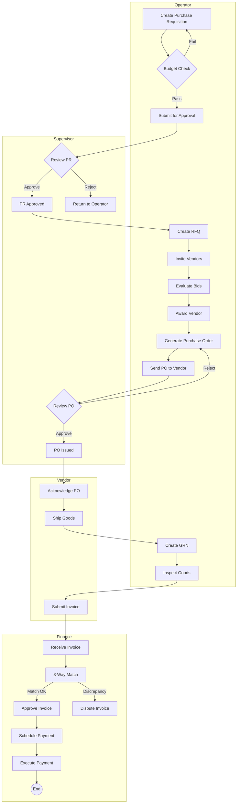

---

## 2. Finance Subprocess: Invoice & Payment

### 2.1 Invoice Verification Process

**Purpose:** Ensure that payments are made only for goods/services actually received and match the agreed terms.

**3-Way Matching Logic:**
| Document | Source | What to Check |
|:---|:---|:---|
| **Purchase Order (PO)** | Procurement Service | Item, Qty, Unit Price, Vendor |
| **Goods Receipt Note (GRN)** | Inventory Service | Qty Received, Condition |
| **Invoice** | Vendor Portal | Invoice Amount, Tax, Due Date |

**Matching Rules:**
1.  Invoice Qty ≤ GRN Qty (Cannot bill for undelivered items).
2.  Invoice Unit Price ≤ PO Unit Price (No price increases without Change Order).
3.  Invoice Total ≤ PO Total (Including Tax).

### 2.2 Invoice & Payment Flow Diagram

```mermaid
flowchart LR
    subgraph Vendor Portal
        A[Submit Digital Invoice] --> B[Upload Tax Invoice PDF]
    end

    subgraph Finance Service
        B --> C{Auto 3-Way Match}
        C -->|Match OK| D[Invoice Status: VERIFIED]
        C -->|Mismatch| E[Invoice Status: DISPUTED]
        E --> F[Finance Reviews]
        F -->|Accept Variance| D
        F -->|Reject| G[Return to Vendor]
        
        D --> H[Apply Withholding Tax]
        H --> I[Create Payment Voucher]
        I --> J{Approval Required?}
        J -->|Yes, > 100M| K[Supervisor Approval]
        J -->|No| L[Schedule Payment]
        K --> L
        
        L --> M{Payment Method}
        M -->|Bank Transfer| N[Send to Payment Gateway]
        M -->|Check| O[Print Check]
        N --> P[Payment Status: SENT]
        O --> P
        P --> Q[Update Vendor Ledger]
        Q --> R[Post to General Ledger]
    end
```

### 2.3 Payment States

| State | Description | Trigger |
|:---|:---|:---|
| `INVOICE_RECEIVED` | Invoice uploaded by Vendor | Vendor submits invoice |
| `PENDING_MATCH` | Awaiting 3-way match | Auto-triggered |
| `VERIFIED` | 3-way match passed | System auto-verify |
| `DISPUTED` | Mismatch found | Price/Qty discrepancy |
| `APPROVED` | Finance approved for payment | Finance user action |
| `SCHEDULED` | Queued for payment batch | Finance schedules |
| `PROCESSING` | Sent to bank | Batch job execution |
| `PAID` | Bank confirmed transfer | Webhook/API callback |
| `FAILED` | Bank rejected | Insufficient funds, etc. |

---

## 3. Vendor Lifecycle Subprocess

### 3.1 Vendor Onboarding Flow

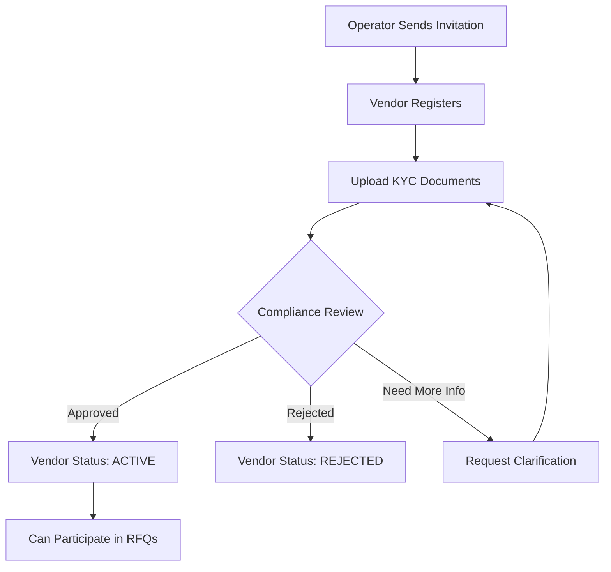

### 3.2 Bidding & Fulfillment

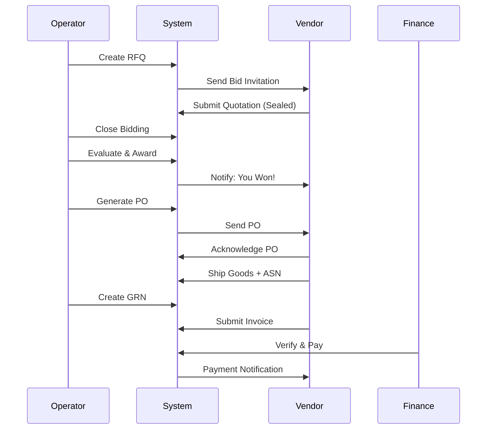

---

## 4. User Flows (Per Actor)

### 4.1 Admin User Flow

**Goal:** Configure system, manage users, ensure compliance.

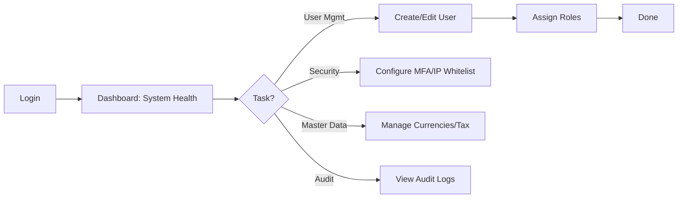

**Key Screens:**
1.  Dashboard (System Health Metrics)
2.  User Management (CRUD Users)
3.  Role & Permission Matrix
4.  Audit Trail Viewer
5.  Master Data (Currencies, Taxes, UoM)

---

### 4.2 Operator User Flow

**Goal:** Execute procurement lifecycle from PR to GRN.

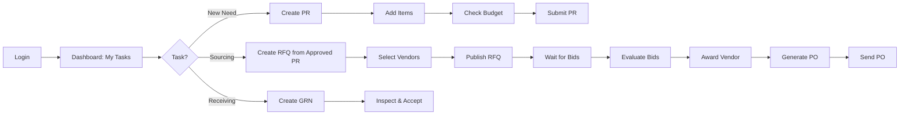

**Key Screens:**
1.  Dashboard (Pending Tasks, PRs, POs)
2.  Purchase Requisition Form
3.  Sourcing Workbench (RFQ Management)
4.  Bid Comparison Table
5.  PO Generation Wizard
6.  Goods Receipt Form

---

### 4.3 Supervisor User Flow

**Goal:** Review and approve/reject requests, monitor budgets.

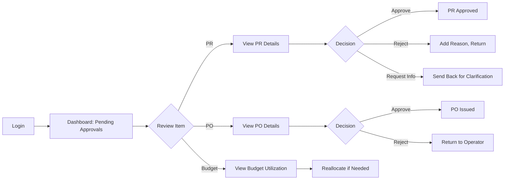

**Key Screens:**
1.  Approval Inbox (Unified Queue)
2.  PR/PO Detail View (with History)
3.  Budget Dashboard (Charts, Alerts)
4.  Spending Analytics (By Category/Vendor)

---

### 4.4 Finance User Flow

**Goal:** Verify invoices, process payments, maintain GL.

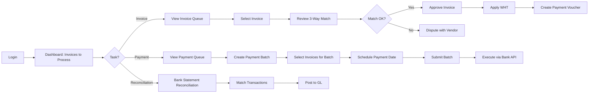

**Key Screens:**
1.  Invoice Dashboard (Pending, Verified, Paid)
2.  3-Way Match Detail Screen
3.  Payment Batch Creator
4.  Bank Reconciliation Wizard
5.  AP Aging Report
6.  GL Postings Log

---

### 4.5 Vendor User Flow

**Goal:** Bid on opportunities, fulfill orders, get paid.

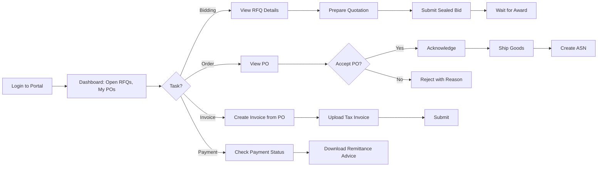

**Key Screens:**
1.  Dashboard (Active RFQs, POs, Payments)
2.  RFQ Detail & Bid Submission Form
3.  PO Acknowledgement Screen
4.  Invoice Creation Wizard
5.  Payment History & Status Tracker

---

## 5. Service Architecture (Developer Reference)

### 5.1 Service Interaction Diagram

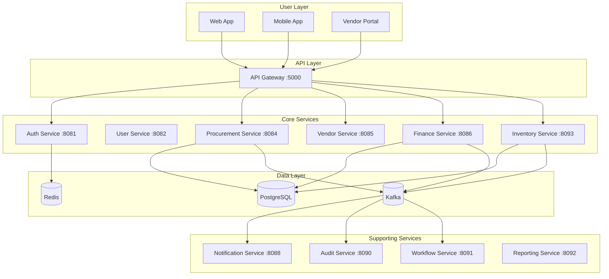

### 5.2 Finance Service Internal Architecture

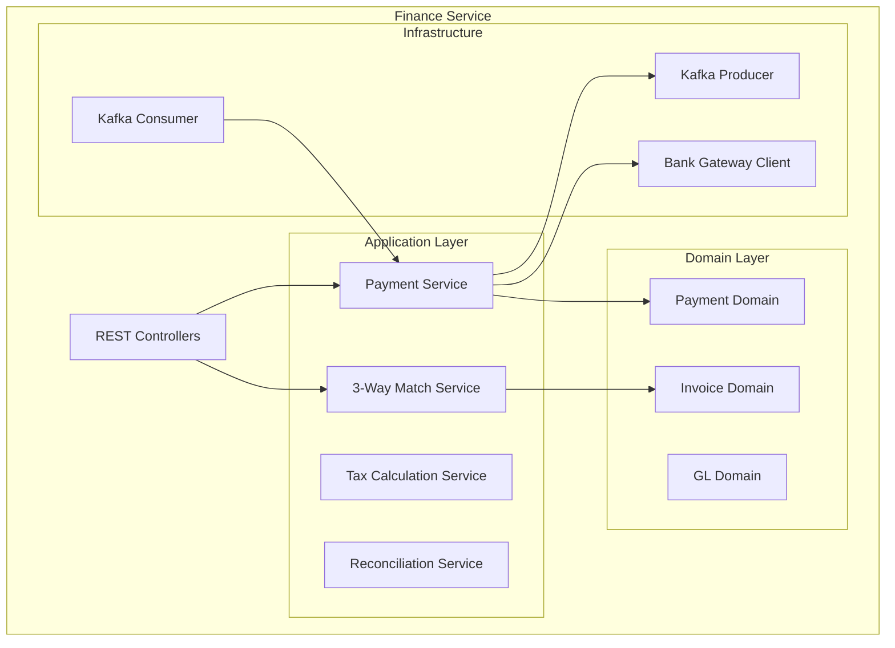

---

## 6. Additional Finance Use Cases

### UC-FIN-021 Create Payment Batch
1.  **Actor:** Finance
2.  **Description:** Group multiple approved invoices into a single payment run for efficiency.
3.  **Flow:**
    1.  Finance selects date range & vendor filter.
    2.  System lists approved invoices.
    3.  Finance selects invoices to include.
    4.  System calculates total amount.
    5.  Finance confirms batch.
    6.  Batch status: `PENDING_EXECUTION`.

### UC-FIN-022 Schedule Payment for Future Date
1.  **Actor:** Finance
2.  **Description:** Set a specific date for payment execution (e.g., align with cash flow).
3.  **Flow:**
    1.  Finance opens payment batch.
    2.  Finance sets "Execution Date": 2026-01-15.
    3.  System validates date is a business day.
    4.  Batch is scheduled.

### UC-FIN-023 Handle Partial Payment
1.  **Actor:** Finance
2.  **Description:** Pay a portion of an invoice (e.g., due to disputes on some items).
3.  **Flow:**
    1.  Finance opens verified invoice.
    2.  Finance enters "Payment Amount": 80,000,000 (of 100,000,000 total).
    3.  System records partial payment.
    4.  Invoice status: `PARTIALLY_PAID`.
    5.  Remaining balance tracked for future payment.

### UC-FIN-024 Generate Payment Remittance Advice
1.  **Actor:** Finance
2.  **Description:** Create a document detailing paid invoices to send to vendor.
3.  **Flow:**
    1.  After payment batch is executed.
    2.  Finance clicks "Generate Remittance".
    3.  System creates PDF listing:
        *   Payment Date
        *   Invoices Covered
        *   Amounts (Gross, WHT, Net)
    4.  Finance emails to vendor.

### UC-FIN-025 Void/Reverse Payment
1.  **Actor:** Finance (Authorized)
2.  **Description:** Cancel a payment that was made in error.
3.  **Pre-condition:** Payment status is `PAID` but funds not yet transferred externally.
4.  **Flow:**
    1.  Finance selects payment.
    2.  Finance clicks "Void Payment".
    3.  Finance enters reason: "Duplicate payment".
    4.  System requires Supervisor approval for reversals > 10M.
    5.  Upon approval, payment status: `VOIDED`.
    6.  GL entries are reversed.
    7.  Invoice returns to `APPROVED` for re-processing.

---

## 7. Appendix: State Diagrams

### 7.1 Purchase Order States

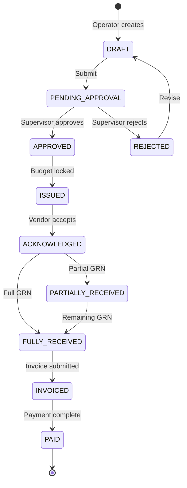

### 7.2 Invoice States

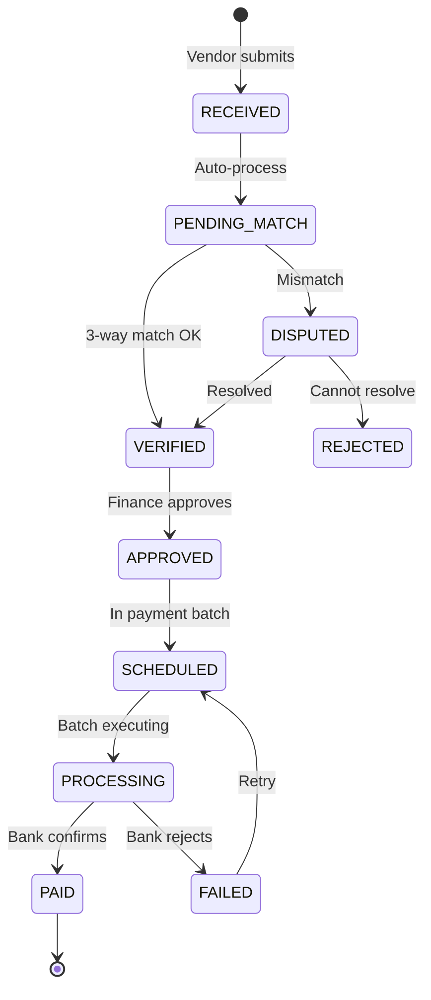
