# Model Proses Bisnis: ERP e-Procurement Enterprise
**Versi:** 1.0
**Tanggal:** Januari 2026
**Tujuan:** Referensi Developer untuk Implementasi Logika Bisnis

---

## 1. Proses Procure-to-Pay (P2P) End-to-End

### 1.1 Gambaran Proses
Siklus Procure-to-Pay mencakup semua aktivitas dari identifikasi kebutuhan hingga pembayaran ke vendor. Ini adalah **proses bisnis inti** dari sistem.

**Fase:**
1.  **Requisition:** Operator mengidentifikasi kebutuhan dan membuat PR.
2.  **Sourcing:** Operator membuat RFQ dan mengundang vendor.
3.  **Ordering:** PO dihasilkan dan dikirim ke vendor pemenang.
4.  **Receiving:** Barang diterima dan diperiksa.
5.  **Payment:** Invoice diverifikasi dan pembayaran dieksekusi.

### 1.2 Diagram Swimlane (BPMN)

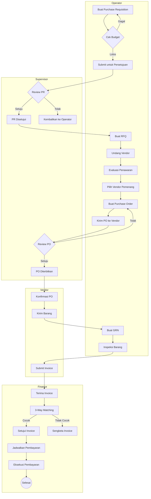

---

## 2. Subproses Finance: Invoice & Pembayaran

### 2.1 Proses Verifikasi Invoice

**Tujuan:** Memastikan pembayaran hanya dilakukan untuk barang/jasa yang benar-benar diterima dan sesuai dengan ketentuan yang disepakati.

**Logika 3-Way Matching:**
| Dokumen | Sumber | Yang Diperiksa |
|:---|:---|:---|
| **Purchase Order (PO)** | Procurement Service | Item, Qty, Harga Satuan, Vendor |
| **Goods Receipt Note (GRN)** | Inventory Service | Qty Diterima, Kondisi |
| **Invoice** | Portal Vendor | Jumlah Invoice, Pajak, Tanggal Jatuh Tempo |

**Aturan Matching:**
1.  Qty Invoice ≤ Qty GRN (Tidak bisa tagih item yang belum dikirim).
2.  Harga Satuan Invoice ≤ Harga Satuan PO (Tidak ada kenaikan harga tanpa Change Order).
3.  Total Invoice ≤ Total PO (Termasuk Pajak).

### 2.2 Diagram Alur Invoice & Pembayaran

```mermaid
flowchart LR
    subgraph Portal Vendor
        A[Submit Invoice Digital] --> B[Upload Faktur Pajak PDF]
    end

    subgraph Finance Service
        B --> C{Auto 3-Way Match}
        C -->|Cocok| D[Status Invoice: TERVERIFIKASI]
        C -->|Tidak Cocok| E[Status Invoice: DISPUTE]
        E --> F[Finance Review]
        F -->|Terima Selisih| D
        F -->|Tolak| G[Kembalikan ke Vendor]
        
        D --> H[Terapkan Withholding Tax]
        H --> I[Buat Payment Voucher]
        I --> J{Perlu Persetujuan?}
        J -->|Ya, > 100Jt| K[Persetujuan Supervisor]
        J -->|Tidak| L[Jadwalkan Pembayaran]
        K --> L
        
        L --> M{Metode Pembayaran}
        M -->|Transfer Bank| N[Kirim ke Payment Gateway]
        M -->|Cek| O[Cetak Cek]
        N --> P[Status Pembayaran: TERKIRIM]
        O --> P
        P --> Q[Update Ledger Vendor]
        Q --> R[Posting ke General Ledger]
    end
```

### 2.3 Status Pembayaran

| Status | Deskripsi | Pemicu |
|:---|:---|:---|
| `INVOICE_DITERIMA` | Invoice diupload oleh Vendor | Vendor submit invoice |
| `PENDING_MATCH` | Menunggu 3-way match | Auto-trigger |
| `TERVERIFIKASI` | 3-way match lolos | Sistem auto-verify |
| `DISPUTE` | Ditemukan ketidakcocokan | Selisih Harga/Qty |
| `DISETUJUI` | Finance menyetujui untuk pembayaran | Aksi user Finance |
| `TERJADWAL` | Dalam antrian batch pembayaran | Finance menjadwalkan |
| `DIPROSES` | Dikirim ke bank | Eksekusi batch job |
| `DIBAYAR` | Bank mengkonfirmasi transfer | Webhook/API callback |
| `GAGAL` | Bank menolak | Dana tidak cukup, dll. |

---

## 3. Subproses Siklus Hidup Vendor

### 3.1 Alur Onboarding Vendor

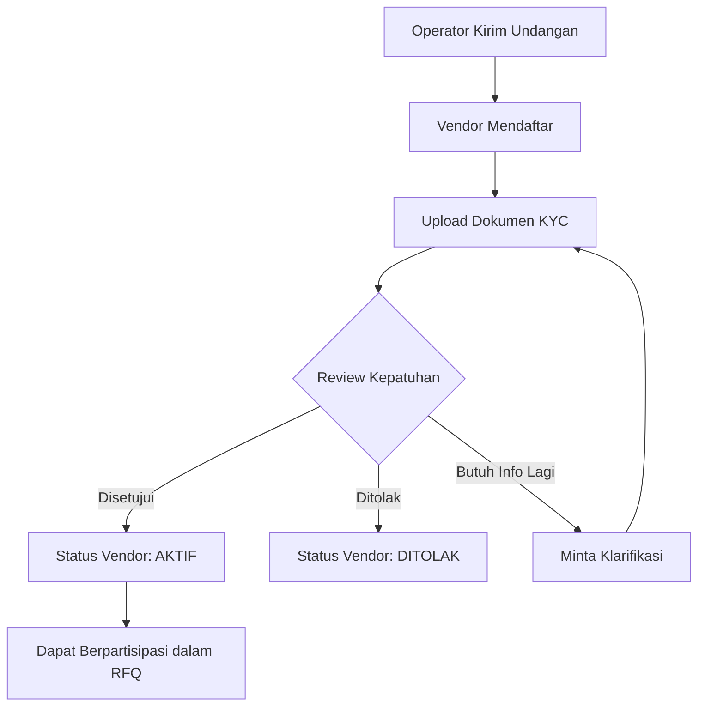

### 3.2 Penawaran & Pemenuhan

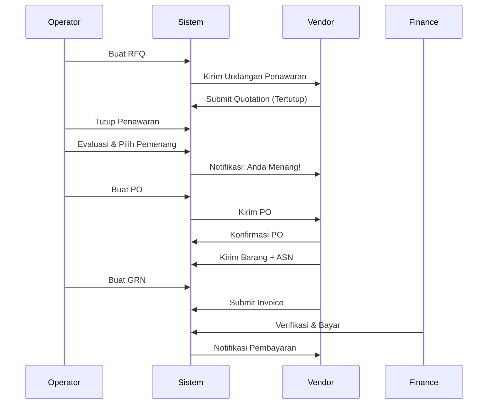

---

## 4. Alur Pengguna (Per Aktor)

### 4.1 Alur Pengguna Admin

**Tujuan:** Konfigurasi sistem, kelola user, pastikan kepatuhan.

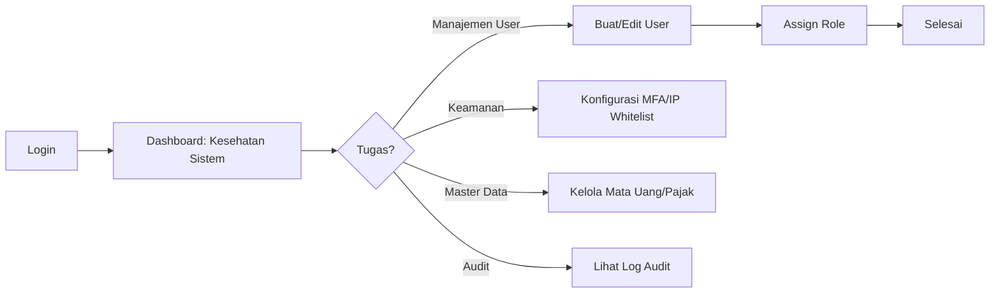

**Layar Utama:**
1.  Dashboard (Metrik Kesehatan Sistem)
2.  Manajemen User (CRUD User)
3.  Matriks Role & Permission
4.  Viewer Audit Trail
5.  Master Data (Mata Uang, Pajak, UoM)

---

### 4.2 Alur Pengguna Operator

**Tujuan:** Eksekusi siklus hidup pengadaan dari PR hingga GRN.

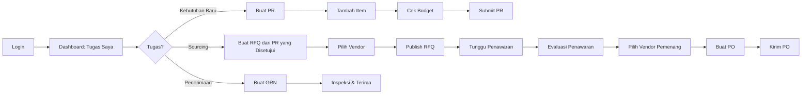

**Layar Utama:**
1.  Dashboard (Tugas Pending, PR, PO)
2.  Form Purchase Requisition
3.  Sourcing Workbench (Manajemen RFQ)
4.  Tabel Perbandingan Penawaran
5.  Wizard Pembuatan PO
6.  Form Goods Receipt

---

### 4.3 Alur Pengguna Supervisor

**Tujuan:** Review dan setujui/tolak request, monitor budget.

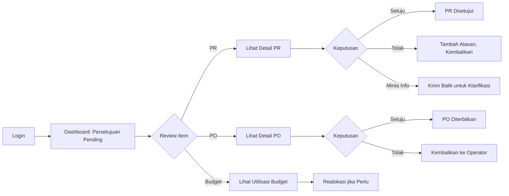

**Layar Utama:**
1.  Inbox Persetujuan (Antrian Terpadu)
2.  View Detail PR/PO (dengan Riwayat)
3.  Dashboard Budget (Grafik, Alert)
4.  Analitik Pengeluaran (Per Kategori/Vendor)

---

### 4.4 Alur Pengguna Finance

**Tujuan:** Verifikasi invoice, proses pembayaran, kelola GL.

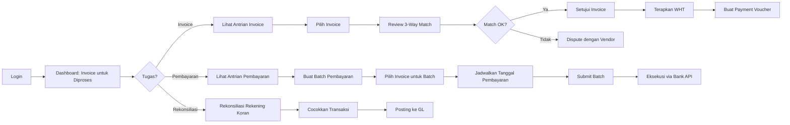

**Layar Utama:**
1.  Dashboard Invoice (Pending, Verified, Paid)
2.  Layar Detail 3-Way Match
3.  Pembuat Batch Pembayaran
4.  Wizard Rekonsiliasi Bank
5.  Laporan AP Aging
6.  Log Posting GL

---

### 4.5 Alur Pengguna Vendor

**Tujuan:** Ikut penawaran, penuhi pesanan, terima pembayaran.

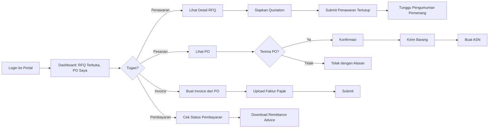

**Layar Utama:**
1.  Dashboard (RFQ Aktif, PO, Pembayaran)
2.  Detail RFQ & Form Submission Penawaran
3.  Layar Konfirmasi PO
4.  Wizard Pembuatan Invoice
5.  Tracker Riwayat & Status Pembayaran

---

## 5. Arsitektur Service (Referensi Developer)

### 5.1 Diagram Interaksi Service

### 5.2 Arsitektur Internal Finance Service

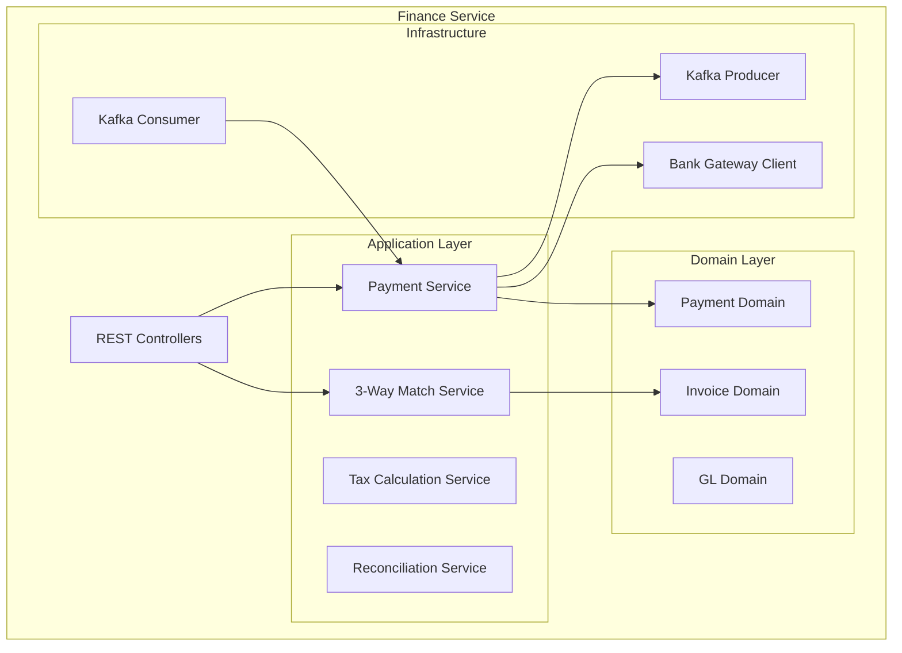

---

## 6. Use Case Finance Tambahan

### UC-FIN-021 Buat Batch Pembayaran
1.  **Aktor:** Finance
2.  **Deskripsi:** Kelompokkan beberapa invoice yang disetujui ke dalam satu run pembayaran untuk efisiensi.
3.  **Alur:**
    1.  Finance memilih rentang tanggal & filter vendor.
    2.  Sistem menampilkan invoiceyang disetujui.
    3.  Finance memilih invoice untuk disertakan.
    4.  Sistem menghitung total jumlah.
    5.  Finance mengkonfirmasi batch.
    6.  Status batch: `PENDING_EXECUTION`.

### UC-FIN-022 Jadwalkan Pembayaran untuk Tanggal Mendatang
1.  **Aktor:** Finance
2.  **Deskripsi:** Tetapkan tanggal spesifik untuk eksekusi pembayaran (contoh: selaraskan dengan cash flow).
3.  **Alur:**
    1.  Finance membuka batch pembayaran.
    2.  Finance menetapkan "Tanggal Eksekusi": 15-01-2026.
    3.  Sistem memvalidasi tanggal adalah hari kerja.
    4.  Batch dijadwalkan.

### UC-FIN-023 Tangani Pembayaran Parsial
1.  **Aktor:** Finance
2.  **Deskripsi:** Bayar sebagian dari invoice (contoh: karena dispute pada beberapa item).
3.  **Alur:**
    1.  Finance membuka invoice yang terverifikasi.
    2.  Finance memasukkan "Jumlah Pembayaran": 80.000.000 (dari total 100.000.000).
    3.  Sistem mencatat pembayaran parsial.
    4.  Status invoice: `DIBAYAR_SEBAGIAN`.
    5.  Saldo tersisa dilacak untuk pembayaran berikutnya.

### UC-FIN-024 Buat Remittance Advice Pembayaran
1.  **Aktor:** Finance
2.  **Deskripsi:** Buat dokumen yang merinci invoice yang dibayar untuk dikirim ke vendor.
3.  **Alur:**
    1.  Setelah batch pembayaran dieksekusi.
    2.  Finance klik "Buat Remittance".
    3.  Sistem membuat PDF yang mencantumkan:
        *   Tanggal Pembayaran
        *   Invoice yang Tercakup
        *   Jumlah (Gross, WHT, Net)
    4.  Finance mengirim email ke vendor.

### UC-FIN-025 Batalkan/Reverse Pembayaran
1.  **Aktor:** Finance (Terautorisasi)
2.  **Deskripsi:** Batalkan pembayaran yang dilakukan secara salah.
3.  **Pra-kondisi:** Status pembayaran adalah `DIBAYAR` tetapi dana belum ditransfer secara eksternal.
4.  **Alur:**
    1.  Finance memilih pembayaran.
    2.  Finance klik "Batalkan Pembayaran".
    3.  Finance memasukkan alasan: "Pembayaran duplikat".
    4.  Sistem memerlukan persetujuan Supervisor untuk reversal > 10Jt.
    5.  Setelah disetujui, status pembayaran: `DIBATALKAN`.
    6.  Jurnal GL di-reverse.
    7.  Invoice kembali ke `DISETUJUI` untuk diproses ulang.

---

## 7. Lampiran: Diagram State

### 7.1 State Purchase Order

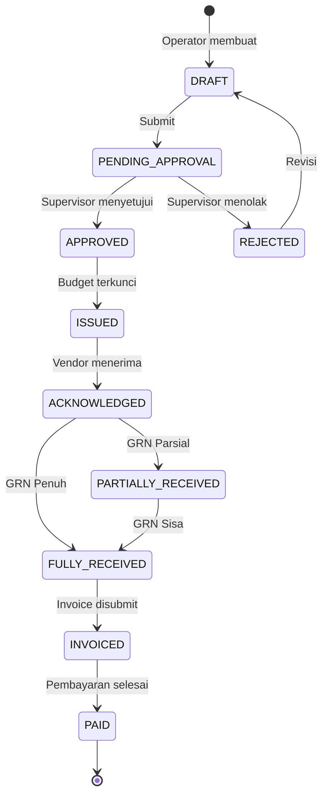

### 7.2 State Invoice

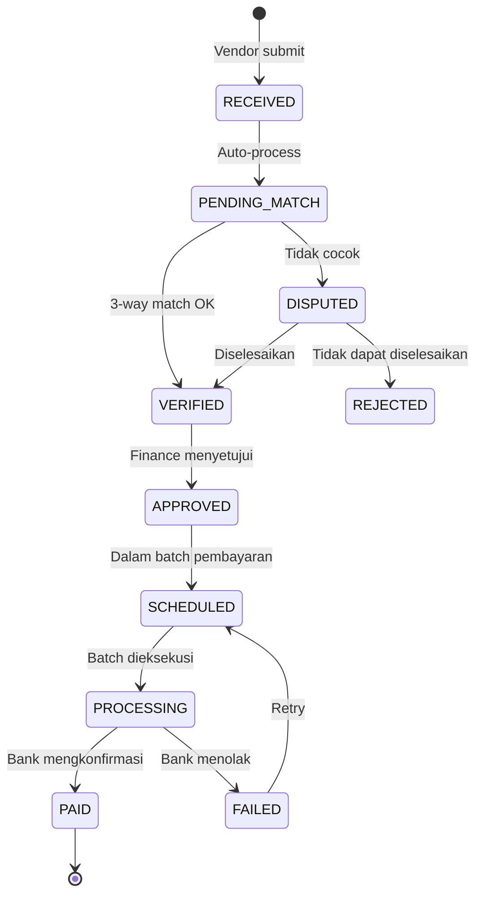
