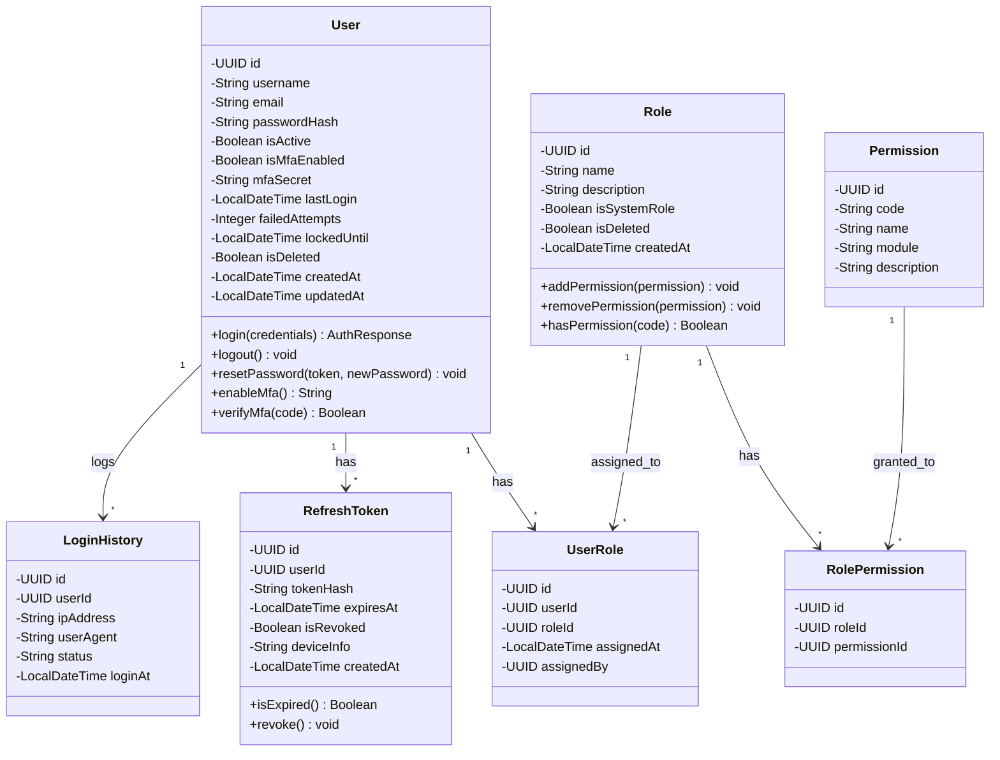
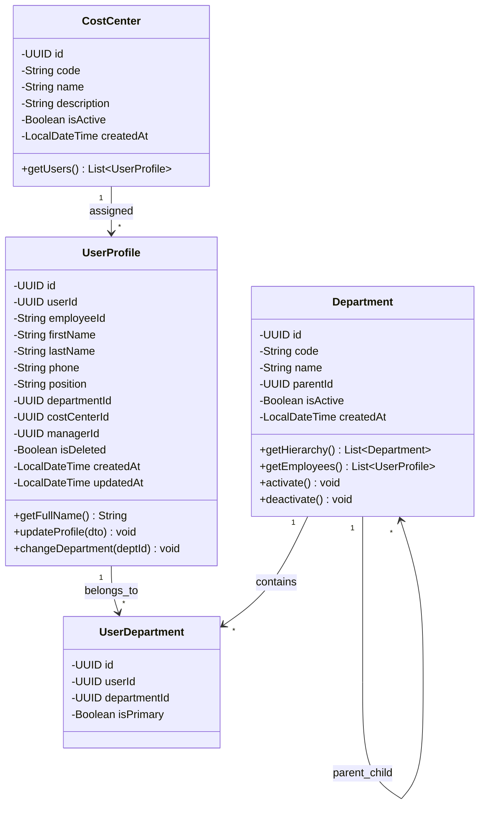
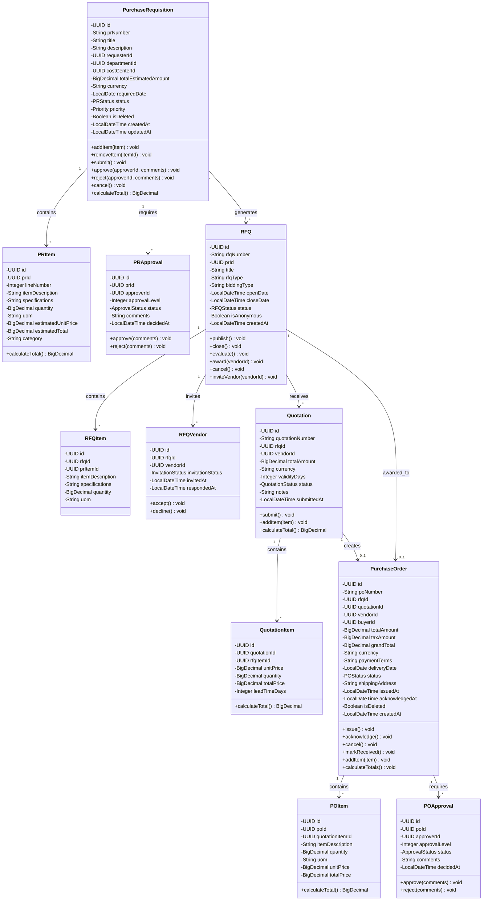
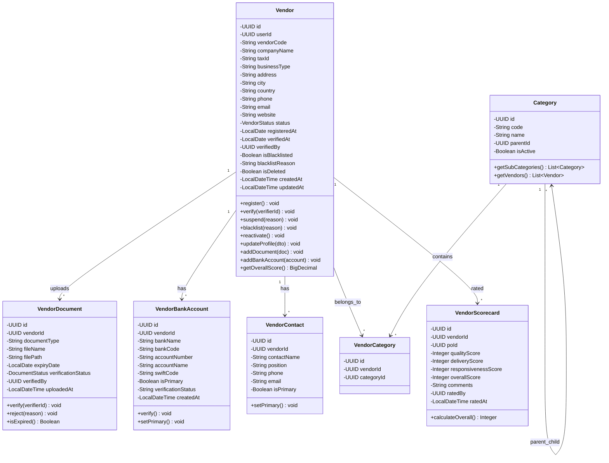
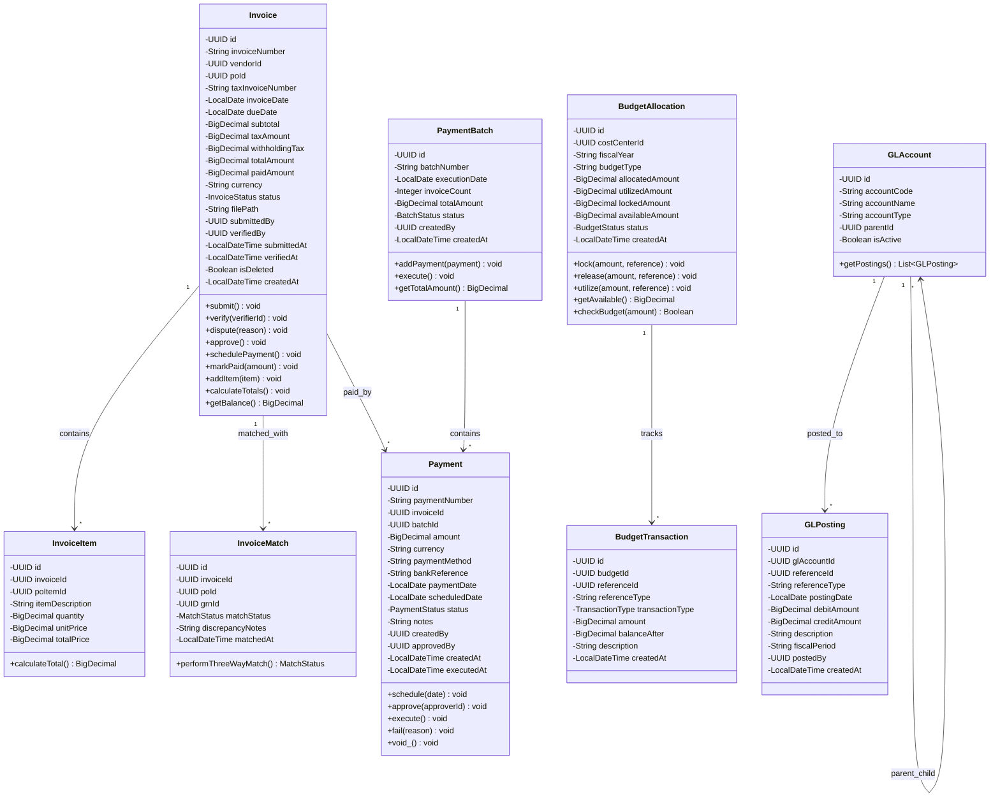
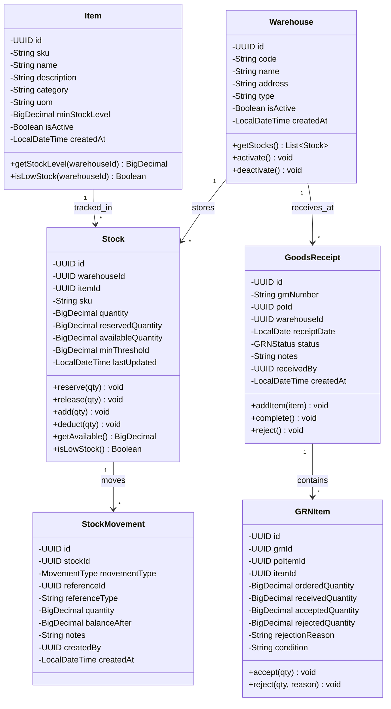
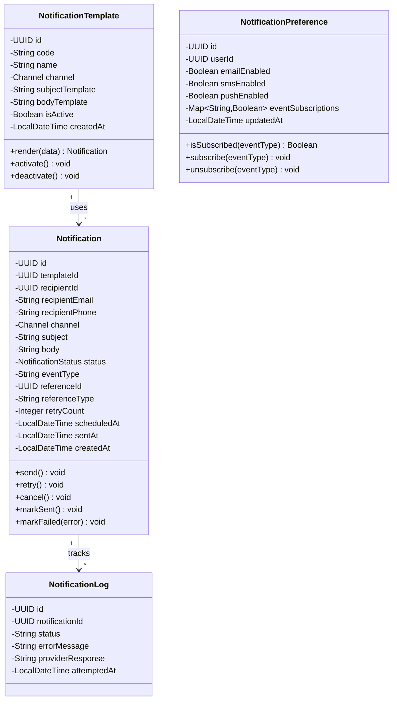
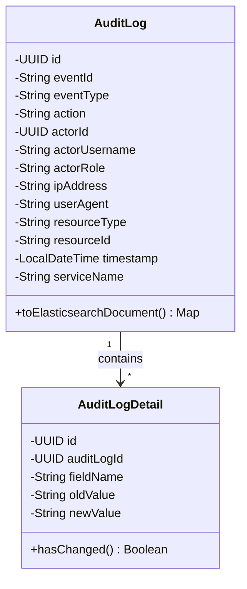
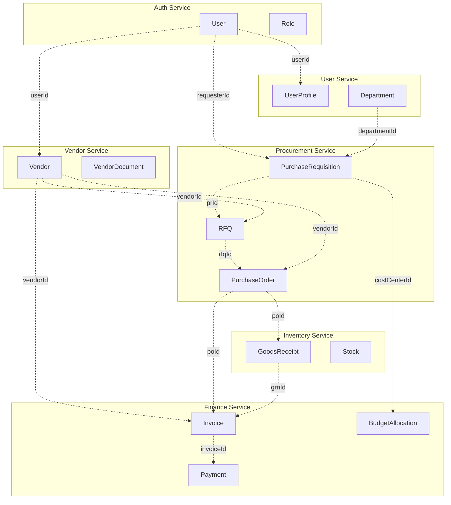

# Class Diagram
**Sistem e-Procurement Enterprise**
**Version:** 1.0 | **Date:** Januari 2026

---

## 1. Overview

Dokumen ini berisi class diagram untuk sistem e-Procurement yang meliputi semua bounded context dalam arsitektur microservices. Setiap service memiliki domain model yang independen namun terintegrasi melalui event-driven architecture.

---

## 2. Auth Service Class Diagram

---

## 3. User Service Class Diagram

---

## 4. Procurement Service Class Diagram

---

## 5. Vendor Service Class Diagram

---

## 6. Finance Service Class Diagram

---

## 7. Inventory Service Class Diagram

---

## 8. Notification Service Class Diagram

---

## 9. Audit Service Class Diagram

---

## 10. Enumerations

```mermaid
classDiagram
    class PRStatus {
        <<enumeration>>
        DRAFT
        PENDING_APPROVAL
        APPROVED
        REJECTED
        CANCELLED
        CONVERTED
    }

    class RFQStatus {
        <<enumeration>>
        DRAFT
        PUBLISHED
        CLOSED
        EVALUATING
        AWARDED
        CANCELLED
    }

    class POStatus {
        <<enumeration>>
        DRAFT
        PENDING_APPROVAL
        APPROVED
        ISSUED
        ACKNOWLEDGED
        PARTIALLY_RECEIVED
        FULLY_RECEIVED
        INVOICED
        CLOSED
        CANCELLED
    }

    class VendorStatus {
        <<enumeration>>
        PENDING_REGISTRATION
        PENDING_VERIFICATION
        ACTIVE
        SUSPENDED
        BLACKLISTED
        INACTIVE
    }

    class InvoiceStatus {
        <<enumeration>>
        RECEIVED
        PENDING_MATCH
        VERIFIED
        DISPUTED
        APPROVED
        SCHEDULED
        PARTIALLY_PAID
        PAID
        CANCELLED
    }

    class PaymentStatus {
        <<enumeration>>
        DRAFT
        PENDING_APPROVAL
        APPROVED
        SCHEDULED
        PROCESSING
        PAID
        FAILED
        VOIDED
    }

    class Channel {
        <<enumeration>>
        EMAIL
        SMS
        PUSH
        IN_APP
    }

    class MovementType {
        <<enumeration>>
        RECEIPT
        ISSUE
        TRANSFER
        ADJUSTMENT
        RETURN
        RESERVATION
        RELEASE
    }

    class Priority {
        <<enumeration>>
        LOW
        MEDIUM
        HIGH
        URGENT
    }

    class ApprovalStatus {
        <<enumeration>>
        PENDING
        APPROVED
        REJECTED
    }
```

---

## 11. Cross-Service Relationships

Diagram berikut menunjukkan hubungan antar bounded context dalam arsitektur microservices:

> **Note:** Garis putus-putus menunjukkan referensi logical antar service yang tidak di-enforce sebagai foreign key constraints karena menggunakan pattern Database-per-Service.

---

## 12. Design Patterns Used

| Pattern | Penggunaan |
|:---|:---|
| **Aggregate Root** | `PurchaseRequisition`, `PurchaseOrder`, `Invoice`, `Vendor` bertindak sebagai aggregate root yang mengelola child entities |
| **Value Object** | `Money` (amount + currency), `Address`, `DateRange` |
| **Domain Event** | Events seperti `PRCreatedEvent`, `POIssuedEvent` dipublish ke Kafka |
| **Repository Pattern** | Setiap aggregate root memiliki repository interface |
| **Factory Pattern** | Digunakan untuk membuat complex objects seperti `PO` dari `Quotation` |
| **Specification Pattern** | Untuk business rules seperti approval thresholds |
| **Soft Delete** | Semua entities menggunakan `isDeleted` flag |

---

## 13. Catatan Implementasi

1. **UUID sebagai Primary Key:** Semua entities menggunakan UUID v4 untuk primary key
2. **Audit Columns:** Semua entities memiliki `createdAt`, `updatedAt`, dan `isDeleted`
3. **Immutable Value Objects:** Objects seperti `Money` dibuat immutable
4. **Lazy Loading:** Gunakan lazy loading untuk relasi one-to-many
5. **Optimistic Locking:** Gunakan version field untuk concurrent updates
