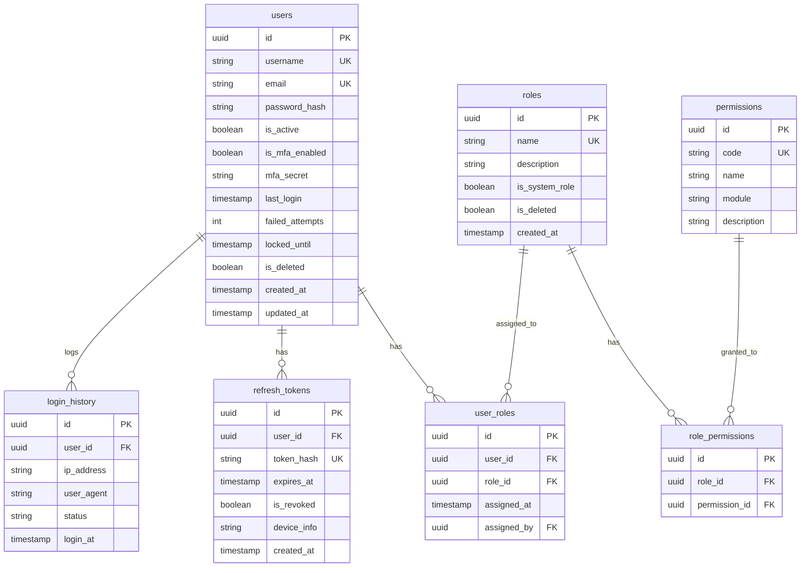
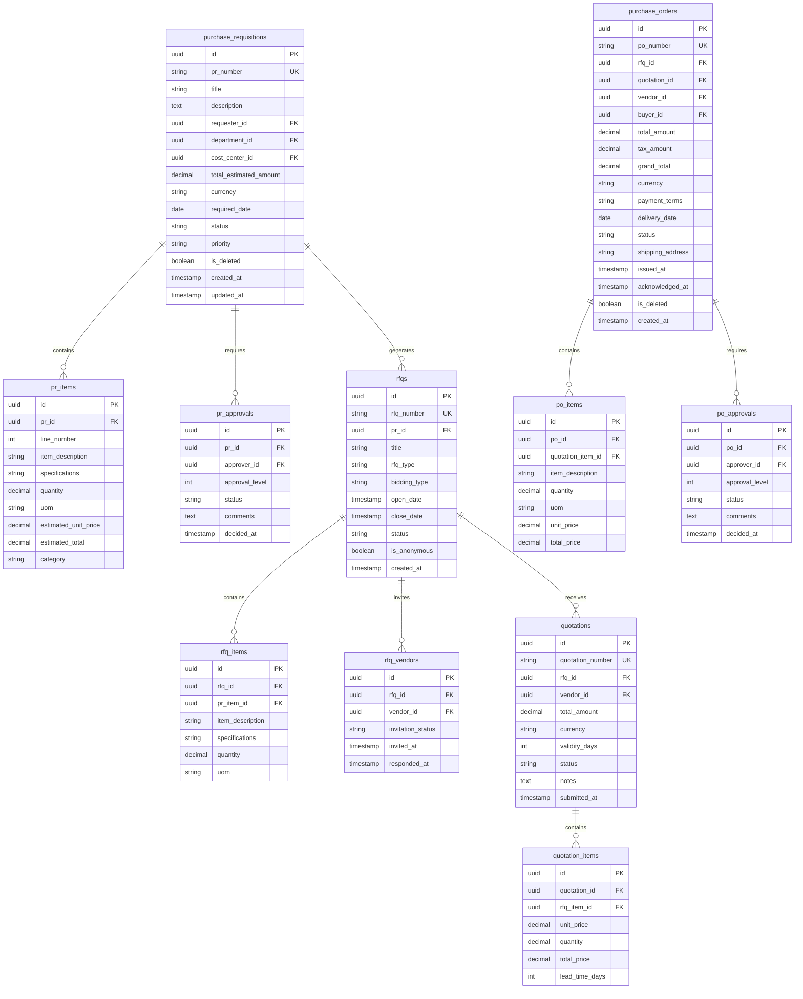
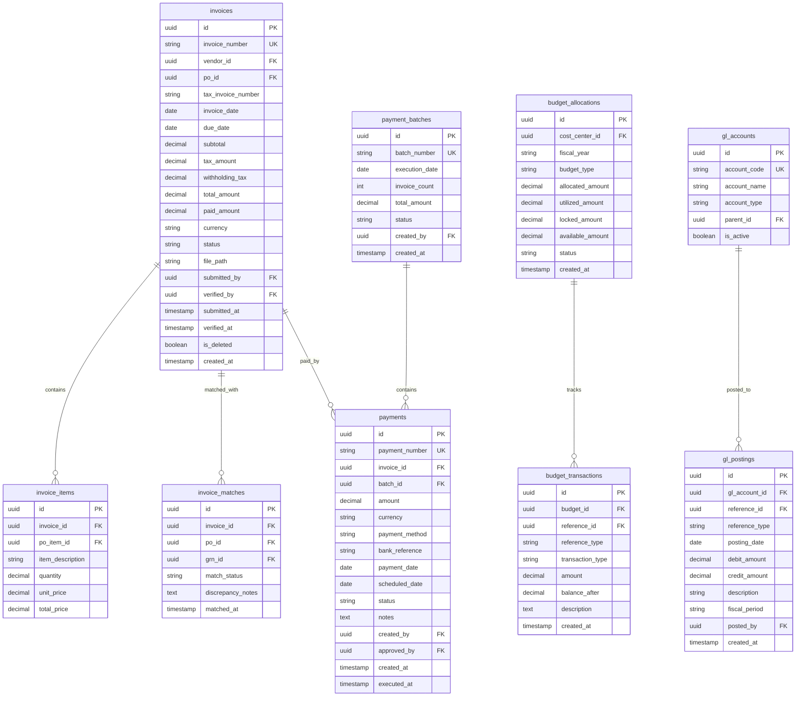
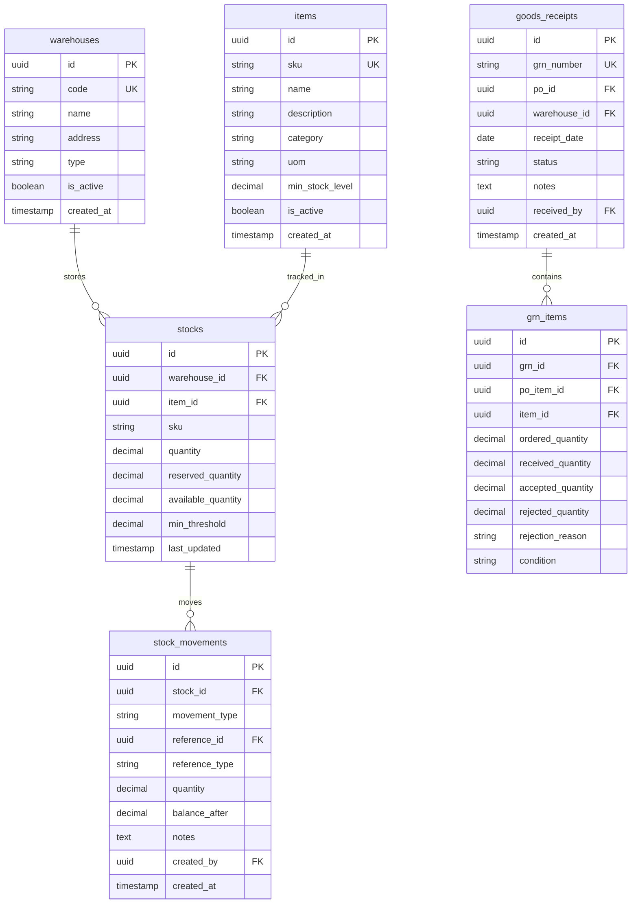
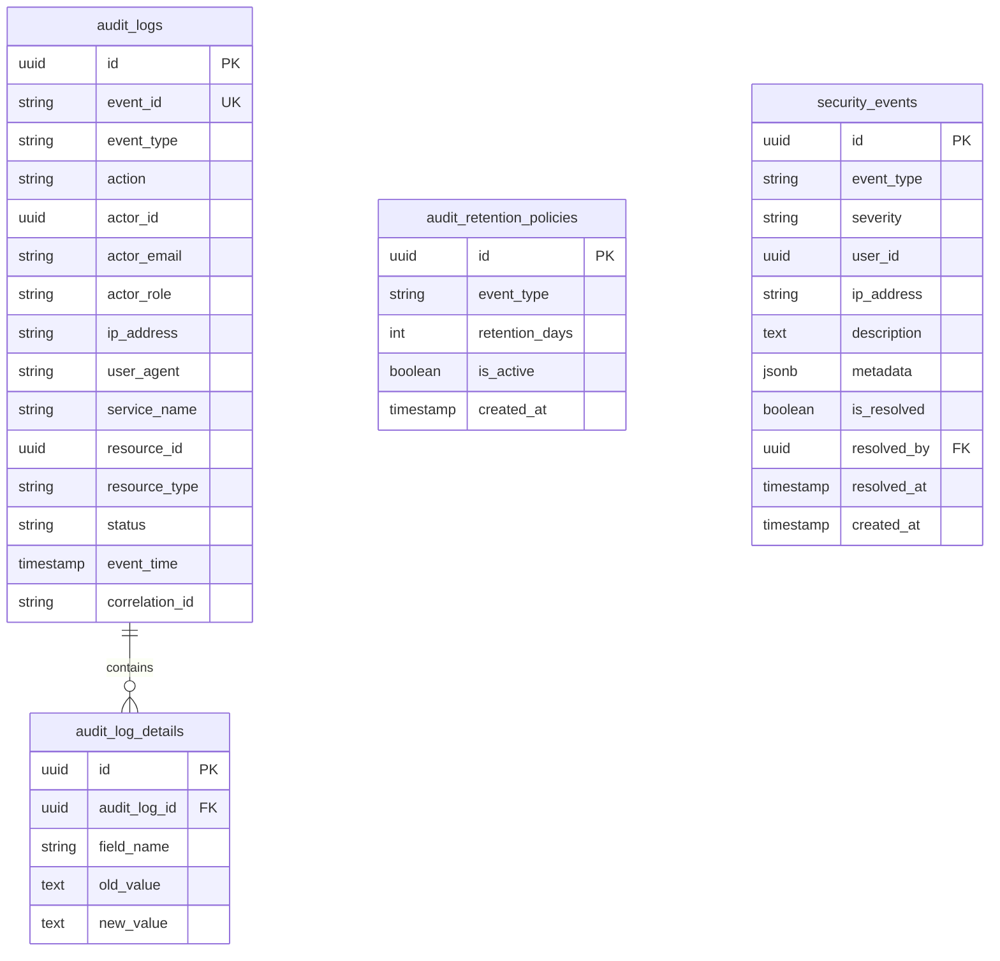
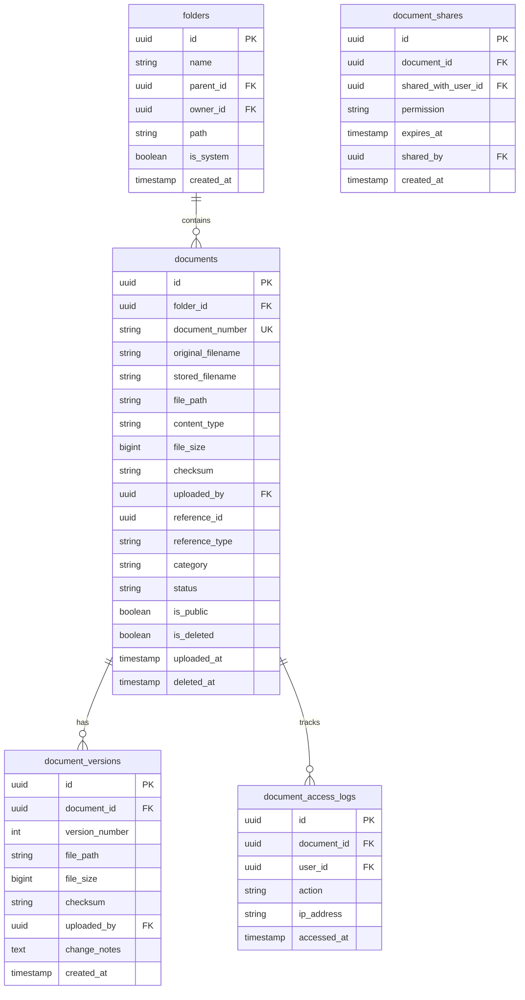

# Database Schema & Entity Relationship Diagrams
**Version:** 1.0
**Date:** January 2026
**Pattern:** Database-per-Service (Microservices)

---

## 1. Overview

Each microservice owns its own database schema. This document defines the core tables, relationships, and constraints for each bounded context.

**Database Technology:** PostgreSQL 16
**Naming Convention:** `snake_case` for tables and columns
**Soft Delete:** All entities use `is_deleted` flag instead of hard delete

---

## 2. Auth Service Schema

### 2.1 ERD



### 2.2 Key Tables

| Table | Description | Key Columns |
|:---|:---|:---|
| `users` | All system users (Internal & External) | `username`, `email`, `password_hash` |
| `roles` | Role definitions (ADMIN, OPERATOR, etc.) | `name`, `is_system_role` |
| `permissions` | Granular permissions | `code` (e.g., `PR_CREATE`) |
| `user_roles` | Many-to-many: User ↔ Role | `user_id`, `role_id` |
| `role_permissions` | Many-to-many: Role ↔ Permission | `role_id`, `permission_id` |
| `refresh_tokens` | JWT refresh token storage | `token_hash`, `expires_at` |
| `login_history` | Audit: login attempts | `ip_address`, `status` |

---

## 3. User Service Schema

### 3.1 ERD

```mermaid
erDiagram
    user_profiles ||--|| users : extends
    user_profiles ||--o{ user_departments : belongs_to
    departments ||--o{ user_departments : contains
    cost_centers ||--o{ user_profiles : assigned

    user_profiles {
        uuid id PK
        uuid user_id FK UK
        string employee_id UK
        string first_name
        string last_name
        string phone
        string position
        uuid department_id FK
        uuid cost_center_id FK
        uuid manager_id FK
        boolean is_deleted
        timestamp created_at
        timestamp updated_at
    }

    departments {
        uuid id PK
        string code UK
        string name
        uuid parent_id FK
        boolean is_active
        timestamp created_at
    }

    cost_centers {
        uuid id PK
        string code UK
        string name
        string description
        boolean is_active
        timestamp created_at
    }

    user_departments {
        uuid id PK
        uuid user_id FK
        uuid department_id FK
        boolean is_primary
    }
```

---

## 4. Procurement Service Schema

### 4.1 ERD



### 4.2 Status Enums

**PR Status:** `DRAFT`, `PENDING_APPROVAL`, `APPROVED`, `REJECTED`, `CANCELLED`, `CONVERTED`

**RFQ Status:** `DRAFT`, `PUBLISHED`, `CLOSED`, `EVALUATING`, `AWARDED`, `CANCELLED`

**PO Status:** `DRAFT`, `PENDING_APPROVAL`, `APPROVED`, `ISSUED`, `ACKNOWLEDGED`, `PARTIALLY_RECEIVED`, `FULLY_RECEIVED`, `INVOICED`, `CLOSED`, `CANCELLED`

---

## 5. Vendor Service Schema

### 5.1 ERD

```mermaid
erDiagram
    vendors ||--o{ vendor_documents : uploads
    vendors ||--o{ vendor_bank_accounts : has
    vendors ||--o{ vendor_contacts : has
    vendors ||--o{ vendor_categories : belongs_to
    vendors ||--o{ vendor_scorecards : rated
    categories ||--o{ vendor_categories : contains

    vendors {
        uuid id PK
        uuid user_id FK UK
        string vendor_code UK
        string company_name
        string tax_id UK
        string business_type
        string address
        string city
        string country
        string phone
        string email
        string website
        string status
        date registered_at
        date verified_at
        uuid verified_by FK
        boolean is_blacklisted
        string blacklist_reason
        boolean is_deleted
        timestamp created_at
        timestamp updated_at
    }

    vendor_documents {
        uuid id PK
        uuid vendor_id FK
        string document_type
        string file_name
        string file_path
        date expiry_date
        string verification_status
        uuid verified_by FK
        timestamp uploaded_at
    }

    vendor_bank_accounts {
        uuid id PK
        uuid vendor_id FK
        string bank_name
        string bank_code
        string account_number
        string account_name
        string swift_code
        boolean is_primary
        string verification_status
        timestamp created_at
    }

    vendor_contacts {
        uuid id PK
        uuid vendor_id FK
        string contact_name
        string position
        string phone
        string email
        boolean is_primary
    }

    categories {
        uuid id PK
        string code UK
        string name
        uuid parent_id FK
        boolean is_active
    }

    vendor_categories {
        uuid id PK
        uuid vendor_id FK
        uuid category_id FK
    }

    vendor_scorecards {
        uuid id PK
        uuid vendor_id FK
        uuid po_id FK
        int quality_score
        int delivery_score
        int responsiveness_score
        int overall_score
        text comments
        uuid rated_by FK
        timestamp rated_at
    }
```

### 5.2 Status Enums

**Vendor Status:** `PENDING_REGISTRATION`, `PENDING_VERIFICATION`, `ACTIVE`, `SUSPENDED`, `BLACKLISTED`, `INACTIVE`

**Document Status:** `PENDING`, `VERIFIED`, `REJECTED`, `EXPIRED`

---

## 6. Finance Service Schema

### 6.1 ERD



### 6.2 Status Enums

**Invoice Status:** `RECEIVED`, `PENDING_MATCH`, `VERIFIED`, `DISPUTED`, `APPROVED`, `SCHEDULED`, `PARTIALLY_PAID`, `PAID`, `CANCELLED`

**Payment Status:** `DRAFT`, `PENDING_APPROVAL`, `APPROVED`, `SCHEDULED`, `PROCESSING`, `PAID`, `FAILED`, `VOIDED`

**Budget Transaction Type:** `ALLOCATION`, `LOCK`, `RELEASE`, `UTILIZATION`, `ADJUSTMENT`

---

## 7. Inventory Service Schema

### 7.1 ERD



### 7.2 Movement Types

`RECEIPT`, `ISSUE`, `TRANSFER`, `ADJUSTMENT`, `RETURN`, `RESERVATION`, `RELEASE`

---

## 8. Cross-Service References

### 8.1 Foreign Key Strategy

Since we use Database-per-Service, cross-service references are stored as UUIDs but **NOT enforced** as FK constraints.

| Source Table | Column | References (Logical) |
|:---|:---|:---|
| `purchase_requisitions.requester_id` | → | `users.id` (Auth Service) |
| `purchase_orders.vendor_id` | → | `vendors.id` (Vendor Service) |
| `invoices.po_id` | → | `purchase_orders.id` (Procurement) |
| `invoice_matches.grn_id` | → | `goods_receipts.id` (Inventory) |

### 8.2 Data Consistency

Cross-service consistency is maintained via:
1.  **Event-Driven Updates:** Kafka events propagate state changes.
2.  **Eventual Consistency:** Read models may lag slightly.
3.  **Saga Pattern:** For distributed transactions.

---

## 9. Indexing Strategy

### 9.1 Common Indexes

| Table | Index | Columns | Type |
|:---|:---|:---|:---|
| `users` | `idx_users_email` | `email` | Unique |
| `purchase_orders` | `idx_po_status` | `status` | B-tree |
| `purchase_orders` | `idx_po_vendor` | `vendor_id` | B-tree |
| `invoices` | `idx_inv_status_due` | `status`, `due_date` | B-tree |
| `stocks` | `idx_stock_warehouse_item` | `warehouse_id`, `item_id` | Unique |

### 9.2 Audit Columns

All tables include:
- `created_at TIMESTAMP DEFAULT NOW()`
- `updated_at TIMESTAMP` (updated via trigger)
- `is_deleted BOOLEAN DEFAULT FALSE`

---

## 10. Notification Service Schema

### 10.1 ERD

```mermaid
erDiagram
    notification_templates ||--o{ notifications : uses
    notifications ||--o{ notification_logs : tracks

    notification_templates {
        uuid id PK
        string code UK
        string name
        string channel
        string subject_template
        text body_template
        boolean is_active
        timestamp created_at
    }

    notifications {
        uuid id PK
        uuid template_id FK
        uuid recipient_id FK
        string recipient_email
        string recipient_phone
        string channel
        string subject
        text body
        string status
        string event_type
        uuid reference_id
        string reference_type
        int retry_count
        timestamp scheduled_at
        timestamp sent_at
        timestamp created_at
    }

    notification_logs {
        uuid id PK
        uuid notification_id FK
        string status
        text error_message
        string provider_response
        timestamp attempted_at
    }

    notification_preferences {
        uuid id PK
        uuid user_id FK UK
        boolean email_enabled
        boolean sms_enabled
        boolean push_enabled
        jsonb event_subscriptions
        timestamp updated_at
    }
```

### 10.2 Status Enums

**Notification Status:** `PENDING`, `QUEUED`, `SENDING`, `SENT`, `FAILED`, `CANCELLED`

**Channel:** `EMAIL`, `SMS`, `PUSH`, `IN_APP`

---

## 11. Audit Service Schema

### 11.1 ERD



### 11.2 Event Types

**Action Types:** `CREATE`, `READ`, `UPDATE`, `DELETE`, `APPROVE`, `REJECT`, `LOGIN`, `LOGOUT`, `EXPORT`

**Security Event Types:** `FAILED_LOGIN`, `BRUTE_FORCE`, `UNAUTHORIZED_ACCESS`, `DATA_EXPORT`, `ROLE_CHANGE`, `PASSWORD_RESET`

**Severity:** `LOW`, `MEDIUM`, `HIGH`, `CRITICAL`

---

## 12. Document Service Schema

### 12.1 ERD



### 12.2 Status & Enums

**Document Status:** `ACTIVE`, `ARCHIVED`, `PENDING_SCAN`, `INFECTED`, `DELETED`

**Category:** `PR_ATTACHMENT`, `VENDOR_KYC`, `INVOICE`, `CONTRACT`, `REPORT`, `OTHER`

**Access Action:** `VIEW`, `DOWNLOAD`, `PRINT`, `SHARE`

**Share Permission:** `VIEW`, `DOWNLOAD`, `EDIT`
