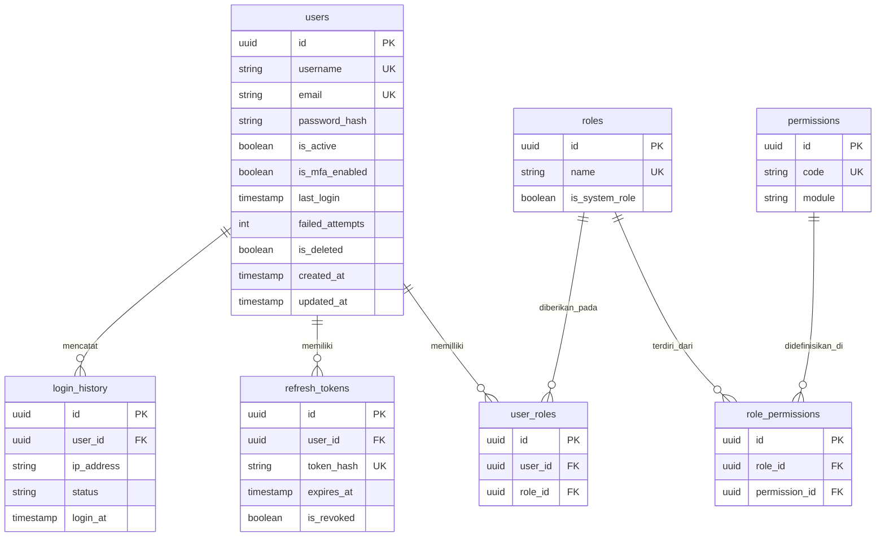
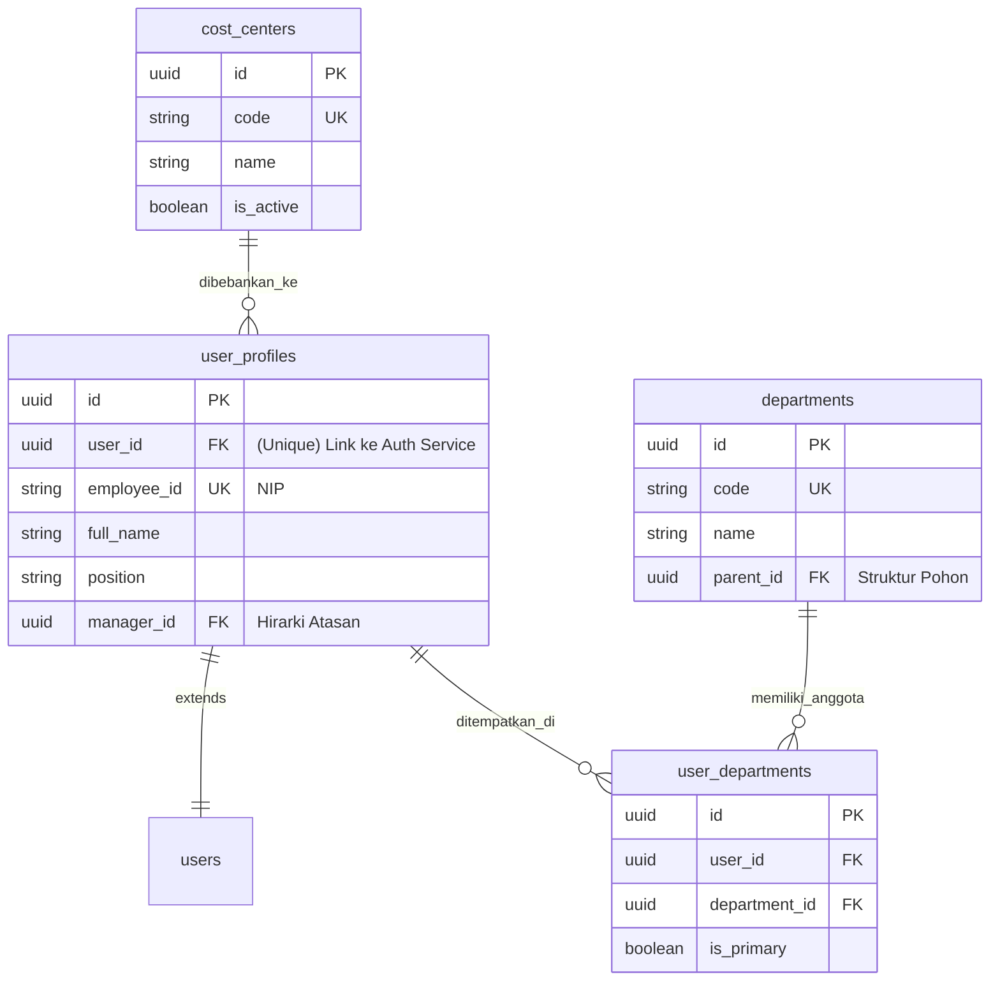
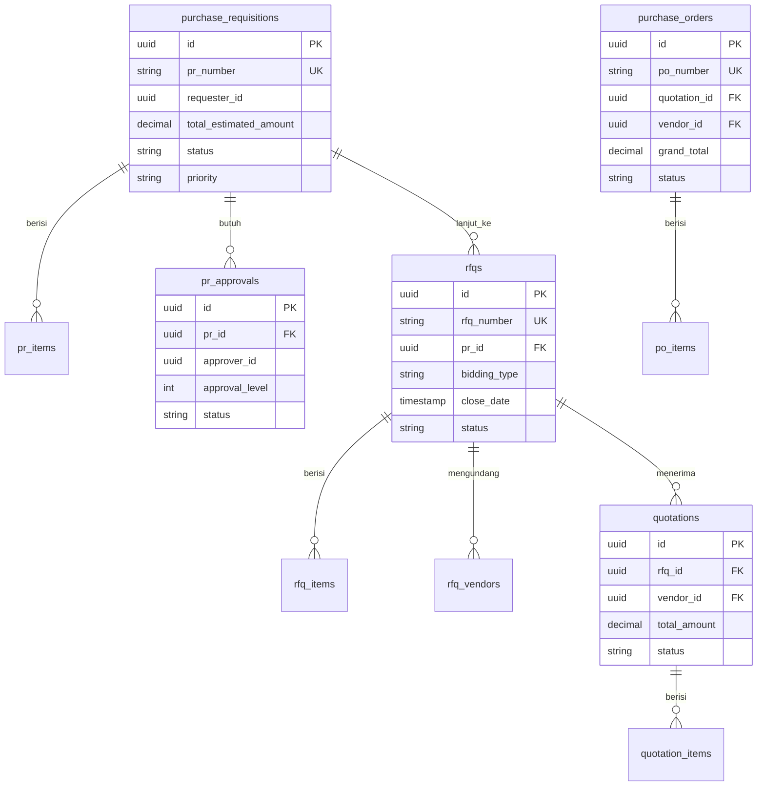
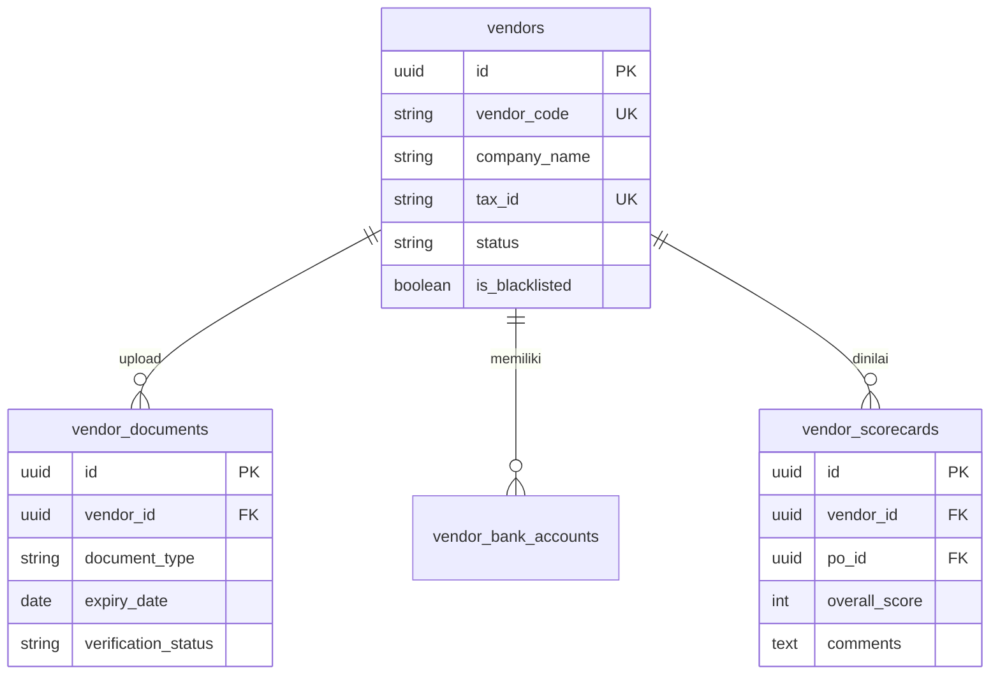
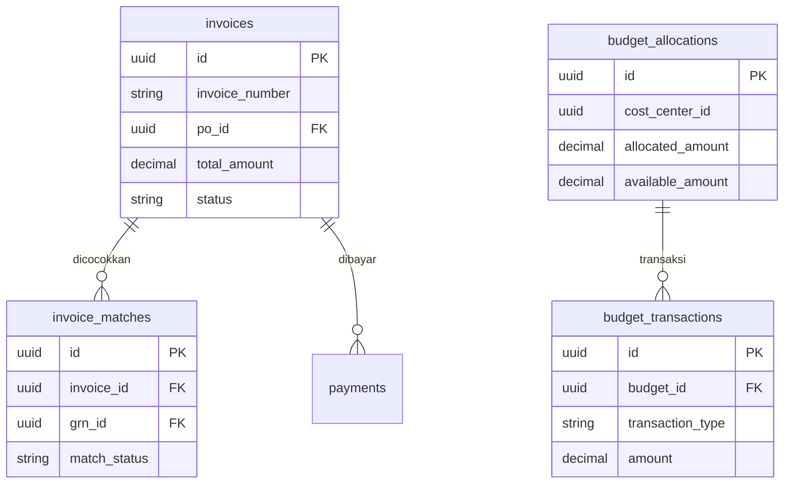

# Skema Database & Diagram Hubungan Entitas (ERD)
**Versi:** 1.1 - Detailed
**Tanggal:** Januari 2026
**Pola Arsitektur:** Database-per-Service (Microservices)

---

## 1. Tinjauan Umum (Overview)

Sistem ini dibangun di atas arsitektur **Microservices**, yang menuntut pemisahan data yang ketat. Berbeda dengan sistem *monolithic* tradisional di mana semua data berada dalam satu database raksasa (shared database), sistem ini menerapkan pola **Database-per-Service**.

### Prinsip Utama Perancangan:
1.  **Isolasi Data (Data Isolation):** Setiap layanan (microservice) memiliki skema database privatnya sendiri. Layanan A tidak boleh melakukan *query* langsung ke tabel milik Layanan B. Akses data lintas layanan hanya diperbolehkan melalui API resmi atau publikasi *event*.
2.  **Kepemilikan Jelas (Clear Ownership):** Setiap tabel memiliki satu "pemilik" tunggal. Contoh: Tabel `vendors` hanya boleh ditulis/diubah oleh **Vendor Service**.
3.  **Integritas Referensial Logis:** Karena database terpisah secara fisik, tidak ada *Foreign Key constraint* keras antar layanan. Referensi disimpan sebagai UUID dan validitasnya dijaga melalui mekanisme logis (pengecekan API) dan konsistensi akhir (*eventual consistency*).
4.  **Standar Audit:** Seluruh tabel transaksional wajib memiliki kolom audit standar (`created_at`, `updated_at`, `is_deleted`) untuk memastikan jejak data yang baik dan mendukung *soft delete*.

---

## 2. Layanan Autentikasi (Auth Service)

Layanan ini adalah gerbang keamanan sistem. Fokus utamanya adalah manajemen **Identitas** (siapa pengguna ini?) dan **Akses** (apa hak pengguna ini?).

### 2.1 Peta Hubungan Entitas (ERD)

### 2.2 Penjelasan Mendetail Entitas

#### Tabel `users`
Tabel ini adalah pusat identitas. Ia tidak menyimpan profil detail (seperti alamat atau jabatan), melainkan hanya data kredensial vital.
*   `password_hash`: Menyimpan kata sandi yang telah di-hash (misal menggunakan BCrypt), bukan teks asli.
*   `is_mfa_enabled`: Menandakan apakah pengguna wajib memasukkan kode OTP (2FA) saat login.
*   `failed_attempts`: Digunakan untuk mekanisme keamanan; jika gagal login berturut-turut (misal 5 kali), akun akan dikunci sementara.

#### Tabel `roles` & `permissions`
Sistem ini menggunakan **Role-Based Access Control (RBAC)** yang fleksibel.
*   `permissions`: Unit terkecil dari hak akses. Contoh: `PR_CREATE` (membuat PR), `PR_APPROVE` (menyetujui PR).
*   `roles`: Kumpulan dari permission. Contoh: Role `STAFF_PROCUREMENT` mungkin memiliki permission `PR_CREATE` dan `RFQ_CREATE`, namun tidak memiliki `PR_APPROVE`.
*   Relasi `user_roles` memungkinkan satu user memiliki banyak role sekaligus (misal: seorang Manager yang juga merangkap sebagai Admin sementara).

---

## 3. Layanan Pengguna (User Service)

Jika Auth Service menangani "login", User Service menangani "profil". Layanan ini menyimpan struktur organisasi perusahaan.

### 3.1 Peta Hubungan Entitas (ERD)

### 3.2 Penjelasan Mendetail Entitas

#### Tabel `user_profiles`
Menyimpan atribut bisnis pengguna.
*   `manager_id`: Kolom rekursif yang menunjuk ke user lain. Ini sangat krusial untuk **Workflow Approval** (misal: PR harus disetujui oleh atasan langsung).
*   `user_id`: Foreign Key logis yang menghubungkan profil ini dengan akun login di Auth Service.

#### Tabel `departments` & `cost_centers`
*   `departments`: Struktur organisasi hierarkis (Parent-Child). Contoh: Divisi IT (Parent) -> Tim Development (Child).
*   `cost_centers`: Digunakan untuk pemetaan anggaran. Setiap karyawan biasanya terikat pada satu cost center utama, yang akan menjadi *default charging* saat mereka membuat PR.

---

## 4. Layanan Pengadaan (Procurement Service)

Jantung dari sistem. Layanan ini mengelola alur dokumen transaksional dari kebutuhan hingga pemesanan.

### 4.1 Peta Hubungan Entitas (ERD)

### 4.2 Alur Data & Logika Bisnis

#### 1. Permintaan Pembelian (`purchase_requisitions`)
Setiap proses dimulai di sini. Tabel ini mencatat "apa yang dibutuhkan".
*   `status`: Mengontrol siklus hidup PR (`DRAFT` > `PENDING_APPROVAL` > `APPROVED` > `CONVERTED`).
*   **Relasi Approval:** Tabel `pr_approvals` menyimpan riwayat persetujuan. Jika PR bernilai tinggi, mungkin memerlukan multiple rows di tabel ini (Level 1: Manager, Level 2: Direktur).

#### 2. Tender / RFQ (`rfqs`)
Setelah PR disetujui, ia dikonversi menjadi RFQ untuk dicarikan vendornya.
*   `bidding_type`: Menentukan mekanisme tender. `OPEN` berarti semua vendor terdaftar bisa melihat, `INVITATION` berarti hanya vendor di tabel `rfq_vendors` yang bisa akses.
*   `is_anonymous`: Jika `true`, nama vendor disembunyikan selama proses bidding (blind bidding) untuk mencegah kolusi.

#### 3. Penawaran Vendor (`quotations`)
Jawaban vendor atas RFQ.
*   Satu RFQ bisa memiliki banyak Quotation.
*   User akan melakukan evaluasi dan memilih satu Quotation sebagai pemenang (`status: AWARDED`).

#### 4. Pesanan Pembelian (`purchase_orders`)
Kontrak legal yang dikirim ke pemenang.
*   Data di tabel ini adalah "snapshot" final dari kesepakatan harga dan barang. Tidak boleh berubah setelah status `ISSUED`.

---

## 5. Layanan Vendor (Vendor Service)

Mengelola "Database Rekanan". Fokus pada integritas data supplier dan kepatuhan (compliance).

### 5.1 Peta Hubungan Entitas (ERD)

### 5.2 Penjelasan Mendetail Entitas

#### Tabel `vendors`
Menyimpan profil perusahaan rekanan.
*   `is_blacklisted`: Flag kritis. Jika `true`, sistem Procurement akan otomatis memblokir vendor ini dari RFQ/PO baru.
*   `status`: `PENDING_VERIFICATION` berarti vendor baru daftar dan belum diverifikasi tim internal.

#### Tabel `vendor_documents`
Menyimpan link ke file legalitas (SIUP, NPWP, TDP).
*   `expiry_date`: Digunakan oleh job scheduler untuk mengirim notifikasi jika dokumen vendor mendekati kadaluarsa.
*   `verification_status`: Setiap dokumen harus ditinjau manual (`VERIFIED`) sebelum vendor menjadi `ACTIVE`.

#### Tabel `vendor_scorecards`
Sistem penilaian kinerja vendor berbasis transaksi. Setiap kali PO selesai, user internal mengisi scorecard ini. Nilai rata-rata dari tabel ini menentukan rating vendor.

---

## 6. Layanan Keuangan (Finance Service)

Menangani aspek moneter: Tagihan masuk dan Pembayaran keluar.

### 6.1 Peta Hubungan Entitas (ERD)

### 6.2 Logika Bisnis Kunci

#### Mekanisme 3-Way Matching (`invoice_matches`)
Ini adalah fitur keamanan finansial utama. Tabel `invoice_matches` menghubungkan tiga dokumen:
1.  **PO** (Apa yang kita pesan?)
2.  **GRN/Goods Receipt** (Apa yang kita terima? - *Data dari Inventory Service*)
3.  **Invoice** (Apa yang ditagihkan vendor?)

Jika ketiga data (Jumlah & Harga) cocok dalam toleransi tertentu, status menjadi `MATCHED` dan pembayaran bisa dijadwalkan. Jika tidak, status `DISCREPANCY` dan butuh review manual.

#### Kontrol Anggaran (`budget_allocations`)
Mengelola plafon anggaran per departemen.
*   `locked_amount`: Saat PR disetujui, dana tidak langsung berkurang, tapi "dikunci" agar tidak dipakai PR lain.
*   `utilized_amount`: Saat PO rilis, dana diubah dari "terkunci" menjadi "terpakai".

---

## 7. Layanan Inventaris (Inventory Service)

Bertugas mencatat fisik barang.

### 7.1 Penjelasan Mendetail Entitas

#### Tabel `stocks`
Menyimpan saldo barang per gudang.
*   `reserved_quantity`: Stok yang sudah dipesan untuk Project tertentu tapi belum dikeluarkan fisik.
*   `available_quantity`: `quantity` fisik dikurangi `reserved`.

#### Tabel `stock_movements`
Ini adalah **Ledger Inventaris**. Tabel `stocks` hanya menyimpan saldo akhir, sedangkan `stock_movements` menyimpan *history perubahannya*.
*   Setiap kali barang masuk/keluar, satu baris harus ditambahkan ke tabel ini.
*   Memungkinkan audit: "Kenapa stok barang X berkurang 5 pcs pada tanggal Y?" -> Cek tabel ini.

#### Tabel `goods_receipts` (GRN)
Bukti penerimaan barang dari vendor.
*   Dokumen ini yang menjadi dasar bagi Finance Service untuk mengakui utang (Account Payable).

---

## 8. Layanan Audit (Audit Service) & Notifikasi

### Tabel `audit_logs`
Tabel ini bertindak sebagai "Kotak hitam" sistem. Semua aktivitas create/update/delete yang krusial di seluruh service akan mengirim event yang disimpan di sini.
*   `old_value` vs `new_value`: Menyimpan snapshot data sebelum dan sesudah perubahan untuk pelacakan forensik.

### Tabel `notifications`
Menyimpan antrian pengiriman pesan.
*   Memisahkan logika aplikasi (misal: "PR Approved") dari logika pengiriman teknis (misal: "Kirim email SMTP"). Jika SMTP error, aplikasi utama tidak terganggu, dan tabel ini mencatat status `FAILED` untuk dicoba ulang (retry).
