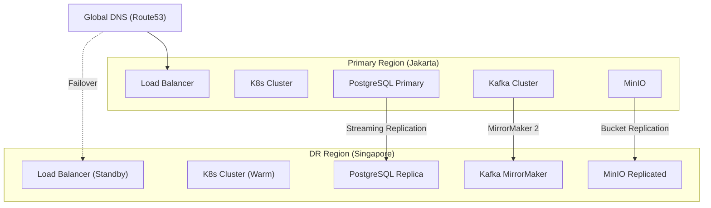

# Non-Functional Requirements (NFR)
**Enterprise e-Procurement ERP**
**Versi:** 1.0 | **Status:** Baseline

---

## 1. Performance Requirements

### 1.1 Response Time SLA

| Tipe Operasi | Target | Threshold Kritis | Catatan |
|:---|:---:|:---:|:---|
| **API Read (GET)** | ≤ 200ms | ≤ 500ms | p95 latency |
| **API Write (POST/PUT)** | ≤ 500ms | ≤ 1s | p95 latency |
| **Complex Query (Reports)** | ≤ 3s | ≤ 5s | Dengan caching |
| **File Upload (≤10MB)** | ≤ 5s | ≤ 10s | Direct to MinIO |
| **Batch Processing** | ≤ 30s | ≤ 60s | Per 1000 records |
| **Search (Elasticsearch)** | ≤ 100ms | ≤ 300ms | p95 latency |

### 1.2 Throughput Targets

| Metrik | Normal Load | Peak Load | Stress Limit |
|:---|:---:|:---:|:---:|
| **Concurrent Users** | 500 | 2,000 | 5,000 |
| **Requests/Second (RPS)** | 1,000 | 5,000 | 10,000 |
| **Transactions/Second (TPS)** | 100 | 500 | 1,000 |
| **Kafka Events/Second** | 5,000 | 20,000 | 50,000 |

### 1.3 Latency Breakdown Target

```
┌──────────────────────────────────────────────────────────────┐
│                    Total Response Time: 200ms                 │
├──────────────────────────────────────────────────────────────┤
│  Network       │  Gateway      │  Service      │  Database   │
│  (10ms)        │  (20ms)       │  (100ms)      │  (70ms)     │
│  ████          │  ████████     │  ██████████   │  ████████   │
│  5%            │  10%          │  50%          │  35%        │
└──────────────────────────────────────────────────────────────┘
```

---

## 2. Availability & Reliability

### 2.1 Availability SLA

| Tier | Target | Downtime/Year | Downtime/Month |
|:---|:---:|:---:|:---:|
| **Production** | 99.9% | 8.76 hours | 43.8 minutes |
| **Staging** | 99.5% | 43.8 hours | 3.65 hours |
| **Development** | 99.0% | 87.6 hours | 7.3 hours |

### 2.2 Maintenance Windows

| Tipe | Waktu | Durasi | Frekuensi |
|:---|:---|:---|:---|
| **Planned Maintenance** | Minggu 02:00-06:00 WIB | Max 4 jam | Bulanan |
| **Hotfix Deployment** | Kapan saja | Max 15 menit | As needed |
| **Database Maintenance** | Minggu 03:00-05:00 WIB | Max 2 jam | Kuartalan |

### 2.3 Recovery Objectives

| Metrik | Target | Maksimum |
|:---|:---:|:---:|
| **RTO (Recovery Time Objective)** | 1 jam | 4 jam |
| **RPO (Recovery Point Objective)** | 5 menit | 15 menit |
| **MTTR (Mean Time to Recovery)** | 30 menit | 2 jam |
| **MTBF (Mean Time Between Failures)** | 720 jam (30 hari) | - |

---

## 3. Scalability

### 3.1 Horizontal Scaling Matrix

| Service | Min Replicas | Normal | Peak | Max |
|:---|:---:|:---:|:---:|:---:|
| **api-gateway** | 2 | 3 | 5 | 10 |
| **auth-service** | 2 | 2 | 4 | 8 |
| **user-service** | 2 | 2 | 3 | 6 |
| **procurement-service** | 2 | 3 | 6 | 12 |
| **vendor-service** | 2 | 2 | 4 | 8 |
| **finance-service** | 2 | 3 | 5 | 10 |
| **notification-service** | 2 | 2 | 4 | 8 |

### 3.2 Auto-Scaling Triggers

```yaml
# HPA Configuration
apiVersion: autoscaling/v2
kind: HorizontalPodAutoscaler
spec:
  minReplicas: 2
  maxReplicas: 12
  metrics:
    - type: Resource
      resource:
        name: cpu
        target:
          type: Utilization
          averageUtilization: 70
    - type: Resource
      resource:
        name: memory
        target:
          type: Utilization
          averageUtilization: 80
    - type: Pods
      pods:
        metric:
          name: http_requests_per_second
        target:
          type: AverageValue
          averageValue: 1000
```

### 3.3 Database Scaling Strategy

| Layer | Strategy | Implementation |
|:---|:---|:---|
| **Read Scaling** | Read Replicas | 1 Primary + 2 Read Replicas |
| **Write Scaling** | Connection Pooling | PgBouncer (500 connections) |
| **Query Optimization** | Indexing | B-tree, GIN, BRIN indexes |
| **Caching** | Redis | Query results, sessions |
| **Partitioning** | Time-based | audit_logs, events tables |

### 3.4 Growth Projections

| Tahun | Users | Daily Transactions | Storage | Kafka Events/Day |
|:---|:---:|:---:|:---:|:---:|
| **Y1** | 1,000 | 10,000 | 100 GB | 1M |
| **Y2** | 5,000 | 50,000 | 500 GB | 5M |
| **Y3** | 15,000 | 150,000 | 1.5 TB | 15M |
| **Y5** | 50,000 | 500,000 | 5 TB | 50M |

---

## 4. Disaster Recovery & Business Continuity

### 4.1 DR Architecture



### 4.2 Backup Strategy

| Data Type | Frequency | Retention | Storage | Encryption |
|:---|:---|:---|:---|:---|
| **Database Full** | Daily 02:00 | 30 days | S3 Glacier | AES-256 |
| **Database WAL** | Continuous | 7 days | S3 Standard | AES-256 |
| **File Storage** | Continuous | Versioned | S3 Cross-Region | AES-256 |
| **Audit Logs** | Daily | 7 years | S3 Glacier Deep | AES-256 |
| **Kafka Topics** | Daily | 90 days | S3 Standard | AES-256 |

### 4.3 Failover Procedures

| Scenario | Detection | RTO | Procedure |
|:---|:---|:---:|:---|
| **Pod Failure** | K8s health check | < 1 min | Auto restart |
| **Node Failure** | K8s node monitor | < 5 min | Pod reschedule |
| **Database Failure** | PgBouncer monitor | < 15 min | Promote replica |
| **Region Failure** | Route53 health | < 1 hour | DNS failover |

### 4.4 Business Continuity Plan

#### Priority Classification

| Priority | Systems | Max Downtime | Recovery Sequence |
|:---:|:---|:---|:---:|
| **P1 - Critical** | Auth, Gateway | 15 menit | 1st |
| **P2 - High** | Procurement, Finance | 1 jam | 2nd |
| **P3 - Medium** | Vendor Portal, Notifications | 4 jam | 3rd |
| **P4 - Low** | Reporting, Analytics | 24 jam | 4th |

#### Communication Plan

| Event | Stakeholder | Channel | Timeline |
|:---|:---|:---|:---|
| Incident Detected | Ops Team | PagerDuty | Immediate |
| Major Outage | Management | Phone + Email | < 15 min |
| Extended Outage | All Users | Status Page | < 30 min |
| Resolution | All Stakeholders | Email | After resolution |

---

## 5. Security Requirements

### 5.1 Authentication & Authorization

| Requirement | Specification |
|:---|:---|
| **Password Policy** | Min 12 chars, uppercase, lowercase, number, symbol |
| **Password Expiry** | 90 days |
| **MFA** | Required for Admin, Supervisor, Finance |
| **Session Timeout** | 30 minutes idle, 8 hours maximum |
| **Failed Login Lock** | 5 attempts → 15 min lock |
| **JWT Expiry** | Access: 15 min, Refresh: 7 days |

### 5.2 Data Protection

| Data Class | At Rest | In Transit | Retention |
|:---|:---|:---|:---|
| **PII** | AES-256 | TLS 1.3 | Per policy |
| **Financial** | AES-256 | TLS 1.3 | 10 years |
| **Audit Logs** | AES-256 | TLS 1.3 | 7 years |
| **Session Data** | AES-256 | TLS 1.3 | Session lifetime |

### 5.3 Compliance Requirements

| Standard | Requirement | Implementation |
|:---|:---|:---|
| **ISO 27001** | ISMS | Full compliance required |
| **SOX** | Financial controls | Audit trail, SoD |
| **OJK** | Banking regulations | Data residency, reporting |
| **GDPR-like** | Data privacy | Consent, right to delete |

---

## 6. Monitoring & Observability

### 6.1 Metrics Collection

| Category | Metrics | Tool | Retention |
|:---|:---|:---|:---|
| **Infrastructure** | CPU, Memory, Disk, Network | Prometheus | 30 days |
| **Application** | RPS, Latency, Error Rate | Prometheus | 30 days |
| **Business** | Transactions, Approvals | Custom + Prometheus | 1 year |
| **Security** | Failed logins, Threats | Elasticsearch | 1 year |

### 6.2 Alerting Rules

| Severity | Condition | Response Time | Escalation |
|:---|:---|:---|:---|
| **Critical** | Service down, Data loss | Immediate | Ops → Manager → CTO |
| **High** | Error rate > 5%, Latency > 2s | 15 min | Ops → Manager |
| **Medium** | Error rate > 1%, Disk > 80% | 1 hour | Ops |
| **Low** | Warning conditions | Next business day | Ops |

### 6.3 SLA Dashboards

```
┌─────────────────────────────────────────────────────────────────┐
│  AVAILABILITY     │  LATENCY (p95)    │  ERROR RATE           │
│  ████████░░ 99.8% │  ██████░░ 180ms   │  █░░░░░░░░ 0.3%       │
│  Target: 99.9%    │  Target: 200ms    │  Target: < 1%         │
├─────────────────────────────────────────────────────────────────┤
│  THROUGHPUT       │  ACTIVE USERS     │  QUEUE DEPTH          │
│  ████████░░ 800   │  ██████░░ 450     │  ██░░░░░░░ 120        │
│  RPS (normal)     │  Concurrent       │  Kafka lag            │
└─────────────────────────────────────────────────────────────────┘
```

---

## 7. Capacity Planning

### 7.1 Resource Requirements per Service

| Service | CPU (cores) | Memory | Storage | Network |
|:---|:---:|:---:|:---:|:---:|
| **api-gateway** | 2 | 4 GB | 10 GB | 1 Gbps |
| **auth-service** | 2 | 4 GB | 20 GB | 100 Mbps |
| **procurement-service** | 4 | 8 GB | 50 GB | 500 Mbps |
| **finance-service** | 4 | 8 GB | 50 GB | 500 Mbps |
| **notification-service** | 2 | 4 GB | 20 GB | 100 Mbps |

### 7.2 Infrastructure Sizing (Production)

| Component | Specification | Quantity | Cost Estimate/Month |
|:---|:---|:---:|:---|
| **K8s Nodes** | 8 vCPU, 32 GB RAM | 6 | $1,800 |
| **PostgreSQL** | db.r6g.xlarge | 3 (1 primary + 2 replica) | $900 |
| **Redis** | cache.r6g.large | 3 (cluster) | $450 |
| **Kafka** | kafka.m5.2xlarge | 3 | $1,200 |
| **MinIO/S3** | Standard | 500 GB | $15 |
| **Elasticsearch** | m5.xlarge.search | 3 | $600 |
| **Load Balancer** | NLB | 2 | $50 |
| **Total** | - | - | **~$5,000/month** |
