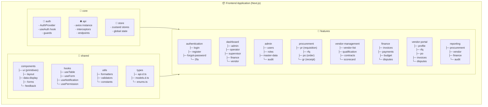
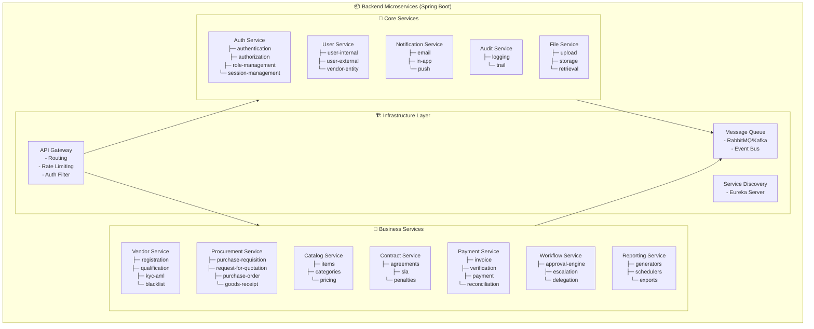
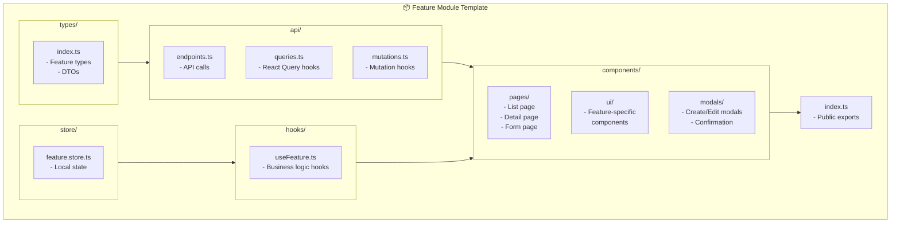
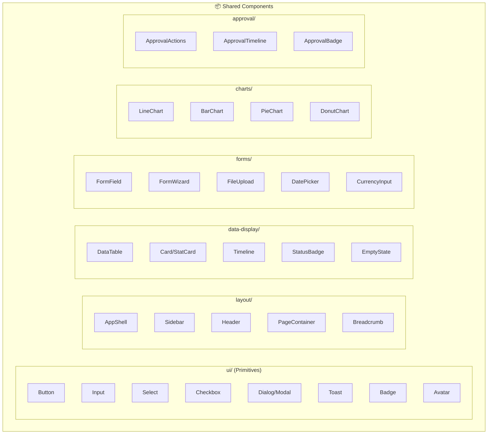
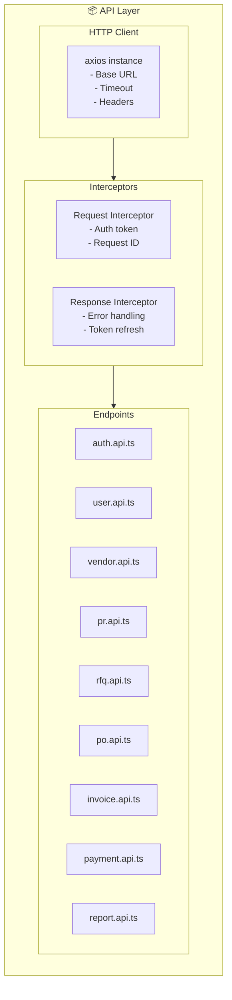
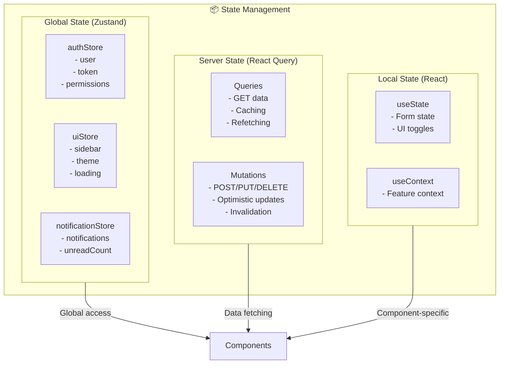
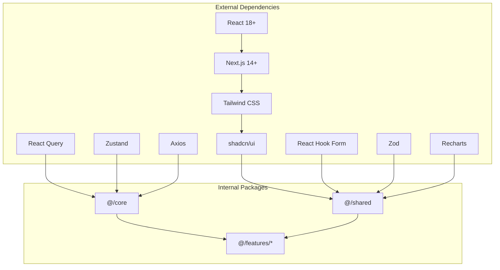

# Package Diagram: Sistem e-Procurement Enterprise

## 1. Frontend Package Structure



---

## 2. Backend Microservices Package



---

## 3. Feature Module Internal Structure



---

## 4. Shared Components Package



---

## 5. API Layer Structure



---

## 6. State Management



---

## 7. Folder Structure Overview

```
src/
├── app/                          # Next.js App Router
│   ├── (auth)/                   # Auth group routes
│   │   ├── login/
│   │   ├── register/
│   │   └── forgot-password/
│   ├── (dashboard)/              # Authenticated routes
│   │   ├── admin/
│   │   ├── operator/
│   │   ├── supervisor/
│   │   ├── finance/
│   │   └── vendor/
│   ├── layout.tsx
│   └── page.tsx
│
├── core/                         # Core functionality
│   ├── api/
│   ├── auth/
│   └── store/
│
├── features/                     # Feature modules
│   ├── authentication/
│   ├── dashboard/
│   ├── admin/
│   ├── procurement/
│   ├── vendor-management/
│   ├── finance/
│   ├── vendor-portal/
│   └── reporting/
│
├── shared/                       # Shared resources
│   ├── components/
│   │   ├── ui/
│   │   ├── layout/
│   │   ├── data-display/
│   │   ├── forms/
│   │   └── charts/
│   ├── hooks/
│   ├── utils/
│   └── types/
│
└── styles/                       # Global styles
    ├── globals.css
    └── variables.css
```

---

## 8. Dependency Flow



---

## Catatan untuk Developer

1. **Feature-first Architecture**: Setiap fitur memiliki folder sendiri dengan struktur konsisten
2. **Barrel Exports**: Gunakan `index.ts` untuk public exports di setiap module
3. **Absolute Imports**: Gunakan path alias (`@/core`, `@/shared`, `@/features`)
4. **Co-location**: Tempatkan test files berdampingan dengan source files
5. **Lazy Loading**: Gunakan dynamic imports untuk feature modules
