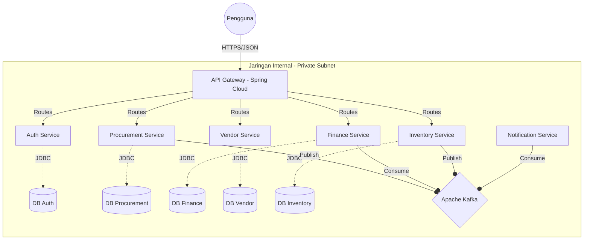
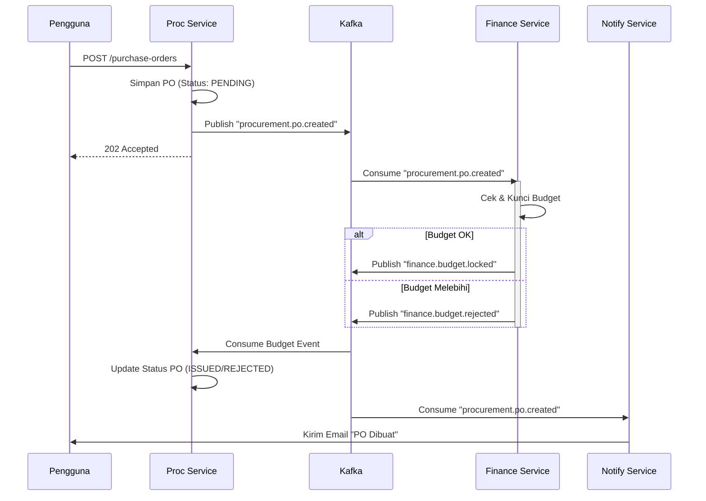

# Dokumen Desain Sistem: Sistem e-Procurement Enterprise
**Versi:** 2.0 (Event-Driven Microservices)
**Tanggal:** Januari 2026
**Penulis:** Tim Arsitek Teknis
**Status:** Dalam Pengembangan

---

## 1. Arsitektur Tingkat Tinggi

### 1.1 Gaya Arsitektur
Sistem mengadopsi **Arsitektur Microservices Berbasis Event (Event-Driven)** untuk memastikan loose coupling, skalabilitas tinggi, dan deployment independen.
*   **Komunikasi Sinkron (REST/gRPC):** Digunakan untuk request langsung dari klien ke service (contoh: UI mengambil data) atau query real-time yang kritis.
*   **Komunikasi Asinkron (Kafka):** Digunakan untuk perubahan state antar service (contoh: "PO Diterbitkan" -> "Budget Dipotong") untuk memastikan ketahanan dan eventual consistency.

### 1.2 Konteks Sistem (Diagram C4 Container)

### 1.3 Komponen Utama
1.  **API Gateway:**
    *   **Tanggung Jawab:** Titik Masuk Tunggal, SSL Termination, Validasi JWT, Rate Limiting (Token Bucket), Request Routing.
    *   **Teknologi:** Spring Cloud Gateway.
2.  **Message Broker:**
    *   **Tanggung Jawab:** Event Bus Asinkron, Log compaction untuk replay state.
    *   **Teknologi:** Apache Kafka (Confluent Platform).
3.  **Discovery & Config:**
    *   **Discovery:** Docker DNS / K8s Service Discovery.
    *   **Config:** `application.properties` lokal (sesuai batasan user).

---

## 2. Dekomposisi Service (Bounded Contexts)

### 2.1 Auth Service (`/auth-service`)
*   **Tanggung Jawab:** Manajemen Identitas, Penerbitan Token (Access/Refresh), RBAC.
*   **Tabel Utama:** `users`, `roles`, `permissions`.
*   **Endpoint:** `POST /login`, `POST /refresh-token`, `POST /validate`.

### 2.2 Procurement Service (`/procurement-service`)
*   **Tanggung Jawab:** Siklus Hidup Pengadaan Inti (PR -> RFQ -> PO).
*   **Tabel Utama:** `purchase_requisition`, `rfq`, `purchase_order`, `po_items`.
*   **Event yang Dipublish:**
    *   `procurement.pr.created`
    *   `procurement.po.issued` (Memicu Penguncian Budget)

### 2.3 Finance Service (`/payment-service` / `/finance-service`)
*   **Tanggung Jawab:** Kontrol Budget, Pencocokan Invoice (3-Way), Pembayaran.
*   **Tabel Utama:** `budget_allocation`, `gl_accounts`, `invoices`, `payments`.
*   **Event yang Dikonsumsi:** `procurement.po.issued`
*   **Event yang Dipublish:** `finance.budget.locked`, `finance.payment.processed`.

### 2.4 Vendor Service (`/vendor-service`)
*   **Tanggung Jawab:** Onboarding Vendor, Manajemen Katalog, Penilaian Kinerja.
*   **Tabel Utama:** `vendors`, `catalogs`, `scorecards`.

### 2.5 Inventory Service (`/inventory-service`)
*   **Tanggung Jawab:** Penerimaan Barang (GRN), Manajemen Stok.
*   **Tabel Utama:** `stock`, `warehouse`, `movements`.
*   **Event yang Dipublish:**
    *   `inventory.stock.updated`
    *   `inventory.stock.reserved`

### 2.6 Notification Service (`/notification-service`)
*   **Tanggung Jawab:** Mengirim Email/SMS/Push berdasarkan event sistem.
*   **Event yang Dikonsumsi:** `*.*` (Mendengarkan semua event domain yang relevan untuk memicu alert).

---

## 3. Alur Kerja Event-Driven

### 3.1 Skenario: Pembuatan PO & Pemotongan Budget
Alur ini mendemonstrasikan bagaimana kita menghindari distributed transactions (2PC) dengan menggunakan Eventual Consistency.

**Alur Kerja:**
1.  **Operator** membuat PO.
2.  **Procurement Service** menyimpan PO dengan status `PENDING_BUDGET`.
3.  **Procurement Service** mempublish event `PO_CREATED`.
4.  **Finance Service** mendengarkan `PO_CREATED`:
    *   Memeriksa ketersediaan Budget.
    *   Jika OK: Mengunci jumlah, Mempublish `BUDGET_LOCKED`.
    *   Jika Gagal: Mempublish `BUDGET_FAILED`.
5.  **Procurement Service** mendengarkan respons:
    *   Jika `BUDGET_LOCKED`: Update PO ke `ISSUED`.
    *   Jika `BUDGET_FAILED`: Update PO ke `REJECTED`.

### 3.2 Diagram Sequence

### 3.3 Taksonomi Kafka Topic
| Nama Topic | Producer | Consumer | Contoh Payload |
|:---|:---|:---|:---|
| `procurement.pr.created` | Procurement | Workflow | `{prId: "123", amount: 5000}` |
| `procurement.po.issued` | Procurement | Finance, Vendor | `{poId: "999", vendorId: "V1"}` |
| `finance.payment.paid` | Finance | Procurement | `{invId: "INV-1", status: "PAID"}` |
| `inventory.stock.low` | Inventory | Procurement | `{sku: "Item-A", qty: 5}` |

---

## 4. Konsistensi Data & Reliabilitas

### 4.1 Pola Saga
Kami biasanya menggunakan **Choreography-based Sagas** (seperti ditunjukkan di atas) untuk alur standar. Service bereaksi terhadap event secara otonom.
*   **Kompensasi:** Jika `BUDGET_LOCKED` berhasil tetapi `PO_UPDATE` gagal, event kompensasi `UNLOCK_BUDGET` dipicu secara manual atau melalui job rekonsiliasi.

### 4.2 Penanganan Kegagalan (Resiliensi)
*   **Dead Letter Queues (DLQ):** Pesan yang gagal diproses 3 kali (contoh: DB down) dipindahkan ke topic DLQ (`procurement.po.created.dlq`) untuk inspeksi manual.
*   **Idempotency:** Semua event consumer bersifat idempotent. Memproses event ID `PO-123` dua kali akan menghasilkan state yang sama (tidak ada pemotongan ganda).

### 4.3 Transaksi Database
*   **ACID Lokal:** Dalam satu microservice, kami menggunakan transaksi PostgreSQL standar (`@Transactional`).
*   **Konsistensi Global:** Dicapai secara eventual melalui Kafka.

---

## 5. Strategi Skalabilitas & Infrastruktur

### 5.1 Horizontal Scaling
*   **Stateless Services:** API Gateway, Auth, Procurement bersifat stateless dan dapat di-scale horizontal (ReplicaSet = 3+).
*   **Partitioning:** Topic Kafka dipartisi (contoh: 3 partisi) untuk memungkinkan konsumsi paralel oleh beberapa instance Service dalam Consumer Group yang sama.

### 5.2 Strategi Caching
*   **Master Data:** Dropdown standar (Mata Uang, Payment Terms) di-cache di Redis (`TTL = 24h`).
*   **Data Sesi:** Token/Session Pengguna disimpan di Redis (`TTL = 30m`).

### 5.3 Circuit Breaker
*   Diimplementasikan menggunakan **Resilience4j**.
*   Jika `Vendor Service` down, `Procurement Service` akan mengembalikan respons fallback (contoh: "Info Vendor Tidak Tersedia - Coba Lagi Nanti") alih-alih hang.
