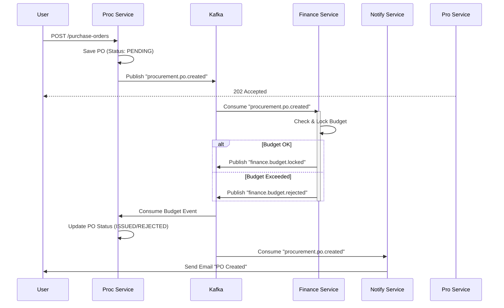

# System Design Document: Enterprise e-Procurement ERP
**Version:** 2.0 (Event-Driven Microservices)
**Date:** January 2026
**Author:** Technical Architect Team
**Status:** Active Development

---

## 1. High-Level Architecture

### 1.1 Architectural Style
The system adopts an **Event-Driven Microservices Architecture** to ensure loose coupling, high scalability, and independent deployment.
*   **Synchronous Communication (REST/gRPC):** Used for direct client-to-service requests (e.g., UI fetching data) or critical real-time queries.
*   **Asynchronous Communication (Kafka):** Used for inter-service state changes (e.g., "PO Issued" -> "Budget Deducted") to ensure resilience and eventual consistency.

### 1.2 System Context (C4 Container Diagram)

```mermaid
graph TD
    User((User)) -->|HTTPS/JSON| Gateway[API Gateway (Kong/Spring Cloud)]
    
    subgraph "Internal Network (Private Subnet)"
        Gateway -->|Routes| Auth[Auth Service]
        Gateway -->|Routes| Proc[Procurement Service]
        Gateway -->|Routes| Fin[Finance Service]
        Gateway -->|Routes| Vendor[Vendor Service]
        Gateway -->|Routes| Inv[Inventory Service]
        
        %% Database per Service
        Auth -.->|JDBC| DB_Auth[(Auth DB)]
        Proc -.->|JDBC| DB_Proc[(Procurement DB)]
        Fin -.->|JDBC| DB_Fin[(Finance DB)]
        Vendor -.->|JDBC| DB_Vendor[(Vendor DB)]
        Inv -.->|JDBC| DB_Inv[(Inventory DB)]
        
        %% Event Bus
        Proc --o|Publishes| Kafka{Apache Kafka}
        Fin --o|Consumes| Kafka
        Inv --o|Publishes| Kafka
        Notif[Notification Service] --o|Consumes| Kafka
    end
```

### 1.3 Key Components
1.  **API Gateway:**
    *   **Responsibilities:** Single Entry Point, SSL Termination, JWT Validation, Rate Limiting (Token Bucket), Request Routing.
    *   **Technology:** Spring Cloud Gateway.
2.  **Message Broker:**
    *   **Responsibilities:** Asynchronous Event Bus, Log compaction for state replay.
    *   **Technology:** Apache Kafka (Confluent Platform).
3.  **Discovery & Config:**
    *   **Discovery:** Docker DNS / K8s Service Discovery.
    *   **Config:** Local `application.properties` (per user constraints).

---

## 2. Service Decomposition (Bounded Contexts)

### 2.1 Auth Service (`/auth-service`)
*   **Responsibility:** Identity Management, Token Issuance (Access/Refresh), RBAC.
*   **Key Tables:** `users`, `roles`, `permissions`.
*   **Endpoints:** `POST /login`, `POST /refresh-token`, `POST /validate`.

### 2.2 Procurement Service (`/procurement-service`)
*   **Responsibility:** Core Procurement Lifecycle (PR -> RFQ -> PO).
*   **Key Tables:** `purchase_requisition`, `rfq`, `purchase_order`, `po_items`.
*   **Events Published:**
    *   `procurement.pr.created`
    *   `procurement.po.issued` (Triggers Budget Lock)

### 2.3 Finance Service (`/payment-service` / `/finance-service`)
*   **Responsibility:** Budget Control, Invoice Matching (3-Way), Payments.
*   **Key Tables:** `budget_allocation`, `gl_accounts`, `invoices`, `payments`.
*   **Events Consumed:** `procurement.po.issued`
*   **Events Published:** `finance.budget.locked`, `finance.payment.processed`.

### 2.4 Vendor Service (`/vendor-service`)
*   **Responsibility:** Vendor Onboarding, Catalog Management, Performance Scoring.
*   **Key Tables:** `vendors`, `catalogs`, `scorecards`.

### 2.5 Inventory Service (`/inventory-service`)
*   **Responsibility:** Goods Receipt (GRN), Stock Management.
*   **Key Tables:** `stock`, `warehouse`, `movements`.
*   **Events Published:**
    *   `inventory.stock.updated`
    *   `inventory.stock.reserved`

### 2.6 Notification Service (`/notification-service`)
*   **Responsibility:** Sending Email/SMS/Push based on system events.
*   **Events Consumed:** `*.*` (Listens to all relevant domain events to trigger alerts).

---

## 3. Event-Driven Workflows

### 3.1 Scenario: PO Creation & Budget Deduction
This flow demonstrates how we avoid distributed transactions (2PC) by using Eventual Consistency.

**Workflow:**
1.  **Operator** creates a PO.
2.  **Procurement Service** saves PO as `PENDING_BUDGET`.
3.  **Procurement Service** publishes `PO_CREATED` event.
4.  **Finance Service** listens to `PO_CREATED`:
    *   Checks Budget availability.
    *   If OK: Locks amount, Publishes `BUDGET_LOCKED`.
    *   If Fail: Publishes `BUDGET_FAILED`.
5.  **Procurement Service** listens to response:
    *   If `BUDGET_LOCKED`: Updates PO to `ISSUED`.
    *   If `BUDGET_FAILED`: Updates PO to `REJECTED`.

### 3.2 Sequence Diagram



### 3.3 Kafka Topic Taxonomy
| Topic Name | Producer | Consumer | Payload Example |
|:---|:---|:---|:---|
| `procurement.pr.created` | Procurement | Workflow | `{prId: "123", amount: 5000}` |
| `procurement.po.issued` | Procurement | Finance, Vendor | `{poId: "999", vendorId: "V1"}` |
| `finance.payment.paid` | Finance | Procurement | `{invId: "INV-1", status: "PAID"}` |
| `inventory.stock.low` | Inventory | Procurement | `{sku: "Item-A", qty: 5}` |

---

## 4. Data Consistency & Reliability

### 4.1 Saga Pattern
We typically use **Choreography-based Sagas** (as shown above) for standard flows. Services react to events autonomously.
*   **Compensation:** If `BUDGET_LOCKED` succeeds but `PO_UPDATE` fails, a compensation event `UNLOCK_BUDGET` is triggered manually or via a reconciliation job.

### 4.2 Handling Failures (Resilience)
*   **Dead Letter Queues (DLQ):** Messages that fail processing 3 times (e.g., DB down) are moved to a DLQ topic (`procurement.po.created.dlq`) for manual inspection.
*   **Idempotency:** All event consumers are idempotent. Processing event ID `PO-123` twice will result in the same state (no double deduction).

### 4.3 Database Transactions
*   **Local ACID:** Within a single microservice, we use standard PostgreSQL transactions (`@Transactional`).
*   **Global Consistency:** Achieved eventually via Kafka.

---

## 5. Scalability & Infra Strategies

### 5.1 Horizontal Scaling
*   **Stateless Services:** API Gateway, Auth, Procurement are stateless and scale horizontally (ReplicaSet = 3+).
*   **Partitioning:** Kafka topics are partitioned (e.g., 3 partitions) to allow parallel consumption by multiple Service Instances within the same Consumer Group.

### 5.2 Caching Strategy
*   **Master Data:** Standard dropdowns (Currencies, Payment Terms) are cached in Redis (`TTL = 24h`).
*   **Session Data:** User Tokens/Sessions are stored in Redis (`TTL = 30m`).

### 5.3 Circuit Breaker
*   Implemented using **Resilience4j**.
*   If `Vendor Service` is down, `Procurement Service` will return a fallback response (e.g., "Vendor Info Unavailable - Try Later") instead of hanging.

