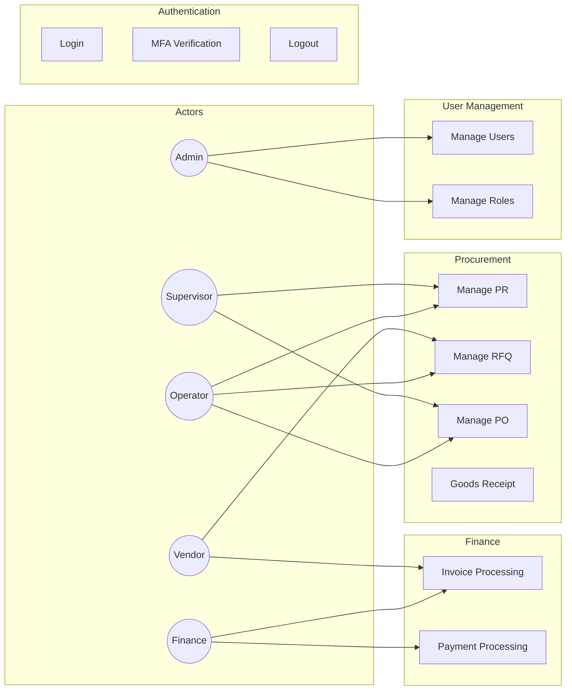

# LAMPIRAN A: DAFTAR USE CASE LENGKAP

## A.1 Use Case Admin (UC-ADM)

| ID | Use Case | Aktor | Prioritas |
|:---|:---|:---|:---:|
| UC-ADM-001 | Manage User Internal | Admin | High |
| UC-ADM-002 | Manage User External | Admin | High |
| UC-ADM-003 | Manage Roles | Admin | High |
| UC-ADM-004 | Assign Role to User | Admin | High |
| UC-ADM-005 | Manage Permissions | Admin | High |
| UC-ADM-006 | Configure Approval Workflow | Admin | High |
| UC-ADM-007 | Manage Department | Admin | Medium |
| UC-ADM-008 | Manage Categories | Admin | Medium |
| UC-ADM-009 | View Audit Trail | Admin | High |
| UC-ADM-010 | Configure System Settings | Admin | Medium |
| UC-ADM-011 | Manage Email Templates | Admin | Low |
| UC-ADM-012 | View Login History | Admin | Medium |

## A.2 Use Case Operator (UC-OP)

| ID | Use Case | Aktor | Prioritas |
|:---|:---|:---|:---:|
| UC-OP-001 | Create Purchase Requisition | Operator | High |
| UC-OP-002 | Edit Draft PR | Operator | High |
| UC-OP-003 | Submit PR for Approval | Operator | High |
| UC-OP-004 | Cancel PR | Operator | Medium |
| UC-OP-005 | View PR List | Operator | High |
| UC-OP-006 | Create RFQ from PR | Operator | High |
| UC-OP-007 | Manage RFQ Vendors | Operator | High |
| UC-OP-008 | Publish RFQ | Operator | High |
| UC-OP-009 | Evaluate Quotations | Operator | High |
| UC-OP-010 | Award RFQ to Vendor | Operator | High |
| UC-OP-011 | Create Purchase Order | Operator | High |
| UC-OP-012 | Submit PO for Approval | Operator | High |
| UC-OP-013 | Create Goods Receipt | Operator | High |
| UC-OP-014 | View Vendor List | Operator | High |
| UC-OP-015 | Review Vendor Registration | Operator | Medium |
| UC-OP-016 | Initiate Vendor KYC | Operator | High |

## A.3 Use Case Supervisor (UC-SUP)

| ID | Use Case | Aktor | Prioritas |
|:---|:---|:---|:---:|
| UC-SUP-001 | View Pending Approvals | Supervisor | High |
| UC-SUP-002 | Approve Purchase Requisition | Supervisor | High |
| UC-SUP-003 | Reject Purchase Requisition | Supervisor | High |
| UC-SUP-004 | Return PR for Revision | Supervisor | Medium |
| UC-SUP-005 | Approve Purchase Order | Supervisor | High |
| UC-SUP-006 | Reject Purchase Order | Supervisor | High |
| UC-SUP-007 | View Department Budget | Supervisor | High |
| UC-SUP-008 | Approve Vendor Blacklist | Supervisor | High |
| UC-SUP-009 | View Procurement Reports | Supervisor | Medium |
| UC-SUP-010 | Delegate Approval | Supervisor | Medium |

## A.4 Use Case Finance (UC-FIN)

| ID | Use Case | Aktor | Prioritas |
|:---|:---|:---|:---:|
| UC-FIN-001 | View Pending Invoices | Finance | High |
| UC-FIN-002 | Verify Invoice | Finance | High |
| UC-FIN-003 | Perform 3-Way Matching | Finance | High |
| UC-FIN-004 | Reject Invoice | Finance | Medium |
| UC-FIN-005 | Create Dispute | Finance | Medium |
| UC-FIN-006 | Schedule Payment | Finance | High |
| UC-FIN-007 | Execute Payment | Finance | High |
| UC-FIN-008 | View Payment History | Finance | Medium |
| UC-FIN-009 | Generate Tax Report | Finance | Medium |
| UC-FIN-010 | View Budget Utilization | Finance | Medium |

## A.5 Use Case Vendor (UC-VEN)

| ID | Use Case | Aktor | Prioritas |
|:---|:---|:---|:---:|
| UC-VEN-001 | Register as Vendor | Vendor | High |
| UC-VEN-002 | Complete Profile | Vendor | High |
| UC-VEN-003 | Upload Documents | Vendor | High |
| UC-VEN-004 | View RFQ Invitations | Vendor | High |
| UC-VEN-005 | Submit Quotation | Vendor | High |
| UC-VEN-006 | View PO | Vendor | High |
| UC-VEN-007 | Acknowledge PO | Vendor | High |
| UC-VEN-008 | Submit Invoice | Vendor | High |
| UC-VEN-009 | View Payment Status | Vendor | High |
| UC-VEN-010 | Create Dispute | Vendor | Medium |
| UC-VEN-011 | View Performance Score | Vendor | Low |

---

## A.6 Use Case Diagram

Lihat dokumentasi lengkap di: [Use Cases](../../use_cases/README.md)
