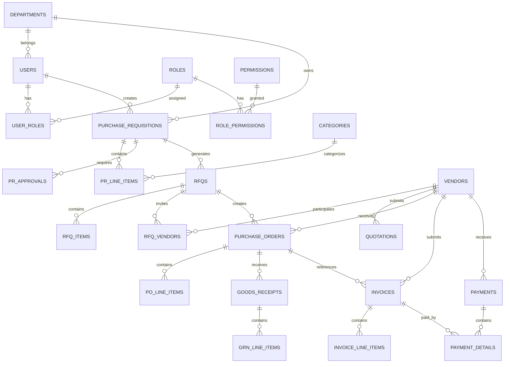

# LAMPIRAN B: DATABASE SCHEMA

## B.1 Entity Relationship Diagram

## B.2 Table Specifications

### B.2.1 Users Table

| Column | Type | Constraints | Description |
|:---|:---|:---|:---|
| id | UUID | PK | Primary key |
| email | VARCHAR(255) | UNIQUE, NOT NULL | User email |
| password_hash | VARCHAR(255) | NOT NULL | Bcrypt hash |
| full_name | VARCHAR(255) | NOT NULL | Display name |
| department_id | UUID | FK | Reference to departments |
| status | VARCHAR(20) | DEFAULT 'ACTIVE' | ACTIVE, INACTIVE, LOCKED |
| mfa_enabled | BOOLEAN | DEFAULT FALSE | MFA status |
| failed_login_attempts | INT | DEFAULT 0 | Failed login count |
| last_login_at | TIMESTAMP | | Last login time |
| created_at | TIMESTAMP | DEFAULT NOW() | Creation time |
| is_deleted | BOOLEAN | DEFAULT FALSE | Soft delete flag |

### B.2.2 Purchase Requisitions Table

| Column | Type | Constraints | Description |
|:---|:---|:---|:---|
| id | UUID | PK | Primary key |
| pr_number | VARCHAR(20) | UNIQUE, NOT NULL | PR-YYYY-NNNNN |
| requester_id | UUID | FK, NOT NULL | Reference to users |
| department_id | UUID | FK | Reference to departments |
| description | TEXT | | PR description |
| urgency | VARCHAR(20) | | LOW, MEDIUM, HIGH |
| budget_code | VARCHAR(50) | | Budget reference |
| total_estimated_amount | DECIMAL(18,2) | | Total value |
| status | VARCHAR(30) | NOT NULL | PR status |
| current_approval_level | INT | DEFAULT 1 | Current level |
| created_at | TIMESTAMP | DEFAULT NOW() | Creation time |
| is_deleted | BOOLEAN | DEFAULT FALSE | Soft delete |

### B.2.3 Vendors Table

| Column | Type | Constraints | Description |
|:---|:---|:---|:---|
| id | UUID | PK | Primary key |
| vendor_code | VARCHAR(20) | UNIQUE | VEN-NNNNN |
| company_name | VARCHAR(255) | NOT NULL | Company name |
| npwp | VARCHAR(20) | | Tax ID |
| email | VARCHAR(255) | UNIQUE, NOT NULL | Contact email |
| status | VARCHAR(30) | | Vendor status |
| kyc_status | VARCHAR(30) | | KYC status |
| is_blacklisted | BOOLEAN | DEFAULT FALSE | Blacklist flag |
| performance_score | DECIMAL(5,2) | | Score 0-100 |
| created_at | TIMESTAMP | DEFAULT NOW() | Creation time |
| is_deleted | BOOLEAN | DEFAULT FALSE | Soft delete |

### B.2.4 Invoices Table

| Column | Type | Constraints | Description |
|:---|:---|:---|:---|
| id | UUID | PK | Primary key |
| invoice_number | VARCHAR(50) | NOT NULL | Vendor invoice no |
| internal_number | VARCHAR(20) | UNIQUE | INV-YYYY-NNNNN |
| vendor_id | UUID | FK, NOT NULL | Reference to vendors |
| po_id | UUID | FK | Reference to POs |
| subtotal | DECIMAL(18,2) | | Before tax |
| tax_amount | DECIMAL(18,2) | | Tax value |
| total_amount | DECIMAL(18,2) | | Grand total |
| matching_status | VARCHAR(30) | | 3-way match status |
| verification_status | VARCHAR(30) | | Verification status |
| created_at | TIMESTAMP | DEFAULT NOW() | Creation time |
| is_deleted | BOOLEAN | DEFAULT FALSE | Soft delete |

---

## B.3 Index Strategy

| Table | Index Name | Columns | Type |
|:---|:---|:---|:---|
| users | idx_users_email | email | UNIQUE |
| users | idx_users_department | department_id | BTREE |
| purchase_requisitions | idx_pr_number | pr_number | UNIQUE |
| purchase_requisitions | idx_pr_status | status | BTREE |
| purchase_requisitions | idx_pr_requester | requester_id | BTREE |
| vendors | idx_vendor_code | vendor_code | UNIQUE |
| vendors | idx_vendor_status | status | BTREE |
| invoices | idx_invoice_vendor | vendor_id | BTREE |
| invoices | idx_invoice_status | verification_status | BTREE |

---

Lihat dokumentasi lengkap di: [Database Schema](../../system_design/DATABASE_SCHEMA.md)
