# Diagram Use Case: Aktor Admin

## Gambaran Umum
Aktor Admin bertanggung jawab untuk konfigurasi sistem, manajemen keamanan, dan pemeliharaan master data.

## Diagram Use Case

```mermaid
graph LR
    Admin((Admin))

    subgraph "Akses User & Keamanan"
        UC001[UC-ADM-001<br/>Buat User Internal]
        UC002[UC-ADM-002<br/>Update Role User]
        UC003[UC-ADM-003<br/>Nonaktifkan User]
        UC004[UC-ADM-004<br/>Reset Password User]
        UC005[UC-ADM-005<br/>Konfigurasi MFA]
        UC006[UC-ADM-006<br/>Whitelist IP]
        UC007[UC-ADM-007<br/>Kelola Timeout Sesi]
        UC008[UC-ADM-008<br/>Unlock Akun User]
        UC009[UC-ADM-009<br/>Lihat Sesi Aktif]
        UC010[UC-ADM-010<br/>Paksa Logout User]
    end

    subgraph "Audit & Kepatuhan"
        UC011[UC-ADM-011<br/>Lihat Audit Trail]
        UC012[UC-ADM-012<br/>Ekspor Log Audit]
        UC013[UC-ADM-013<br/>Konfigurasi Retensi]
        UC014[UC-ADM-014<br/>Laporan Kontrol Akses]
        UC015[UC-ADM-015<br/>Tandai Aktivitas Mencurigakan]
    end

    subgraph "Manajemen Master Data"
        UC016[UC-ADM-016<br/>Kelola Departemen]
        UC017[UC-ADM-017<br/>Konfigurasi Matriks Approval]
        UC018[UC-ADM-018<br/>Kelola Mata Uang]
        UC019[UC-ADM-019<br/>Kelola Kode Pajak]
        UC020[UC-ADM-020<br/>Kelola UoM]
        UC021[UC-ADM-021<br/>Kelola Terms Pembayaran]
        UC022[UC-ADM-022<br/>Kelola Template]
        UC023[UC-ADM-023<br/>Konfigurasi Template Email]
        UC024[UC-ADM-024<br/>Kelola Kalender Libur]
        UC025[UC-ADM-025<br/>Lihat Kesehatan Sistem]
    end

    Admin --> UC001
    Admin --> UC002
    Admin --> UC003
    Admin --> UC004
    Admin --> UC005
    Admin --> UC006
    Admin --> UC007
    Admin --> UC008
    Admin --> UC009
    Admin --> UC010
    Admin --> UC011
    Admin --> UC012
    Admin --> UC013
    Admin --> UC014
    Admin --> UC015
    Admin --> UC016
    Admin --> UC017
    Admin --> UC018
    Admin --> UC019
    Admin --> UC020
    Admin --> UC021
    Admin --> UC022
    Admin --> UC023
    Admin --> UC024
    Admin --> UC025
```

## Tabel Ringkasan Use Case

| ID | Nama Use Case | Kategori |
|:---|:---|:---|
| UC-ADM-001 | Buat User Internal | Akses User |
| UC-ADM-002 | Update Role & Permission User | Akses User |
| UC-ADM-003 | Nonaktifkan/Soft Delete User | Akses User |
| UC-ADM-004 | Reset Password User | Keamanan |
| UC-ADM-005 | Konfigurasi Pengaturan MFA | Keamanan |
| UC-ADM-006 | Whitelist Alamat IP | Keamanan |
| UC-ADM-007 | Kelola Timeout Sesi | Keamanan |
| UC-ADM-008 | Unlock Akun User | Keamanan |
| UC-ADM-009 | Lihat Sesi Aktif | Monitoring |
| UC-ADM-010 | Paksa Logout User | Keamanan |
| UC-ADM-011 | Lihat Audit Trail Global | Kepatuhan |
| UC-ADM-012 | Ekspor Log Audit | Kepatuhan |
| UC-ADM-013 | Konfigurasi Kebijakan Retensi | Kepatuhan |
| UC-ADM-014 | Buat Laporan Kontrol Akses | Kepatuhan |
| UC-ADM-015 | Tandai Aktivitas Mencurigakan | Keamanan |
| UC-ADM-016 | Kelola Departemen/Cost Center | Master Data |
| UC-ADM-017 | Konfigurasi Matriks Approval (SoD) | Master Data |
| UC-ADM-018 | Kelola Mata Uang & Kurs | Master Data |
| UC-ADM-019 | Kelola Kode & Tarif Pajak | Master Data |
| UC-ADM-020 | Kelola Unit of Measurement | Master Data |
| UC-ADM-021 | Kelola Terms Pembayaran | Master Data |
| UC-ADM-022 | Kelola Template Dokumen | Konfigurasi |
| UC-ADM-023 | Konfigurasi Template Email | Konfigurasi |
| UC-ADM-024 | Kelola Kalender Hari Libur | Konfigurasi |
| UC-ADM-025 | Lihat Dashboard Kesehatan Sistem | Monitoring |
