# Use Case Diagram: Admin Actor

## Overview
The Admin actor is responsible for system configuration, security management, and master data maintenance.

## Use Case Diagram

```mermaid
graph LR
    Admin((Admin))

    subgraph "User Access & Security"
        UC001[UC-ADM-001<br/>Create Internal User]
        UC002[UC-ADM-002<br/>Update User Role]
        UC003[UC-ADM-003<br/>Deactivate User]
        UC004[UC-ADM-004<br/>Reset User Password]
        UC005[UC-ADM-005<br/>Configure MFA]
        UC006[UC-ADM-006<br/>Whitelist IP]
        UC007[UC-ADM-007<br/>Manage Session Timeout]
        UC008[UC-ADM-008<br/>Unlock User Account]
        UC009[UC-ADM-009<br/>View Active Sessions]
        UC010[UC-ADM-010<br/>Force Logout User]
    end

    subgraph "Audit & Compliance"
        UC011[UC-ADM-011<br/>View Audit Trail]
        UC012[UC-ADM-012<br/>Export Audit Logs]
        UC013[UC-ADM-013<br/>Configure Retention]
        UC014[UC-ADM-014<br/>Access Control Report]
        UC015[UC-ADM-015<br/>Flag Suspicious Activity]
    end

    subgraph "Master Data Management"
        UC016[UC-ADM-016<br/>Manage Departments]
        UC017[UC-ADM-017<br/>Configure Approval Matrix]
        UC018[UC-ADM-018<br/>Manage Currencies]
        UC019[UC-ADM-019<br/>Manage Tax Codes]
        UC020[UC-ADM-020<br/>Manage UoM]
        UC021[UC-ADM-021<br/>Manage Payment Terms]
        UC022[UC-ADM-022<br/>Manage Templates]
        UC023[UC-ADM-023<br/>Configure Email Templates]
        UC024[UC-ADM-024<br/>Manage Holiday Calendar]
        UC025[UC-ADM-025<br/>View System Health]
    end

    Admin --> UC001
    Admin --> UC002
    Admin --> UC003
    Admin --> UC004
    Admin --> UC005
    Admin --> UC006
    Admin --> UC007
    Admin --> UC008
    Admin --> UC009
    Admin --> UC010
    Admin --> UC011
    Admin --> UC012
    Admin --> UC013
    Admin --> UC014
    Admin --> UC015
    Admin --> UC016
    Admin --> UC017
    Admin --> UC018
    Admin --> UC019
    Admin --> UC020
    Admin --> UC021
    Admin --> UC022
    Admin --> UC023
    Admin --> UC024
    Admin --> UC025
```

## Use Case Summary Table

| ID | Use Case Name | Category |
|:---|:---|:---|
| UC-ADM-001 | Create Internal User | User Access |
| UC-ADM-002 | Update User Role & Permissions | User Access |
| UC-ADM-003 | Deactivate/Soft Delete User | User Access |
| UC-ADM-004 | Reset User Password | Security |
| UC-ADM-005 | Configure MFA Settings | Security |
| UC-ADM-006 | Whitelist IP Addresses | Security |
| UC-ADM-007 | Manage Session Timeouts | Security |
| UC-ADM-008 | Unlock User Account | Security |
| UC-ADM-009 | View Active Sessions | Monitoring |
| UC-ADM-010 | Force Logout User | Security |
| UC-ADM-011 | View Global Audit Trail | Compliance |
| UC-ADM-012 | Export Audit Logs | Compliance |
| UC-ADM-013 | Configure Retention Policy | Compliance |
| UC-ADM-014 | Generate Access Control Report | Compliance |
| UC-ADM-015 | Flag Suspicious Activity | Security |
| UC-ADM-016 | Manage Departments/Cost Centers | Master Data |
| UC-ADM-017 | Configure Approval Matrix (SoD) | Master Data |
| UC-ADM-018 | Manage Currency & Exchange Rates | Master Data |
| UC-ADM-019 | Manage Tax Codes & Rates | Master Data |
| UC-ADM-020 | Manage Units of Measurement | Master Data |
| UC-ADM-021 | Manage Payment Terms | Master Data |
| UC-ADM-022 | Manage Document Templates | Config |
| UC-ADM-023 | Configure Email Templates | Config |
| UC-ADM-024 | Manage Holiday Calendar | Config |
| UC-ADM-025 | View System Health Dashboard | Monitoring |
