# Use Case Diagram: Operator Actor

## Overview
The Operator actor is responsible for executing the procurement lifecycle from requisition to goods receipt.

## Use Case Diagram

```mermaid
graph LR
    Operator((Operator))

    subgraph "Requisition Management"
        UC001[UC-OP-001<br/>Create PR]
        UC002[UC-OP-002<br/>Upload PR Attachments]
        UC003[UC-OP-003<br/>Cancel PR]
    end

    subgraph "Sourcing & RFQ"
        UC004[UC-OP-004<br/>Create RFQ]
        UC005[UC-OP-005<br/>Invite Vendors]
        UC006[UC-OP-006<br/>Manage RFQ Q&A]
        UC007[UC-OP-007<br/>Extend Deadline]
        UC008[UC-OP-008<br/>Compare Quotations]
        UC009[UC-OP-009<br/>Request Clarification]
        UC010[UC-OP-010<br/>Award Vendor]
        UC011[UC-OP-011<br/>Create Sole Source Waiver]
    end

    subgraph "Purchase Orders"
        UC012[UC-OP-012<br/>Generate PO]
        UC013[UC-OP-013<br/>Send PO to Vendor]
        UC014[UC-OP-014<br/>Revise PO]
        UC015[UC-OP-015<br/>Cancel PO]
    end

    subgraph "Contracts"
        UC016[UC-OP-016<br/>Draft Contract]
        UC017[UC-OP-017<br/>Upload Signed Contract]
        UC018[UC-OP-018<br/>Monitor Contract Expiry]
    end

    subgraph "Vendor Management"
        UC019[UC-OP-019<br/>Invite New Vendor]
        UC020[UC-OP-020<br/>Verify Vendor KYC]
        UC021[UC-OP-021<br/>Evaluate Vendor Performance]
        UC022[UC-OP-022<br/>Search Vendor Database]
        UC023[UC-OP-023<br/>Blacklist Vendor]
    end

    subgraph "Inventory & Receipt"
        UC024[UC-OP-024<br/>Create GRN]
        UC025[UC-OP-025<br/>Inspect Goods QC]
        UC026[UC-OP-026<br/>Return Damaged Goods]
    end

    Operator --> UC001
    Operator --> UC002
    Operator --> UC003
    Operator --> UC004
    Operator --> UC005
    Operator --> UC006
    Operator --> UC007
    Operator --> UC008
    Operator --> UC009
    Operator --> UC010
    Operator --> UC011
    Operator --> UC012
    Operator --> UC013
    Operator --> UC014
    Operator --> UC015
    Operator --> UC016
    Operator --> UC017
    Operator --> UC018
    Operator --> UC019
    Operator --> UC020
    Operator --> UC021
    Operator --> UC022
    Operator --> UC023
    Operator --> UC024
    Operator --> UC025
    Operator --> UC026
```

## Use Case Summary Table

| ID | Use Case Name | Category |
|:---|:---|:---|
| UC-OP-001 | Create Purchase Requisition | Requisition |
| UC-OP-002 | Upload PR Attachments | Requisition |
| UC-OP-003 | Cancel Purchase Requisition | Requisition |
| UC-OP-004 | Create Request for Quotation | Sourcing |
| UC-OP-005 | Invite Vendors to Bid | Sourcing |
| UC-OP-006 | Manage RFQ Q&A (Addendum) | Sourcing |
| UC-OP-007 | Extend Bidding Deadline | Sourcing |
| UC-OP-008 | Compare Vendor Quotations | Sourcing |
| UC-OP-009 | Request Technical Clarification | Sourcing |
| UC-OP-010 | Select Preferred Vendor (Awarding) | Sourcing |
| UC-OP-011 | Create Waiver for Sole Sourcing | Sourcing |
| UC-OP-012 | Generate Purchase Order | Ordering |
| UC-OP-013 | Send PO to Vendor | Ordering |
| UC-OP-014 | Revise PO (Change Order) | Ordering |
| UC-OP-015 | Cancel Purchase Order | Ordering |
| UC-OP-016 | Draft Contract Agreement | Contract |
| UC-OP-017 | Upload Signed Contract | Contract |
| UC-OP-018 | Monitor Contract Expiry | Contract |
| UC-OP-019 | Invite New Vendor Registration | Vendor Mgmt |
| UC-OP-020 | Verify Vendor Documents (KYC) | Vendor Mgmt |
| UC-OP-021 | Evaluate Vendor Performance | Vendor Mgmt |
| UC-OP-022 | Search Vendor Database | Vendor Mgmt |
| UC-OP-023 | Blacklist/Suspend Vendor | Vendor Mgmt |
| UC-OP-024 | Create Goods Receipt Note | Receiving |
| UC-OP-025 | Inspect Received Goods (QC) | Receiving |
| UC-OP-026 | Return Damaged Goods (RTV) | Receiving |
