# Diagram Use Case: Aktor Operator

## Gambaran Umum
Aktor Operator bertanggung jawab untuk mengeksekusi siklus hidup pengadaan dari requisition hingga penerimaan barang.

## Diagram Use Case

```mermaid
graph LR
    Operator((Operator))

    subgraph "Manajemen Requisition"
        UC001[UC-OP-001<br/>Buat PR]
        UC002[UC-OP-002<br/>Upload Lampiran PR]
        UC003[UC-OP-003<br/>Batalkan PR]
    end

    subgraph "Sourcing & RFQ"
        UC004[UC-OP-004<br/>Buat RFQ]
        UC005[UC-OP-005<br/>Undang Vendor]
        UC006[UC-OP-006<br/>Kelola Q&A RFQ]
        UC007[UC-OP-007<br/>Perpanjang Deadline]
        UC008[UC-OP-008<br/>Bandingkan Quotation]
        UC009[UC-OP-009<br/>Minta Klarifikasi]
        UC010[UC-OP-010<br/>Award Vendor]
        UC011[UC-OP-011<br/>Buat Waiver Sole Source]
    end

    subgraph "Purchase Orders"
        UC012[UC-OP-012<br/>Buat PO]
        UC013[UC-OP-013<br/>Kirim PO ke Vendor]
        UC014[UC-OP-014<br/>Revisi PO]
        UC015[UC-OP-015<br/>Batalkan PO]
    end

    subgraph "Kontrak"
        UC016[UC-OP-016<br/>Draft Kontrak]
        UC017[UC-OP-017<br/>Upload Kontrak Tertandatangani]
        UC018[UC-OP-018<br/>Monitor Kadaluarsa Kontrak]
    end

    subgraph "Manajemen Vendor"
        UC019[UC-OP-019<br/>Undang Vendor Baru]
        UC020[UC-OP-020<br/>Verifikasi KYC Vendor]
        UC021[UC-OP-021<br/>Evaluasi Kinerja Vendor]
        UC022[UC-OP-022<br/>Cari Database Vendor]
        UC023[UC-OP-023<br/>Blacklist Vendor]
    end

    subgraph "Inventori & Penerimaan"
        UC024[UC-OP-024<br/>Buat GRN]
        UC025[UC-OP-025<br/>Inspeksi Barang QC]
        UC026[UC-OP-026<br/>Kembalikan Barang Rusak]
    end

    Operator --> UC001
    Operator --> UC002
    Operator --> UC003
    Operator --> UC004
    Operator --> UC005
    Operator --> UC006
    Operator --> UC007
    Operator --> UC008
    Operator --> UC009
    Operator --> UC010
    Operator --> UC011
    Operator --> UC012
    Operator --> UC013
    Operator --> UC014
    Operator --> UC015
    Operator --> UC016
    Operator --> UC017
    Operator --> UC018
    Operator --> UC019
    Operator --> UC020
    Operator --> UC021
    Operator --> UC022
    Operator --> UC023
    Operator --> UC024
    Operator --> UC025
    Operator --> UC026
```

## Tabel Ringkasan Use Case

| ID | Nama Use Case | Kategori |
|:---|:---|:---|
| UC-OP-001 | Buat Purchase Requisition | Requisition |
| UC-OP-002 | Upload Lampiran PR | Requisition |
| UC-OP-003 | Batalkan Purchase Requisition | Requisition |
| UC-OP-004 | Buat Request for Quotation | Sourcing |
| UC-OP-005 | Undang Vendor untuk Penawaran | Sourcing |
| UC-OP-006 | Kelola Q&A RFQ (Addendum) | Sourcing |
| UC-OP-007 | Perpanjang Deadline Penawaran | Sourcing |
| UC-OP-008 | Bandingkan Quotation Vendor | Sourcing |
| UC-OP-009 | Minta Klarifikasi Teknis | Sourcing |
| UC-OP-010 | Pilih Vendor Pemenang (Awarding) | Sourcing |
| UC-OP-011 | Buat Waiver untuk Sole Sourcing | Sourcing |
| UC-OP-012 | Buat Purchase Order | Ordering |
| UC-OP-013 | Kirim PO ke Vendor | Ordering |
| UC-OP-014 | Revisi PO (Change Order) | Ordering |
| UC-OP-015 | Batalkan Purchase Order | Ordering |
| UC-OP-016 | Draft Perjanjian Kontrak | Kontrak |
| UC-OP-017 | Upload Kontrak Tertandatangani | Kontrak |
| UC-OP-018 | Monitor Kadaluarsa Kontrak | Kontrak |
| UC-OP-019 | Undang Registrasi Vendor Baru | Manajemen Vendor |
| UC-OP-020 | Verifikasi Dokumen Vendor (KYC) | Manajemen Vendor |
| UC-OP-021 | Evaluasi Kinerja Vendor | Manajemen Vendor |
| UC-OP-022 | Cari Database Vendor | Manajemen Vendor |
| UC-OP-023 | Blacklist/Suspend Vendor | Manajemen Vendor |
| UC-OP-024 | Buat Goods Receipt Note | Penerimaan |
| UC-OP-025 | Inspeksi Barang Diterima (QC) | Penerimaan |
| UC-OP-026 | Kembalikan Barang Rusak (RTV) | Penerimaan |
