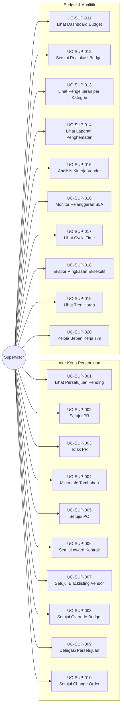

# Diagram Use Case: Aktor Supervisor

## Gambaran Umum
Aktor Supervisor bertanggung jawab untuk menyetujui permintaan, memonitor anggaran, dan pengawasan strategis.

## Diagram Use Case

## Tabel Ringkasan Use Case

| ID | Nama Use Case | Kategori |
|:---|:---|:---|
| UC-SUP-001 | Lihat Persetujuan Pending | Persetujuan |
| UC-SUP-002 | Setujui Purchase Requisition | Persetujuan |
| UC-SUP-003 | Tolak PR dengan Alasan | Persetujuan |
| UC-SUP-004 | Minta Info (Kembalikan ke Submitter) | Persetujuan |
| UC-SUP-005 | Setujui Purchase Order | Persetujuan |
| UC-SUP-006 | Setujui Award Kontrak | Persetujuan |
| UC-SUP-007 | Setujui Blacklisting Vendor | Persetujuan |
| UC-SUP-008 | Setujui Override Budget | Persetujuan |
| UC-SUP-009 | Delegasi Otoritas Persetujuan | Konfigurasi |
| UC-SUP-010 | Setujui Change Order | Persetujuan |
| UC-SUP-011 | Lihat Dashboard Utilisasi Budget | Analitik |
| UC-SUP-012 | Setujui Realokasi Budget | Budget |
| UC-SUP-013 | Lihat Pengeluaran per Kategori | Analitik |
| UC-SUP-014 | Lihat Laporan Penghematan | Analitik |
| UC-SUP-015 | Analisis Kinerja Vendor | Analitik |
| UC-SUP-016 | Monitor Pelanggaran SLA | Monitoring |
| UC-SUP-017 | Lihat Cycle Time Pengadaan | Analitik |
| UC-SUP-018 | Ekspor Ringkasan Eksekutif | Pelaporan |
| UC-SUP-019 | Lihat Tren Harga Historis | Analitik |
| UC-SUP-020 | Kelola Beban Kerja Tim | Monitoring |
