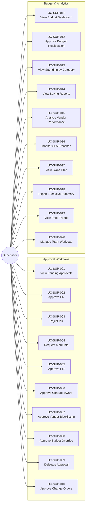

# Use Case Diagram: Supervisor Actor

## Overview
The Supervisor actor is responsible for approving requests, monitoring budgets, and strategic oversight.

## Use Case Diagram

## Use Case Summary Table

| ID | Use Case Name | Category |
|:---|:---|:---|
| UC-SUP-001 | View Pending Approvals | Approval |
| UC-SUP-002 | Approve Purchase Requisition | Approval |
| UC-SUP-003 | Reject PR with Reason | Approval |
| UC-SUP-004 | Request Info (Return to Submitter) | Approval |
| UC-SUP-005 | Approve Purchase Order | Approval |
| UC-SUP-006 | Approve Contract Award | Approval |
| UC-SUP-007 | Approve Vendor Blacklisting | Approval |
| UC-SUP-008 | Approve Budget Override | Approval |
| UC-SUP-009 | Delegate Approval Authority | Config |
| UC-SUP-010 | Approve Change Orders | Approval |
| UC-SUP-011 | View Budget Utilization Dashboard | Analytics |
| UC-SUP-012 | Approve Budget Reallocation | Budget |
| UC-SUP-013 | View Spending by Category | Analytics |
| UC-SUP-014 | View Saving Reports | Analytics |
| UC-SUP-015 | Analyze Vendor Performance | Analytics |
| UC-SUP-016 | Monitor SLA Breaches | Monitoring |
| UC-SUP-017 | View Procurement Cycle Time | Analytics |
| UC-SUP-018 | Export Executive Summary | Reporting |
| UC-SUP-019 | View Historical Price Trends | Analytics |
| UC-SUP-020 | Manage Team Workload | Monitoring |
