# Diagram Use Case: Aktor Finance

## Gambaran Umum
Aktor Finance bertanggung jawab untuk verifikasi invoice, eksekusi pembayaran, kepatuhan pajak, dan rekonsiliasi keuangan.

## Diagram Use Case

```mermaid
graph LR
    Finance((Finance))

    subgraph "Pemrosesan Invoice"
        UC001[UC-FIN-001<br/>Terima Invoice]
        UC002[UC-FIN-002<br/>Verifikasi Faktur Pajak]
        UC003[UC-FIN-003<br/>3-Way Matching]
        UC004[UC-FIN-004<br/>Tangani Dispute]
        UC005[UC-FIN-005<br/>Setujui Invoice]
        UC006[UC-FIN-006<br/>Terapkan WHT]
        UC007[UC-FIN-007<br/>Hitung Penalti]
    end

    subgraph "Pembayaran"
        UC008[UC-FIN-008<br/>Buat Payment Voucher]
        UC009[UC-FIN-009<br/>Proses Batch Pembayaran]
        UC010[UC-FIN-010<br/>Update Status Pembayaran]
        UC021[UC-FIN-021<br/>Buat Batch Pembayaran]
        UC022[UC-FIN-022<br/>Jadwalkan Pembayaran]
        UC023[UC-FIN-023<br/>Tangani Pembayaran Parsial]
        UC024[UC-FIN-024<br/>Buat Remittance]
        UC025[UC-FIN-025<br/>Batalkan Pembayaran]
    end

    subgraph "GL & Rekonsiliasi"
        UC011[UC-FIN-011<br/>Rekonsiliasi Rekening Koran]
        UC012[UC-FIN-012<br/>Mapping Akun GL]
        UC013[UC-FIN-013<br/>Posting ke General Ledger]
        UC014[UC-FIN-014<br/>Kelola Kas Kecil]
    end

    subgraph "Pelaporan"
        UC015[UC-FIN-015<br/>Lihat AP Aging]
        UC016[UC-FIN-016<br/>Monitor Cash Flow]
        UC017[UC-FIN-017<br/>Kelola Kartu Kredit Korporat]
        UC018[UC-FIN-018<br/>Buat Laporan Pajak]
        UC019[UC-FIN-019<br/>Arsipkan Dokumen]
        UC020[UC-FIN-020<br/>Proses Refund]
    end

    Finance --> UC001
    Finance --> UC002
    Finance --> UC003
    Finance --> UC004
    Finance --> UC005
    Finance --> UC006
    Finance --> UC007
    Finance --> UC008
    Finance --> UC009
    Finance --> UC010
    Finance --> UC011
    Finance --> UC012
    Finance --> UC013
    Finance --> UC014
    Finance --> UC015
    Finance --> UC016
    Finance --> UC017
    Finance --> UC018
    Finance --> UC019
    Finance --> UC020
    Finance --> UC021
    Finance --> UC022
    Finance --> UC023
    Finance --> UC024
    Finance --> UC025
```

## Tabel Ringkasan Use Case

| ID | Nama Use Case | Kategori |
|:---|:---|:---|
| UC-FIN-001 | Terima Invoice Vendor | Invoice |
| UC-FIN-002 | Verifikasi Faktur Pajak | Kepatuhan |
| UC-FIN-003 | Lakukan 3-Way Matching | Invoice |
| UC-FIN-004 | Tangani Dispute Invoice | Invoice |
| UC-FIN-005 | Setujui Invoice untuk Pembayaran | Invoice |
| UC-FIN-006 | Terapkan Withholding Tax | Pajak |
| UC-FIN-007 | Hitung Penalti/Demurrage | Invoice |
| UC-FIN-008 | Buat Payment Voucher | Pembayaran |
| UC-FIN-009 | Proses Batch Pembayaran | Pembayaran |
| UC-FIN-010 | Update Status Pembayaran | Pembayaran |
| UC-FIN-011 | Rekonsiliasi Rekening Koran | Rekonsiliasi |
| UC-FIN-012 | Mapping Akun GL | GL |
| UC-FIN-013 | Posting ke General Ledger | GL |
| UC-FIN-014 | Kelola Kas Kecil | Kas |
| UC-FIN-015 | Lihat Accounts Payable Aging | Pelaporan |
| UC-FIN-016 | Monitor Proyeksi Cash Flow | Pelaporan |
| UC-FIN-017 | Kelola Kartu Kredit Korporat | Kas |
| UC-FIN-018 | Buat Laporan Pajak (PPh/PPN) | Pelaporan |
| UC-FIN-019 | Arsipkan Dokumen Keuangan | Admin |
| UC-FIN-020 | Proses Refund | Pembayaran |
| UC-FIN-021 | Buat Batch Pembayaran | Pembayaran |
| UC-FIN-022 | Jadwalkan Pembayaran Tanggal Mendatang | Pembayaran |
| UC-FIN-023 | Tangani Pembayaran Parsial | Pembayaran |
| UC-FIN-024 | Buat Remittance Pembayaran | Pembayaran |
| UC-FIN-025 | Batalkan/Reverse Pembayaran | Pembayaran |
