# Use Case Diagram: Finance Actor

## Overview
The Finance actor is responsible for invoice verification, payment execution, tax compliance, and financial reconciliation.

## Use Case Diagram

```mermaid
graph LR
    Finance((Finance))

    subgraph "Invoice Processing"
        UC001[UC-FIN-001<br/>Receive Invoice]
        UC002[UC-FIN-002<br/>Verify Tax Invoice]
        UC003[UC-FIN-003<br/>3-Way Matching]
        UC004[UC-FIN-004<br/>Handle Dispute]
        UC005[UC-FIN-005<br/>Approve Invoice]
        UC006[UC-FIN-006<br/>Apply WHT]
        UC007[UC-FIN-007<br/>Calculate Penalty]
    end

    subgraph "Payments"
        UC008[UC-FIN-008<br/>Create Payment Voucher]
        UC009[UC-FIN-009<br/>Process Batch Payment]
        UC010[UC-FIN-010<br/>Update Payment Status]
        UC021[UC-FIN-021<br/>Create Payment Batch]
        UC022[UC-FIN-022<br/>Schedule Payment]
        UC023[UC-FIN-023<br/>Handle Partial Payment]
        UC024[UC-FIN-024<br/>Generate Remittance]
        UC025[UC-FIN-025<br/>Void Payment]
    end

    subgraph "GL & Reconciliation"
        UC011[UC-FIN-011<br/>Reconcile Bank Statement]
        UC012[UC-FIN-012<br/>Map GL Accounts]
        UC013[UC-FIN-013<br/>Post to General Ledger]
        UC014[UC-FIN-014<br/>Manage Petty Cash]
    end

    subgraph "Reporting"
        UC015[UC-FIN-015<br/>View AP Aging]
        UC016[UC-FIN-016<br/>Monitor Cash Flow]
        UC017[UC-FIN-017<br/>Manage Corp Cards]
        UC018[UC-FIN-018<br/>Generate Tax Report]
        UC019[UC-FIN-019<br/>Archive Documents]
        UC020[UC-FIN-020<br/>Refund Processing]
    end

    Finance --> UC001
    Finance --> UC002
    Finance --> UC003
    Finance --> UC004
    Finance --> UC005
    Finance --> UC006
    Finance --> UC007
    Finance --> UC008
    Finance --> UC009
    Finance --> UC010
    Finance --> UC011
    Finance --> UC012
    Finance --> UC013
    Finance --> UC014
    Finance --> UC015
    Finance --> UC016
    Finance --> UC017
    Finance --> UC018
    Finance --> UC019
    Finance --> UC020
    Finance --> UC021
    Finance --> UC022
    Finance --> UC023
    Finance --> UC024
    Finance --> UC025
```

## Use Case Summary Table

| ID | Use Case Name | Category |
|:---|:---|:---|
| UC-FIN-001 | Receive Vendor Invoice | Invoice |
| UC-FIN-002 | Verify Tax Invoice (Faktur) | Compliance |
| UC-FIN-003 | Perform 3-Way Matching | Invoice |
| UC-FIN-004 | Handle Invoice Dispute | Invoice |
| UC-FIN-005 | Approve Invoice for Payment | Invoice |
| UC-FIN-006 | Apply Withholding Tax | Tax |
| UC-FIN-007 | Calculate Penalty/Demurrage | Invoice |
| UC-FIN-008 | Create Payment Voucher | Payment |
| UC-FIN-009 | Process Batch Payment | Payment |
| UC-FIN-010 | Update Payment Status | Payment |
| UC-FIN-011 | Reconcile Bank Statement | Reconciliation |
| UC-FIN-012 | Map GL Accounts | GL |
| UC-FIN-013 | Post to General Ledger | GL |
| UC-FIN-014 | Manage Petty Cash | Cash |
| UC-FIN-015 | View Accounts Payable Aging | Reporting |
| UC-FIN-016 | Monitor Cash Flow Projection | Reporting |
| UC-FIN-017 | Manage Corporate Credit Cards | Cash |
| UC-FIN-018 | Generate Tax Report (PPh/PPN) | Reporting |
| UC-FIN-019 | Archive Financial Documents | Admin |
| UC-FIN-020 | Refund Processing | Payment |
| UC-FIN-021 | Create Payment Batch | Payment |
| UC-FIN-022 | Schedule Payment for Future Date | Payment |
| UC-FIN-023 | Handle Partial Payment | Payment |
| UC-FIN-024 | Generate Payment Remittance | Payment |
| UC-FIN-025 | Void/Reverse Payment | Payment |
