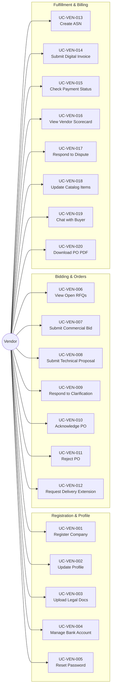

# Use Case Diagram: Vendor Actor

## Overview
The Vendor actor is an external user responsible for registration, bidding, order fulfillment, and invoice submission.

## Use Case Diagram

## Use Case Summary Table

| ID | Use Case Name | Category |
|:---|:---|:---|
| UC-VEN-001 | Register Company Account | Onboarding |
| UC-VEN-002 | Update Company Profile | Profile |
| UC-VEN-003 | Upload Legal Documents | Compliance |
| UC-VEN-004 | Manage Bank Account Details | Profile |
| UC-VEN-005 | Reset Password | Security |
| UC-VEN-006 | View Open RFQs | Bidding |
| UC-VEN-007 | Submit Commercial Bid | Bidding |
| UC-VEN-008 | Submit Technical Proposal | Bidding |
| UC-VEN-009 | Respond to Clarification | Bidding |
| UC-VEN-010 | Acknowledge Purchase Order | Orders |
| UC-VEN-011 | Reject Purchase Order | Orders |
| UC-VEN-012 | Request Delivery Extension | Orders |
| UC-VEN-013 | Create Advance Shipping Notice | Fulfillment |
| UC-VEN-014 | Submit Digital Invoice | Billing |
| UC-VEN-015 | Check Payment Status | Billing |
| UC-VEN-016 | View Vendor Scorecard | Performance |
| UC-VEN-017 | Respond to Dispute | Billing |
| UC-VEN-018 | Update Catalog Items | Catalog |
| UC-VEN-019 | Chat with Buyer | Communication |
| UC-VEN-020 | Download PO PDF | Utility |
