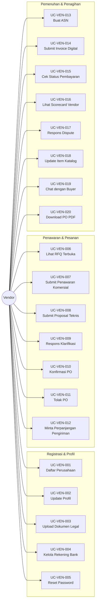

# Diagram Use Case: Aktor Vendor

## Gambaran Umum
Aktor Vendor adalah pengguna eksternal yang bertanggung jawab untuk registrasi, penawaran, pemenuhan pesanan, dan pengajuan invoice.

## Diagram Use Case

## Tabel Ringkasan Use Case

| ID | Nama Use Case | Kategori |
|:---|:---|:---|
| UC-VEN-001 | Daftar Akun Perusahaan | Onboarding |
| UC-VEN-002 | Update Profil Perusahaan | Profil |
| UC-VEN-003 | Upload Dokumen Legal | Kepatuhan |
| UC-VEN-004 | Kelola Detail Rekening Bank | Profil |
| UC-VEN-005 | Reset Password | Keamanan |
| UC-VEN-006 | Lihat RFQ Terbuka | Penawaran |
| UC-VEN-007 | Submit Penawaran Komersial | Penawaran |
| UC-VEN-008 | Submit Proposal Teknis | Penawaran |
| UC-VEN-009 | Respons Klarifikasi | Penawaran |
| UC-VEN-010 | Konfirmasi Purchase Order | Pesanan |
| UC-VEN-011 | Tolak Purchase Order | Pesanan |
| UC-VEN-012 | Minta Perpanjangan Pengiriman | Pesanan |
| UC-VEN-013 | Buat Advance Shipping Notice | Pemenuhan |
| UC-VEN-014 | Submit Invoice Digital | Penagihan |
| UC-VEN-015 | Cek Status Pembayaran | Penagihan |
| UC-VEN-016 | Lihat Scorecard Vendor | Kinerja |
| UC-VEN-017 | Respons Dispute | Penagihan |
| UC-VEN-018 | Update Item Katalog | Katalog |
| UC-VEN-019 | Chat dengan Buyer | Komunikasi |
| UC-VEN-020 | Download PO PDF | Utilitas |
